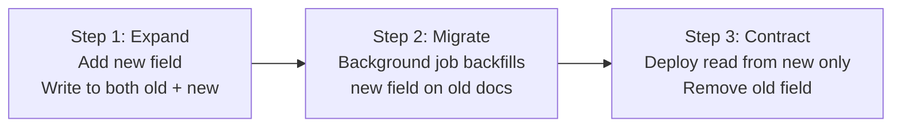

# How to Handle Schema Evolution Without Downtime in MongoDB

Relational databases require `ALTER TABLE` statements that can lock tables for minutes on large datasets. MongoDB's flexible schema means you can change document shapes without modifying the database structure, but you still need to manage the transition carefully to avoid breaking your running application. The key is deploying changes in stages that are backward compatible at every step.

## The Expand-Contract Pattern

The safest approach to any schema change is the expand-contract pattern:

1. **Expand**: Add the new field or structure alongside the old one. Deploy code that writes to both.
2. **Migrate**: Run a background job to populate the new field on existing documents.
3. **Contract**: Deploy code that reads only from the new field. Remove the old field.



## Example: Renaming a Field

Suppose you want to rename `fullName` to `displayName`.

### Step 1: Expand -- Write Both Fields

Deploy application code that writes to both fields. Reads still use `fullName`.

```javascript
// Step 1 write path
await db.collection("users").updateOne(
  { _id: userId },
  {
    $set: {
      fullName: newName,       // old field -- keep writing
      displayName: newName     // new field -- start writing
    }
  }
);

// Step 1 read path -- still using old field
const user = await db.collection("users").findOne({ _id: userId });
const name = user.fullName;
```

### Step 2: Backfill Migration

Run a background job to copy `fullName` to `displayName` for all documents that do not yet have `displayName`.

```javascript
async function backfillDisplayName(db) {
  const cursor = db.collection("users").find({
    fullName: { $exists: true },
    displayName: { $exists: false }
  });

  let count = 0;
  for await (const doc of cursor) {
    await db.collection("users").updateOne(
      { _id: doc._id },
      { $set: { displayName: doc.fullName } }
    );
    count++;
  }
  console.log(`Backfilled ${count} documents.`);
}
```

### Step 3: Contract -- Switch to New Field

Deploy code that reads from `displayName`. Stop writing `fullName`.

```javascript
// Step 3 write path -- only write new field
await db.collection("users").updateOne(
  { _id: userId },
  { $set: { displayName: newName } }
);

// Step 3 read path -- now using new field
const user = await db.collection("users").findOne({ _id: userId });
const name = user.displayName;

// Final cleanup -- remove old field from all documents
await db.collection("users").updateMany(
  { fullName: { $exists: true } },
  { $unset: { fullName: "" } }
);
```

## Adding a New Required Field

Never add a required field directly to the schema validator without first backfilling the value on all existing documents.

```javascript
// Wrong: adding required validation before backfilling
// This breaks inserts on old code paths that don't set the field

// Correct sequence:
// 1. Backfill default value on all existing documents
await db.collection("orders").updateMany(
  { currency: { $exists: false } },
  { $set: { currency: "USD" } }
);

// 2. Add schema validation after backfill is complete
db.runCommand({
  collMod: "orders",
  validator: {
    $jsonSchema: {
      required: ["currency"],
      properties: {
        currency: { type: "string", enum: ["USD", "EUR", "GBP"] }
      }
    }
  },
  validationLevel: "strict",
  validationAction: "error"
});
```

## Changing a Field's Type

Suppose you want to change `quantity` from a string to a number.

```javascript
// Add new typed field alongside old field
await db.collection("products").updateMany(
  {},
  [
    {
      $set: {
        quantityNum: { $toInt: "$quantity" }  // Convert string to int
      }
    }
  ]
);

// Verify conversion
const problems = await db.collection("products")
  .find({ quantityNum: { $exists: false } })
  .count();
console.log("Documents without new field:", problems);

// After application is reading quantityNum:
// Remove old field
await db.collection("products").updateMany(
  {},
  { $unset: { quantity: "" } }
);

// Rename quantityNum to quantity
await db.collection("products").updateMany(
  {},
  [{ $set: { quantity: "$quantityNum" } }]
);
await db.collection("products").updateMany(
  {},
  { $unset: { quantityNum: "" } }
);
```

## Schema Versioning Integration

Combine the expand-contract pattern with schema versioning for complex multi-step migrations.

```javascript
// Read function handles both old and new schema
async function getOrder(db, orderId) {
  const doc = await db.collection("orders").findOne({ _id: orderId });
  if (!doc) return null;

  // Normalize to latest schema in memory
  if (!doc.schemaVersion || doc.schemaVersion < 2) {
    return {
      ...doc,
      schemaVersion: 2,
      displayName: doc.fullName || doc.displayName,
      currency: doc.currency || "USD"
    };
  }
  return doc;
}
```

## Rolling Out Index Changes

When adding a new index that supports a new field, create it before deploying application code that depends on it.

```javascript
// Create index in background before deploying new code
await db.collection("orders").createIndex(
  { customerId: 1, currency: 1, createdAt: -1 },
  { background: true }
);
```

In MongoDB 4.2+, all index builds run in the background by default and do not block reads or writes.

## Validating Migration Progress

```javascript
async function checkMigrationProgress(db) {
  const total = await db.collection("users").countDocuments();
  const migrated = await db.collection("users").countDocuments({
    displayName: { $exists: true }
  });
  const remaining = total - migrated;

  console.log(`Migration progress: ${migrated}/${total} (${remaining} remaining)`);
  return { total, migrated, remaining };
}
```

## Summary

Handle MongoDB schema evolution without downtime by following the expand-contract pattern: add new fields alongside old ones, backfill old documents in the background, then switch reads to the new field before removing the old. Never add required schema validation before backfilling all existing documents. Use schema versioning to handle multiple document shapes gracefully in application code during the transition window. Create indexes before deploying code that depends on them. Monitor backfill progress by counting documents missing the new field, and only proceed to the contract phase once all documents are migrated.
