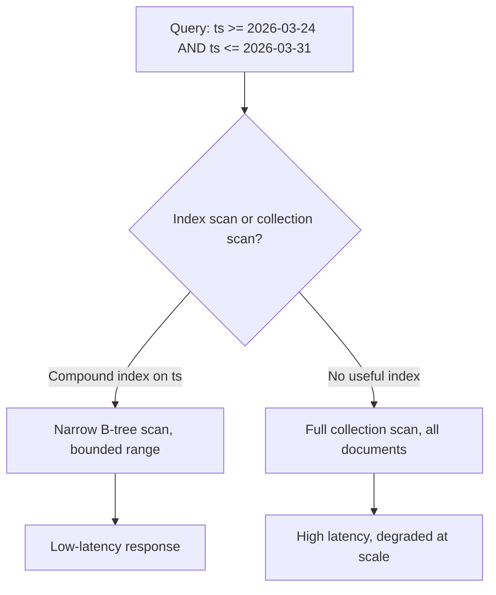

# How to Design Schemas for Range-Query-Heavy Workloads in MongoDB

Author: [nawazdhandala](https://www.github.com/nawazdhandala)

Tags: MongoDB, Schema design, Index, Range query, Performance

Description: Learn how to model documents and indexes in MongoDB to serve fast range queries on dates, numbers, and other ordered fields at scale.

---

## What Is a Range-Query-Heavy Workload

Range queries filter documents using inequality operators: `$gt`, `$gte`, `$lt`, `$lte`, `$between`. Dashboards showing the last 7 days of events, paginated reports sorted by timestamp, and price-range product searches all fall into this category.



## Principle 1: Put the Range Field Last in Compound Indexes

MongoDB traverses a compound index by field order. Equality predicates narrow the key space first; the range field should come last so the B-tree scan is as narrow as possible.

```javascript
// Equality on userId, range on createdAt
db.orders.createIndex({ userId: 1, createdAt: -1 });

// Query uses the full compound index efficiently
db.orders.find({
  userId: ObjectId("64a1..."),
  createdAt: { $gte: new Date("2026-03-01"), $lt: new Date("2026-04-01") }
}).sort({ createdAt: -1 });

// Verify with explain
db.orders.explain("executionStats").find({
  userId: ObjectId("64a1..."),
  createdAt: { $gte: new Date("2026-03-01"), $lt: new Date("2026-04-01") }
});
// Look for "IXSCAN" and low nDocsExamined
```

## Principle 2: Match the Sort Direction to the Index Direction

If the sort direction mismatches the index direction MongoDB must sort in memory (SORT stage), which can run out of the 100 MB allowance.

```javascript
// Index has createdAt: -1 (descending)
db.events.createIndex({ accountId: 1, createdAt: -1 });

// Sort descending - index provides the sort for free
db.events.find({ accountId: "acct-1" }).sort({ createdAt: -1 }).limit(50);

// Sort ascending - MongoDB must reverse the index; still uses the index
// but for very large result sets consider a separate ascending index
db.events.find({ accountId: "acct-1" }).sort({ createdAt: 1 }).limit(50);

// Create a second index if you serve both sort directions at high volume
db.events.createIndex({ accountId: 1, createdAt: 1 });
```

## Principle 3: Use Covered Queries to Eliminate Document Fetches

A covered query returns results entirely from the index without loading the documents from disk.

```javascript
// Index includes every field the query projects
db.metrics.createIndex({ sensorId: 1, recordedAt: -1, value: 1 });

// Projection includes only indexed fields -> covered query
db.metrics.find(
  { sensorId: "s-42", recordedAt: { $gte: new Date("2026-03-31T00:00:00Z") } },
  { _id: 0, sensorId: 1, recordedAt: 1, value: 1 }
);

// Confirm: "totalDocsExamined": 0 means fully covered
db.metrics.explain("executionStats").find(
  { sensorId: "s-42", recordedAt: { $gte: new Date("2026-03-31T00:00:00Z") } },
  { _id: 0, sensorId: 1, recordedAt: 1, value: 1 }
);
```

## Principle 4: Store Dates as ISODate, Not Strings

String comparisons do not produce correct range results unless the format is strictly ISO 8601. Always use native BSON Date.

```javascript
// Avoid: string dates break range semantics
db.logs.insertOne({ ts: "2026-03-31 10:05:00", level: "error" });

// Prefer: BSON Date
db.logs.insertOne({ ts: new Date("2026-03-31T10:05:00Z"), level: "error" });

// Range query works correctly
db.logs.find({ ts: { $gte: new Date("2026-03-31T00:00:00Z"), $lt: new Date("2026-04-01T00:00:00Z") } });
```

## Principle 5: Use the Attribute Pattern for Sparse Range Fields

When many documents have no value for a range field, a sparse index avoids indexing nulls and reduces index size.

```javascript
// Sparse index: only indexes documents where resolvedAt exists
db.incidents.createIndex({ resolvedAt: -1 }, { sparse: true });

// Query resolved-only incidents in a date range
db.incidents.find({
  resolvedAt: { $gte: new Date("2026-03-01"), $lt: new Date("2026-04-01") }
});
```

## Principle 6: Avoid Low-Cardinality Range Fields as Leading Keys

A range on a field with few distinct values (boolean, status enum) does not benefit from an index on that field alone. Combine it with a high-cardinality field.

```javascript
// Poor: status has ~5 distinct values, range on createdAt is wide
db.jobs.createIndex({ status: 1, createdAt: -1 });
// MongoDB will scan a large fraction of the index

// Better: high-cardinality ownerId first, then optional status filter
db.jobs.createIndex({ ownerId: 1, createdAt: -1 });
db.jobs.find({ ownerId: "user-99", createdAt: { $gte: cutoff }, status: "failed" });
```

## Principle 7: Partition Data into Time-Bucketed Collections

For very large time-series datasets, partition writes into monthly or daily collections. Range queries then hit a smaller collection rather than a monolithic one.

```javascript
function collectionName(date) {
  const y = date.getFullYear();
  const m = String(date.getMonth() + 1).padStart(2, "0");
  return `events_${y}_${m}`;
}

async function insertEvent(db, event) {
  const col = collectionName(event.ts);
  await db.collection(col).insertOne(event);
}

async function queryRange(db, start, end) {
  // Only query collections that overlap with the range
  const results = [];
  let cursor = new Date(start);
  while (cursor <= end) {
    const col = collectionName(cursor);
    const docs = await db.collection(col).find({
      ts: { $gte: start, $lte: end }
    }).toArray();
    results.push(...docs);
    cursor.setMonth(cursor.getMonth() + 1);
  }
  return results;
}
```

## Principle 8: Use MongoDB Clustered Collections for Sequential Access

A clustered collection stores documents physically sorted by `_id`. When `_id` is a time-ordered value (ObjectId or a timestamp), range scans over `_id` become sequential disk reads.

```javascript
// Create a clustered collection (MongoDB 5.3+)
db.createCollection("audit_log", {
  clusteredIndex: { key: { _id: 1 }, unique: true }
});

// Use ObjectId (which encodes creation time) as _id
db.audit_log.insertOne({
  _id: new ObjectId(),
  userId: "u-1",
  action: "login",
  ts: new Date()
});

// Range scan on _id is sequential I/O
db.audit_log.find({
  _id: {
    $gte: ObjectId.createFromTime(Math.floor(new Date("2026-03-31").getTime() / 1000)),
    $lte: ObjectId.createFromTime(Math.floor(new Date("2026-04-01").getTime() / 1000))
  }
});
```

## Principle 9: Index Bound Tightening with $and

When multiple range conditions apply to different fields, separate indexes cannot be intersected efficiently. A compound index covering both fields is far more effective.

```javascript
// Two separate single-field indexes cannot be intersected well for this query
db.products.createIndex({ price: 1 });
db.products.createIndex({ stock: 1 });

// Single compound index covers both range conditions
db.products.createIndex({ price: 1, stock: 1 });
db.products.find({
  price: { $gte: 10, $lte: 50 },
  stock: { $gt: 0 }
});
```

## Range Query Schema Checklist

| Decision | Recommendation |
|---|---|
| Index field order | Equality fields first, range field last |
| Sort direction | Match index direction to avoid in-memory sort |
| Date storage | BSON ISODate, never strings |
| Covered queries | Include projected fields in the index |
| Sparse ranges | Use sparse index for optional date fields |
| Data volume | Bucket by time period for very large datasets |
| Physical layout | Clustered collections for sequential range I/O |

## Summary

Range-query-heavy MongoDB workloads benefit most from carefully ordered compound indexes with equality fields leading and the range field trailing. Storing dates as BSON Date, designing covered queries, using sparse indexes for optional fields, and partitioning data into time-bucketed collections or clustered collections all reduce the number of documents scanned per query and keep latency predictable as data volumes grow.
