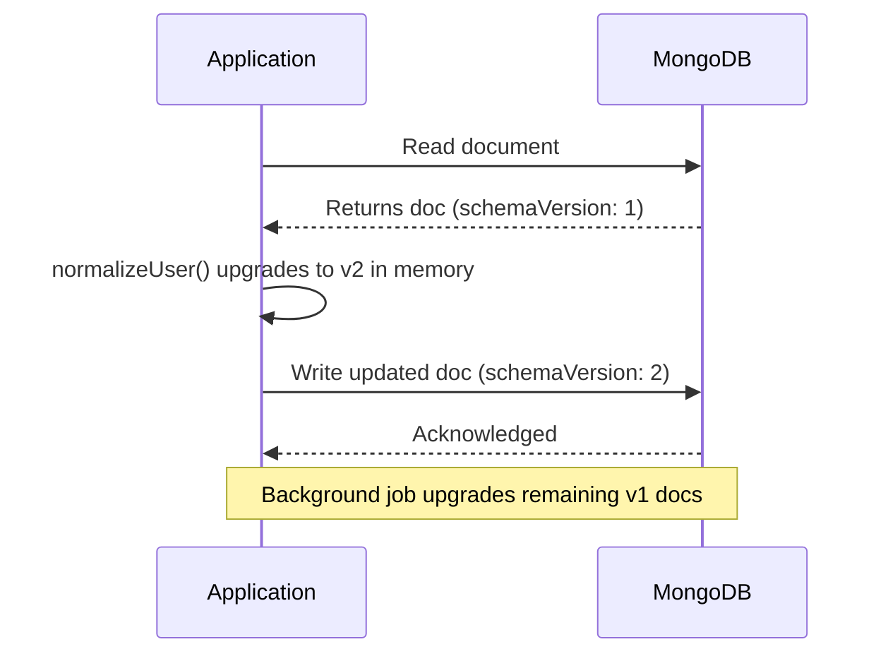

# How to Implement the Schema Versioning Pattern in MongoDB

MongoDB's flexible schema allows documents in the same collection to have different structures. The schema versioning pattern formalizes this flexibility by adding a `schemaVersion` field to every document. Application code reads this field and applies version-specific logic, enabling you to evolve your schema gradually without migrating all documents at once.

## The Problem: Schema Changes in Production

When you add a field, rename a field, or restructure embedded documents, you face a choice:

1. Migrate all documents at once -- risky, requires downtime for large collections
2. Do nothing -- application code breaks when it encounters old document shapes
3. Use schema versioning -- handle both old and new shapes in application code

Schema versioning enables option 3: deploy the new application first, then migrate documents lazily or in a background job.

## Adding a Schema Version Field

Add a `schemaVersion` field to every new document. Start at version 1.

```javascript
// Schema version 1 -- original structure
db.users.insertOne({
  _id: ObjectId(),
  schemaVersion: 1,
  name: "Alice Johnson",
  email: "alice@example.com",
  phone: "555-1234",
  createdAt: new Date()
});
```

## Evolving the Schema

Suppose version 2 splits `name` into `firstName` and `lastName`, and restructures `phone` into an array of phone objects.

```javascript
// Schema version 2 -- new structure
db.users.insertOne({
  _id: ObjectId(),
  schemaVersion: 2,
  firstName: "Bob",
  lastName: "Smith",
  email: "bob@example.com",
  phones: [
    { type: "mobile", number: "555-5678" }
  ],
  createdAt: new Date()
});
```

## Application-Level Version Handling

Write a transformation function that normalizes any version into the latest version.

```javascript
function normalizeUser(doc) {
  if (doc.schemaVersion === 1) {
    const nameParts = doc.name.split(" ");
    return {
      ...doc,
      schemaVersion: 2,
      firstName: nameParts[0],
      lastName: nameParts.slice(1).join(" "),
      phones: doc.phone ? [{ type: "mobile", number: doc.phone }] : [],
      name: undefined,
      phone: undefined
    };
  }
  return doc;  // Already version 2
}

// Usage
const raw = await db.collection("users").findOne({ email: "alice@example.com" });
const user = normalizeUser(raw);
console.log(user.firstName, user.lastName);
// Alice Johnson
```

## Lazy Migration

Update documents to the latest schema version when they are read and written. This spreads the migration load over time without a bulk operation.

```javascript
async function getUser(db, filter) {
  const raw = await db.collection("users").findOne(filter);
  if (!raw) return null;

  const normalized = normalizeUser(raw);

  // If the document was on an old schema, persist the upgrade
  if (raw.schemaVersion !== normalized.schemaVersion) {
    await db.collection("users").updateOne(
      { _id: raw._id },
      {
        $set: normalized,
        $unset: { name: "", phone: "" }
      }
    );
  }

  return normalized;
}
```

## Background Migration Script

After deploying the new application code, run a background migration to update all remaining old-schema documents.

```javascript
async function migrateUsersToV2(db) {
  const cursor = db.collection("users").find({ schemaVersion: { $lt: 2 } });
  let migrated = 0;

  for await (const doc of cursor) {
    const normalized = normalizeUser(doc);
    await db.collection("users").updateOne(
      { _id: doc._id },
      {
        $set: {
          schemaVersion: 2,
          firstName: normalized.firstName,
          lastName: normalized.lastName,
          phones: normalized.phones
        },
        $unset: { name: "", phone: "" }
      }
    );
    migrated++;
    if (migrated % 1000 === 0) {
      console.log(`Migrated ${migrated} documents...`);
    }
  }

  console.log(`Migration complete: ${migrated} documents updated.`);
}
```

## Indexing by Schema Version

Create a partial index on the old schema version to make migration queries efficient.

```javascript
db.users.createIndex(
  { schemaVersion: 1 },
  { partialFilterExpression: { schemaVersion: { $lt: 2 } } }
);
```

## Schema Versioning Flow



## Handling Multiple Versions

For collections that go through many versions, use a switch or map pattern.

```javascript
const migrators = {
  1: migrateV1toV2,
  2: migrateV2toV3,
  3: migrateV3toV4
};

function upgradeToLatest(doc) {
  let current = doc;
  while (migrators[current.schemaVersion]) {
    current = migrators[current.schemaVersion](current);
  }
  return current;
}
```

## Summary

The schema versioning pattern adds a `schemaVersion` field to every document and handles multiple schema shapes in application code. New documents are written with the latest version number. Old documents are transformed to the latest shape when read (lazy migration) or updated in bulk by a background job. This approach eliminates downtime for large-collection migrations, allows gradual rollouts, and gives you a safe rollback path by keeping old documents readable until migration is complete. Use partial indexes on `schemaVersion` to make migration queries efficient.
