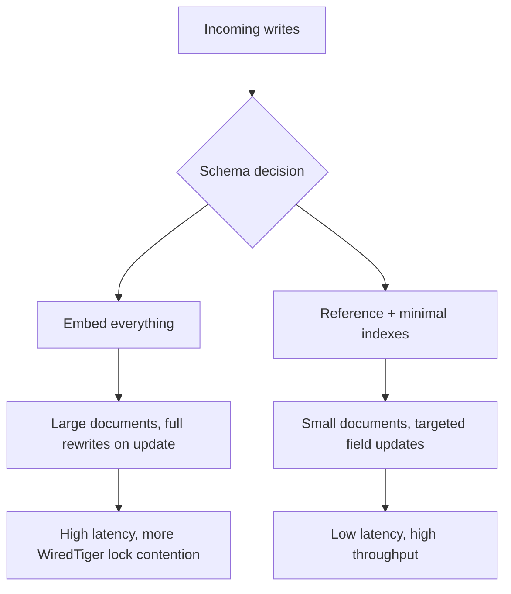
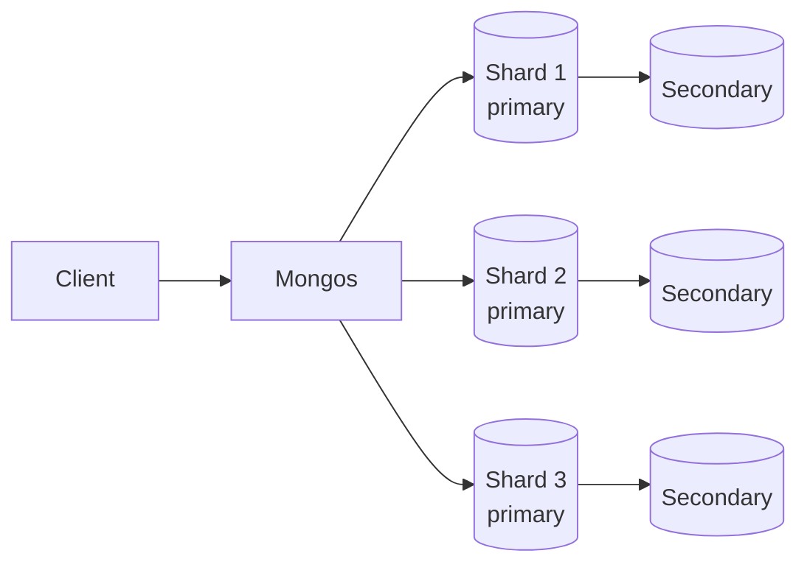

# How to Design Schemas for Write-Heavy Workloads in MongoDB

Author: [nawazdhandala](https://www.github.com/nawazdhandala)

Tags: MongoDB, Schema Design, Performance, Write, Indexing

Description: Learn how to model MongoDB documents, choose index strategies, and configure write concern to maximize throughput in write-heavy applications.

---

## What Makes a Workload Write-Heavy

A write-heavy workload performs far more inserts, updates, or deletes than reads. Examples include event ingestion pipelines, IoT telemetry collectors, audit log streams, and activity trackers. The schema choices that optimise for reads (many indexes, deeply nested documents) actively hurt write throughput.



## Principle 1: Keep Documents Small and Flat

Large documents require MongoDB to read and rewrite the entire document on any field change. Keep frequently-updated fields in a separate, lean document.

```javascript
// Avoid: one giant user document
{
  _id: ObjectId("..."),
  name: "Alice",
  email: "alice@example.com",
  activityLog: [/* thousands of entries */],
  preferences: { /* 50 fields */ }
}

// Prefer: split hot write path from cold profile data
// users collection - rarely updated
{
  _id: ObjectId("64a1..."),
  name: "Alice",
  email: "alice@example.com"
}

// user_activity collection - write-heavy
{
  _id: ObjectId("..."),
  userId: ObjectId("64a1..."),
  event: "page_view",
  url: "/dashboard",
  ts: ISODate("2026-03-31T10:00:00Z")
}
```

## Principle 2: Pre-allocate Array Space (Bucket Pattern)

Unbounded array growth causes document moves, which are expensive. The bucket pattern pre-allocates slots and fills them in later.

```javascript
// Create a bucket document that holds up to 200 readings
db.sensor_readings.insertOne({
  sensorId: "sensor-42",
  bucketStart: ISODate("2026-03-31T10:00:00Z"),
  readings: [],
  count: 0
});

// Append a reading to the current open bucket
db.sensor_readings.updateOne(
  { sensorId: "sensor-42", count: { $lt: 200 } },
  {
    $push: { readings: { v: 23.4, ts: ISODate("2026-03-31T10:05:00Z") } },
    $inc: { count: 1 }
  }
);
```

## Principle 3: Use Targeted Field Updates

Never replace the entire document when only one field changes. Use `$set`, `$inc`, and other update operators to touch only the changed bytes.

```javascript
// Avoid: full document replacement
db.orders.replaceOne(
  { _id: orderId },
  { ...entireOrderObject, status: "shipped" }
);

// Prefer: targeted update
db.orders.updateOne(
  { _id: orderId },
  {
    $set: { status: "shipped", updatedAt: new Date() },
    $push: { statusHistory: { status: "shipped", ts: new Date() } }
  }
);
```

## Principle 4: Minimise Index Count

Every index is updated on every write. Reduce index count aggressively on write-heavy collections.

```javascript
// Check existing indexes and their sizes
db.events.getIndexes();

// Drop unused indexes
db.events.dropIndex("old_field_1");

// Use a compound index to cover multiple query shapes
// instead of two separate single-field indexes
db.events.createIndex({ userId: 1, ts: -1 });

// Enable background index builds to avoid blocking writes
db.events.createIndex(
  { sessionId: 1 },
  { background: true }  // MongoDB 4.2+: all index builds are non-blocking by default
);
```

## Principle 5: Use Write Concern Wisely

For high-throughput ingestion where occasional data loss on crash is acceptable, lower the write concern.

```javascript
const { MongoClient } = require("mongodb");

const client = new MongoClient(process.env.MONGO_URI);
const db = client.db("telemetry");

// w:1 means acknowledged by the primary only (faster)
// w:"majority" means durable on majority of nodes (safer)
const collection = db.collection("events", {
  writeConcern: { w: 1, j: false }  // no journal flush, maximum speed
});

async function bulkIngest(events) {
  const ops = events.map((e) => ({
    insertOne: { document: e }
  }));
  const result = await collection.bulkWrite(ops, { ordered: false });
  return result.insertedCount;
}
```

## Principle 6: Use Unordered Bulk Writes

Ordered bulk writes stop on first error. Unordered bulk writes parallelise inserts and continue past errors, delivering much higher throughput.

```javascript
async function ingestBatch(db, events) {
  const ops = events.map((e) => ({ insertOne: { document: e } }));

  const result = await db.collection("events").bulkWrite(ops, {
    ordered: false,  // parallelise; don't halt on first error
    writeConcern: { w: 1 }
  });

  console.log(`Inserted: ${result.insertedCount}`);
  if (result.hasWriteErrors()) {
    result.getWriteErrors().forEach((err) => console.error(err.errmsg));
  }
}
```

## Principle 7: Shard Write-Heavy Collections

A single primary replica becomes a bottleneck. Distribute writes across shards using a hashed shard key on a high-cardinality field.

```javascript
// Enable sharding on the database
sh.enableSharding("telemetry");

// Shard the events collection on a hashed sensorId
sh.shardCollection("telemetry.events", { sensorId: "hashed" });

// Confirm the shard distribution
db.adminCommand({ listShards: 1 });
sh.status();
```



## Principle 8: Use Time-to-Live Indexes for Automatic Pruning

In write-heavy systems the collection grows fast. A TTL index auto-deletes old documents without application code.

```javascript
// Automatically delete events older than 30 days
db.events.createIndex(
  { ts: 1 },
  { expireAfterSeconds: 30 * 24 * 60 * 60 }
);
```

## Principle 9: Avoid Expensive Array Operations

`$push` on a large array, `$addToSet` with deduplication checks, and `$pull` all require reading the full array. Cap arrays using `$slice` or switch to separate documents.

```javascript
// Keep only the last 50 items in a log array
db.sessions.updateOne(
  { _id: sessionId },
  {
    $push: {
      recentActions: {
        $each: [{ action: "click", ts: new Date() }],
        $slice: -50  // keep only the newest 50 entries
      }
    }
  }
);
```

## Principle 10: Monitor Write Latency with Profiler

Identify hot spots before they become bottlenecks.

```javascript
// Enable profiling for operations slower than 50 ms
db.setProfilingLevel(1, { slowms: 50 });

// Query the profile collection for the slowest writes
db.system.profile.find({
  op: { $in: ["insert", "update", "delete"] }
}).sort({ millis: -1 }).limit(10).pretty();

// Turn profiling off after analysis
db.setProfilingLevel(0);
```

## Schema Design Checklist for Write-Heavy Workloads

| Decision | Write-optimised choice |
|---|---|
| Document size | Small; split hot from cold fields |
| Array growth | Bucket pattern with capped arrays |
| Update style | Targeted operators (`$set`, `$inc`) |
| Index count | Minimal; prefer compound over many singles |
| Write concern | `w:1` for ingestion, `w:"majority"` for critical data |
| Bulk writes | Unordered |
| Scaling | Hashed sharding on high-cardinality key |
| Data retention | TTL index |

## Summary

Designing schemas for write-heavy MongoDB workloads means keeping documents small, using targeted update operators, limiting index count, preferring unordered bulk writes, and distributing load with hashed sharding. The bucket pattern controls array growth, TTL indexes manage retention, and the profiler surfaces slow paths before they cause incidents.
