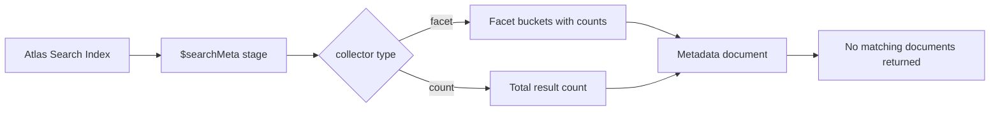

# How to Use $searchMeta in MongoDB Atlas Search

Author: [nawazdhandala](https://www.github.com/nawazdhandala)

Tags: MongoDB, Atlas Search, Aggregation, Full-Text Search, Facet

Description: Learn how to use $searchMeta in MongoDB Atlas Search to retrieve only metadata like facet counts and result totals without returning the matching documents themselves.

---

`$searchMeta` is an Atlas Search aggregation stage that returns only the metadata about a search query -- facet buckets, result counts, and scoring information -- without returning the matching documents. It is the companion to `$search` and is commonly used to build faceted navigation and result count indicators.

## $search vs. $searchMeta

| Stage | Returns |
|---|---|
| `$search` | Matching documents + metadata in `$$SEARCH_META` variable |
| `$searchMeta` | Only metadata (facets, count) -- no documents |

Use `$search` when you need documents. Use `$searchMeta` when you need only facets or counts, such as rendering a sidebar filter UI without a second full document query.

## How $searchMeta Works



## Prerequisites

You need an Atlas cluster with Atlas Search enabled and an index on the collection. The examples use this index definition on a `products` collection:

```json
{
  "mappings": {
    "dynamic": false,
    "fields": {
      "name":     { "type": "string" },
      "brand":    { "type": "stringFacet" },
      "category": { "type": "stringFacet" },
      "price":    { "type": "numberFacet" },
      "rating":   { "type": "number" },
      "inStock":  { "type": "boolean" }
    }
  }
}
```

## Getting Facet Counts

Retrieve how many products exist per category and per price range:

```javascript
db.products.aggregate([
  {
    $searchMeta: {
      index: "products_search",
      facet: {
        operator: {
          text: {
            query: "laptop",
            path: "name"
          }
        },
        facets: {
          categoryFacet: {
            type: "string",
            path: "category",
            numBuckets: 10
          },
          brandFacet: {
            type: "string",
            path: "brand",
            numBuckets: 20
          },
          priceFacet: {
            type: "number",
            path: "price",
            boundaries: [0, 200, 500, 1000, 2000],
            default: "Other"
          }
        }
      }
    }
  }
]);
```

Example output:

```javascript
{
  "count": { "lowerBound": 342 },
  "facet": {
    "categoryFacet": {
      "buckets": [
        { "_id": "Laptops",   "count": 180 },
        { "_id": "Gaming",    "count": 95  },
        { "_id": "Business",  "count": 67  }
      ]
    },
    "brandFacet": {
      "buckets": [
        { "_id": "Dell",   "count": 85 },
        { "_id": "Apple",  "count": 72 },
        { "_id": "Lenovo", "count": 61 }
      ]
    },
    "priceFacet": {
      "buckets": [
        { "_id": "0",    "count": 12  },
        { "_id": "200",  "count": 87  },
        { "_id": "500",  "count": 143 },
        { "_id": "1000", "count": 100 }
      ]
    }
  }
}
```

## Getting Only a Count

Use the `count` collector to get the total number of matching documents without any facets:

```javascript
db.products.aggregate([
  {
    $searchMeta: {
      index: "products_search",
      count: {
        type: "total"    // exact count (slower for large results)
      },
      text: {
        query: "wireless headphones",
        path: ["name", "description"]
      }
    }
  }
]);
// Returns: { "count": { "total": 287 } }
```

For large collections, use `lowerBound` for a faster approximate count:

```javascript
db.products.aggregate([
  {
    $searchMeta: {
      index: "products_search",
      count: {
        type: "lowerBound",
        threshold: 1000   // stop counting at 1000
      },
      text: {
        query: "wireless headphones",
        path: "name"
      }
    }
  }
]);
```

## Facets with Compound Queries

Apply filters inside the facet `operator` to count only within matching documents:

```javascript
db.products.aggregate([
  {
    $searchMeta: {
      index: "products_search",
      facet: {
        operator: {
          compound: {
            must: [
              {
                text: {
                  query: "running shoes",
                  path: "name"
                }
              }
            ],
            filter: [
              {
                equals: {
                  path: "inStock",
                  value: true
                }
              }
            ]
          }
        },
        facets: {
          brandFacet: {
            type: "string",
            path: "brand",
            numBuckets: 15
          },
          priceFacet: {
            type: "number",
            path: "price",
            boundaries: [0, 50, 100, 150, 200, 300],
            default: "Over 300"
          }
        }
      }
    }
  }
]);
```

## Using $search with $$SEARCH_META for Inline Metadata

If you need both documents and facets in one query, use `$search` and read the metadata from the `$$SEARCH_META` variable in a subsequent stage:

```javascript
db.products.aggregate([
  {
    $search: {
      index: "products_search",
      facet: {
        operator: {
          text: { query: "tablet", path: "name" }
        },
        facets: {
          categoryFacet: {
            type: "string",
            path: "category",
            numBuckets: 5
          }
        }
      }
    }
  },
  { $limit: 20 },
  {
    $facet: {
      docs: [
        {
          $project: {
            name: 1, brand: 1, price: 1, rating: 1
          }
        }
      ],
      meta: [
        {
          $replaceWith: "$$SEARCH_META"
        },
        { $limit: 1 }
      ]
    }
  }
]);
```

## Building a Faceted Filter Sidebar

In a typical search UI, two parallel requests are made:

```javascript
// Request 1: fetch paginated documents
const docsResult = await db.products.aggregate([
  {
    $search: {
      index: "products_search",
      text: { query: userQuery, path: "name" }
    }
  },
  { $skip: (page - 1) * pageSize },
  { $limit: pageSize },
  { $project: { name: 1, price: 1, brand: 1, rating: 1 } }
]).toArray();

// Request 2: fetch facets for the same query
const facetsResult = await db.products.aggregate([
  {
    $searchMeta: {
      index: "products_search",
      facet: {
        operator: {
          text: { query: userQuery, path: "name" }
        },
        facets: {
          brandFacet: { type: "string", path: "brand", numBuckets: 20 },
          categoryFacet: { type: "string", path: "category", numBuckets: 10 },
          priceFacet: {
            type: "number",
            path: "price",
            boundaries: [0, 100, 500, 1000, 5000]
          }
        }
      }
    }
  }
]).toArray();
```

## Date Facets

```javascript
db.articles.aggregate([
  {
    $searchMeta: {
      index: "articles_search",
      facet: {
        operator: {
          text: { query: "mongodb", path: "body" }
        },
        facets: {
          publishedFacet: {
            type: "date",
            path: "publishedAt",
            boundaries: [
              ISODate("2024-01-01"),
              ISODate("2025-01-01"),
              ISODate("2026-01-01"),
              ISODate("2027-01-01")
            ],
            default: "Other"
          }
        }
      }
    }
  }
]);
```

## Summary

`$searchMeta` is the dedicated Atlas Search stage for retrieving facet counts and result totals without fetching document content. Use it with the `facet` collector to build filter sidebars showing how many results exist per category, brand, price range, or date bucket. Use the `count` collector to display a fast result count. For combined document + facet responses, use `$search` with `$$SEARCH_META` inside a `$facet` stage. All `$searchMeta` queries require an Atlas Search index with `stringFacet` or `numberFacet` field mappings for the faceted fields.
