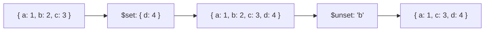

# How to Use $set and $unset in MongoDB Aggregation Pipeline

Author: [nawazdhandala](https://www.github.com/nawazdhandala)

Tags: MongoDB, Aggregation, $set, $unset, Pipeline, Stage

Description: Learn how to use $set and $unset stages in MongoDB aggregation pipelines to add, overwrite, or remove fields from documents.

---

## How $set and $unset Work

`$set` and `$unset` are aliases for `$addFields` and a restricted form of `$project` respectively, introduced to make pipeline intent more readable.

- `$set` adds new fields or overwrites existing fields (alias for `$addFields`)
- `$unset` removes specified fields from documents (shorthand for `$project` with field set to `0`)



## Syntax

### $set

```javascript
{
  $set: {
    <field1>: <expression1>,
    <field2>: <expression2>,
    ...
  }
}
```

### $unset

```javascript
// Remove a single field
{ $unset: "<fieldName>" }

// Remove multiple fields
{ $unset: ["<field1>", "<field2>", ...] }
```

## Examples

### Input Documents

```javascript
[
  { _id: 1, name: "Alice", salary: 75000, department: "Engineering", ssn: "123-45-6789" },
  { _id: 2, name: "Bob",   salary: 60000, department: "Marketing",   ssn: "987-65-4321" }
]
```

### Example 1 - $set to Add a Computed Field

Add `annualBonus` without removing existing fields:

```javascript
db.employees.aggregate([
  {
    $set: {
      annualBonus: { $multiply: ["$salary", 0.10] }
    }
  }
])
```

Output:

```javascript
[
  { _id: 1, name: "Alice", salary: 75000, department: "Engineering", ssn: "123-45-6789", annualBonus: 7500 },
  { _id: 2, name: "Bob",   salary: 60000, department: "Marketing",   ssn: "987-65-4321", annualBonus: 6000 }
]
```

### Example 2 - $set to Overwrite an Existing Field

Normalize the `department` field to uppercase:

```javascript
db.employees.aggregate([
  {
    $set: {
      department: { $toUpper: "$department" }
    }
  }
])
```

Output:

```javascript
[
  { _id: 1, name: "Alice", salary: 75000, department: "ENGINEERING", ssn: "123-45-6789" },
  { _id: 2, name: "Bob",   salary: 60000, department: "MARKETING",   ssn: "987-65-4321" }
]
```

### Example 3 - $unset to Remove a Field

Remove the sensitive `ssn` field from the output:

```javascript
db.employees.aggregate([
  { $unset: "ssn" }
])
```

Output:

```javascript
[
  { _id: 1, name: "Alice", salary: 75000, department: "Engineering" },
  { _id: 2, name: "Bob",   salary: 60000, department: "Marketing"   }
]
```

### Example 4 - $unset Multiple Fields

Remove both `ssn` and `salary`:

```javascript
db.employees.aggregate([
  { $unset: ["ssn", "salary"] }
])
```

Output:

```javascript
[
  { _id: 1, name: "Alice", department: "Engineering" },
  { _id: 2, name: "Bob",   department: "Marketing"   }
]
```

### Example 5 - Combining $set and $unset

Add a computed field and remove a sensitive field in the same pipeline:

```javascript
db.employees.aggregate([
  {
    $set: {
      monthlySalary: { $divide: ["$salary", 12] },
      fullLabel: { $concat: ["$name", " - ", "$department"] }
    }
  },
  { $unset: ["ssn", "salary"] }
])
```

Output:

```javascript
[
  { _id: 1, name: "Alice", department: "Engineering", monthlySalary: 6250, fullLabel: "Alice - Engineering" },
  { _id: 2, name: "Bob",   department: "Marketing",   monthlySalary: 5000, fullLabel: "Bob - Marketing"    }
]
```

### Example 6 - $unset a Nested Field

Remove a nested field using dot notation:

```javascript
// Input: { _id: 1, name: "Alice", profile: { age: 30, ssn: "123-45" } }
db.users.aggregate([
  { $unset: "profile.ssn" }
])
```

Output:

```javascript
[
  { _id: 1, name: "Alice", profile: { age: 30 } }
]
```

## $set vs $addFields

`$set` and `$addFields` are identical in behavior. `$set` was introduced as a more intuitive alias. Use whichever reads more clearly in context.

## $unset vs $project with 0

```javascript
// These are equivalent
{ $unset: ["ssn", "salary"] }

{
  $project: {
    ssn: 0,
    salary: 0
  }
}
```

`$unset` is more concise for removing fields, while `$project` with field exclusion gives you the same result with more verbose syntax.

## Use Cases

- Adding computed enrichment fields (computed salary, full name, status label)
- Removing sensitive data (PII, secrets) before returning results
- Overwriting fields to normalize or convert values in the pipeline
- Cleaning up intermediate fields added by earlier pipeline stages

## Summary

`$set` adds or overwrites fields (identical to `$addFields`) and `$unset` removes specified fields. Together they give you clean, readable control over field presence in a pipeline. Use `$unset` to strip sensitive or unnecessary fields late in a pipeline, and `$set` to enrich documents with computed values at any stage.
