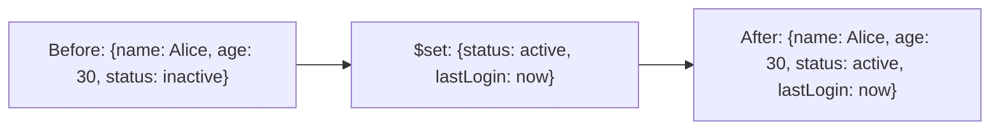

# How to Use $set Operator in MongoDB to Update Fields

Author: [nawazdhandala](https://www.github.com/nawazdhandala)

Tags: MongoDB, $set, Update, Operator, CRUD

Description: Learn how to use MongoDB's $set operator to update or add fields in a document without affecting other fields, including nested fields and array elements.

---

## How $set Works

The `$set` operator sets the value of a field in a document. If the field does not exist, `$set` adds the field with the specified value. If the field already exists, `$set` replaces the existing value. Crucially, `$set` only affects the named fields - all other fields in the document remain untouched.



## Syntax

```javascript
{ $set: { field1: value1, field2: value2, ... } }
```

## Basic Field Update

Update an existing field:

```javascript
// Before: { _id: 1, name: "Alice", status: "inactive" }

db.users.updateOne(
  { _id: 1 },
  { $set: { status: "active" } }
)

// After: { _id: 1, name: "Alice", status: "active" }
```

## Adding a New Field

`$set` creates the field if it does not exist:

```javascript
// Before: { _id: 2, name: "Bob", email: "bob@example.com" }

db.users.updateOne(
  { _id: 2 },
  { $set: { phoneVerified: false, updatedAt: new Date() } }
)

// After: { _id: 2, name: "Bob", email: "bob@example.com", phoneVerified: false, updatedAt: ISODate("...") }
```

## Setting Multiple Fields at Once

```javascript
// Before: { _id: 3, product: "Widget", price: 9.99, inStock: true }

db.products.updateOne(
  { _id: 3 },
  {
    $set: {
      price: 12.99,
      category: "Accessories",
      updatedAt: new Date()
    }
  }
)

// After: { _id: 3, product: "Widget", price: 12.99, inStock: true, category: "Accessories", updatedAt: ISODate("...") }
```

## Updating Nested Fields with Dot Notation

Use dot notation to update fields inside embedded documents:

```javascript
// Before: { _id: 4, address: { city: "SF", zip: "94105", state: "CA" } }

db.users.updateOne(
  { _id: 4 },
  { $set: { "address.city": "Oakland", "address.zip": "94601" } }
)

// After: { _id: 4, address: { city: "Oakland", zip: "94601", state: "CA" } }
```

Note: using `$set` with dot notation only changes the targeted nested field. The rest of the embedded document (`state: "CA"`) is preserved.

## $set vs Replacing the Entire Embedded Document

Beware: setting an entire sub-document replaces it completely:

```javascript
// This REPLACES the entire address object, removing "state"
db.users.updateOne(
  { _id: 4 },
  { $set: { address: { city: "Oakland", zip: "94601" } } }
)
// After: { _id: 4, address: { city: "Oakland", zip: "94601" } }  -- state is gone!
```

Use dot notation to update individual fields safely:

```javascript
// This only updates city and zip, preserving state
db.users.updateOne(
  { _id: 4 },
  { $set: { "address.city": "Oakland", "address.zip": "94601" } }
)
```

## Setting Array Elements by Index

```javascript
// Before: { _id: 5, scores: [85, 90, 78] }

db.students.updateOne(
  { _id: 5 },
  { $set: { "scores.2": 95 } }
)

// After: { _id: 5, scores: [85, 90, 95] }
```

## Setting Fields in Matched Array Elements

Use the positional `$` operator with `$set` to update a matched array element:

```javascript
// Before: { _id: 6, orders: [{ id: "ORD-1", status: "pending" }, { id: "ORD-2", status: "processing" }] }

db.users.updateOne(
  { _id: 6, "orders.id": "ORD-1" },
  { $set: { "orders.$.status": "shipped" } }
)

// After: { _id: 6, orders: [{ id: "ORD-1", status: "shipped" }, { id: "ORD-2", status: "processing" }] }
```

## Using $set with $setOnInsert in Upserts

`$setOnInsert` is similar to `$set` but only applies when a document is being inserted (not updated):

```javascript
db.pageViews.updateOne(
  { page: "/home" },
  {
    $inc: { views: 1 },
    $setOnInsert: { createdAt: new Date() }
  },
  { upsert: true }
)
```

## Use Cases

- Updating a user's profile information
- Adding timestamps like `updatedAt` or `lastLoginAt`
- Changing the status of an order or task
- Adding new optional fields during schema migration
- Updating the price or description of a product

## Summary

`$set` is the most commonly used MongoDB update operator. It updates or adds fields in a document without replacing the entire document or affecting unmentioned fields. Always use dot notation when targeting nested fields to avoid accidentally overwriting entire embedded objects. For array element updates, combine `$set` with the positional `$` operator or `arrayFilters` to target specific elements precisely.
