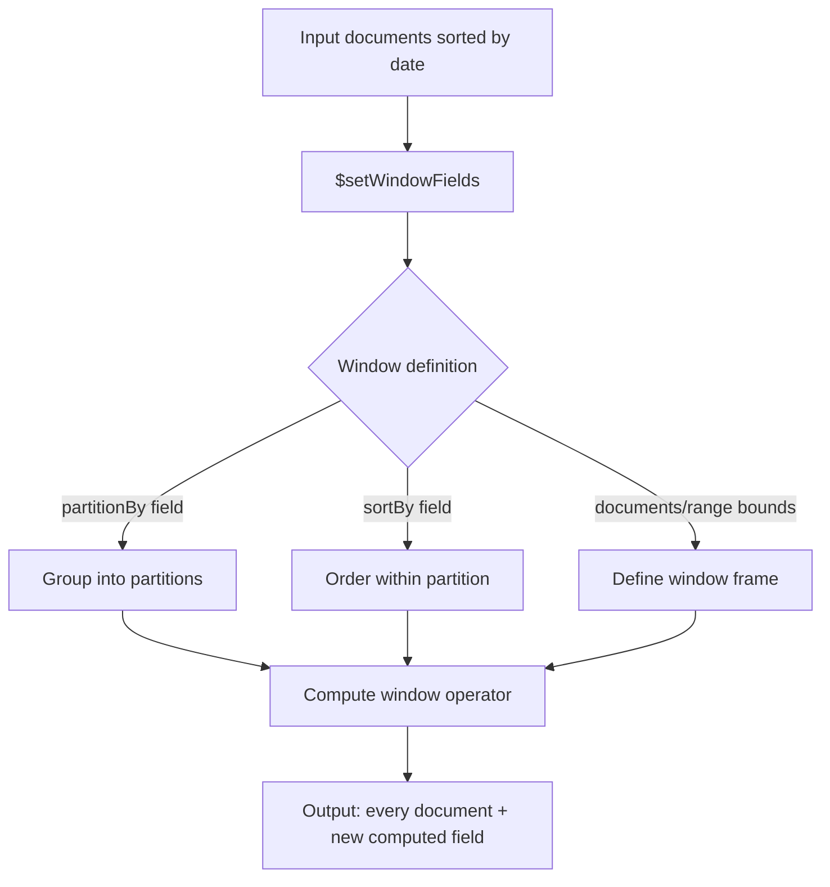

# How to Use $setWindowFields for Window Functions in MongoDB

Author: OneUptime Team

Tags: MongoDB, Aggregation, Window function, Analytics, Pipeline

Description: Learn how to use MongoDB's $setWindowFields stage to compute running totals, moving averages, rankings, and cumulative values without collapsing documents.

---

`$setWindowFields`, introduced in MongoDB 5.0, brings SQL-style window functions to aggregation pipelines. Unlike `$group`, it computes values across a window of documents while keeping every document in the output.

## What Is a Window Function?

A window function operates over a set of documents (the "window") relative to the current document and adds a new field -- without removing any rows from the result.



## Basic Setup

```javascript
db.sales.aggregate([
  {
    $setWindowFields: {
      partitionBy: "$region",         // like GROUP BY
      sortBy: { saleDate: 1 },        // order within partition
      output: {
        runningTotal: {
          $sum: "$amount",
          window: {
            documents: ["unbounded", "current"]  // from start to current row
          }
        }
      }
    }
  }
]);
```

## Sample Data

```javascript
db.sales.insertMany([
  { region: "west", rep: "Alice", amount: 1000, saleDate: ISODate("2026-01-05") },
  { region: "west", rep: "Bob",   amount: 1500, saleDate: ISODate("2026-01-10") },
  { region: "west", rep: "Alice", amount: 800,  saleDate: ISODate("2026-01-15") },
  { region: "east", rep: "Carol", amount: 2000, saleDate: ISODate("2026-01-07") },
  { region: "east", rep: "Dave",  amount: 1200, saleDate: ISODate("2026-01-12") },
  { region: "east", rep: "Carol", amount: 900,  saleDate: ISODate("2026-01-20") }
]);
```

## Running Total Per Partition

```javascript
db.sales.aggregate([
  {
    $setWindowFields: {
      partitionBy: "$region",
      sortBy: { saleDate: 1 },
      output: {
        runningTotal: {
          $sum: "$amount",
          window: { documents: ["unbounded", "current"] }
        }
      }
    }
  },
  { $project: { region: 1, rep: 1, amount: 1, saleDate: 1, runningTotal: 1 } }
]);
```

## Moving Average (3-Period)

A sliding window of the current row plus two preceding rows:

```javascript
db.sales.aggregate([
  {
    $setWindowFields: {
      partitionBy: "$region",
      sortBy: { saleDate: 1 },
      output: {
        movingAvg3: {
          $avg: "$amount",
          window: { documents: [-2, 0] }  // 2 before + current
        }
      }
    }
  }
]);
```

## Ranking with $rank and $denseRank

```javascript
db.sales.aggregate([
  {
    $setWindowFields: {
      partitionBy: "$region",
      sortBy: { amount: -1 },      // rank by highest amount
      output: {
        rankInRegion: {
          $rank: {}
        },
        denseRankInRegion: {
          $denseRank: {}
        }
      }
    }
  }
]);
```

## Row Number

Assign a sequential number within each partition:

```javascript
db.sales.aggregate([
  {
    $setWindowFields: {
      partitionBy: "$region",
      sortBy: { saleDate: 1 },
      output: {
        rowNumber: { $documentNumber: {} }
      }
    }
  }
]);
```

## Cumulative Count

Count how many documents have appeared up to the current one:

```javascript
db.events.aggregate([
  {
    $setWindowFields: {
      partitionBy: "$userId",
      sortBy: { occurredAt: 1 },
      output: {
        cumulativeEventCount: {
          $sum: 1,
          window: { documents: ["unbounded", "current"] }
        }
      }
    }
  }
]);
```

## Lag and Lead

Access a previous or next document value within the partition:

```javascript
db.stockPrices.aggregate([
  {
    $setWindowFields: {
      partitionBy: "$ticker",
      sortBy: { tradeDate: 1 },
      output: {
        prevClose: {
          $shift: {
            output: "$closePrice",
            by: -1,                // previous row
            default: null
          }
        },
        nextClose: {
          $shift: {
            output: "$closePrice",
            by: 1,                 // next row
            default: null
          }
        }
      }
    }
  },
  {
    $addFields: {
      dailyChange: { $subtract: ["$closePrice", "$prevClose"] }
    }
  }
]);
```

## Time-Range Window

Use a range-based window instead of a row-based window to look back a fixed time interval:

```javascript
// 7-day rolling average of sales amount, sorted by date as milliseconds
db.sales.aggregate([
  {
    $addFields: {
      saleDateMs: { $toLong: "$saleDate" }
    }
  },
  {
    $setWindowFields: {
      partitionBy: "$region",
      sortBy: { saleDateMs: 1 },
      output: {
        rollingAvg7d: {
          $avg: "$amount",
          window: {
            range: [
              -604800000,   // 7 days in ms
              0
            ],
            unit: "millisecond"
          }
        }
      }
    }
  }
]);
```

## Multiple Outputs in One Stage

Compute several window metrics in a single `$setWindowFields` pass:

```javascript
db.sales.aggregate([
  {
    $setWindowFields: {
      partitionBy: "$region",
      sortBy: { saleDate: 1 },
      output: {
        runningTotal: {
          $sum: "$amount",
          window: { documents: ["unbounded", "current"] }
        },
        movingAvg3: {
          $avg: "$amount",
          window: { documents: [-2, 0] }
        },
        rankInRegion: { $rank: {} },
        rowNum: { $documentNumber: {} },
        partitionTotal: {
          $sum: "$amount",
          window: { documents: ["unbounded", "unbounded"] }
        }
      }
    }
  },
  {
    $addFields: {
      pctOfRegionTotal: {
        $multiply: [
          { $divide: ["$amount", "$partitionTotal"] },
          100
        ]
      }
    }
  }
]);
```

## Using $setWindowFields After $group

You can mix `$group` aggregation with window functions by running them in sequence:

```javascript
db.orders.aggregate([
  // First aggregate to daily totals
  {
    $group: {
      _id: {
        date: { $dateTrunc: { date: "$createdAt", unit: "day" } },
        region: "$region"
      },
      dailyRevenue: { $sum: "$total" }
    }
  },
  // Then apply window functions on the aggregated results
  {
    $setWindowFields: {
      partitionBy: "$_id.region",
      sortBy: { "_id.date": 1 },
      output: {
        cumulativeRevenue: {
          $sum: "$dailyRevenue",
          window: { documents: ["unbounded", "current"] }
        },
        movingAvg7d: {
          $avg: "$dailyRevenue",
          window: { documents: [-6, 0] }
        }
      }
    }
  }
]);
```

## Available Window Operators

| Operator | Description |
|---|---|
| `$sum` | Running or windowed sum |
| `$avg` | Running or windowed average |
| `$min` / `$max` | Min or max within window |
| `$count` | Count of documents in window |
| `$rank` | Rank with gaps for ties |
| `$denseRank` | Rank without gaps for ties |
| `$documentNumber` | Sequential row number |
| `$shift` | Access value from offset row (lag/lead) |
| `$first` / `$last` | First or last value in window |
| `$derivative` | Rate of change |
| `$integral` | Area under a curve |
| `$stdDevPop` / `$stdDevSamp` | Standard deviation |

## Summary

`$setWindowFields` brings SQL window function power to MongoDB aggregation. It computes running totals, moving averages, ranks, row numbers, lag/lead values, and cumulative metrics over ordered partitions without collapsing the document set. Combine it with `$group` for post-aggregation windowing, use range-based windows for time-series rolling calculations, and pack multiple outputs into one stage for efficient single-pass analytics.
