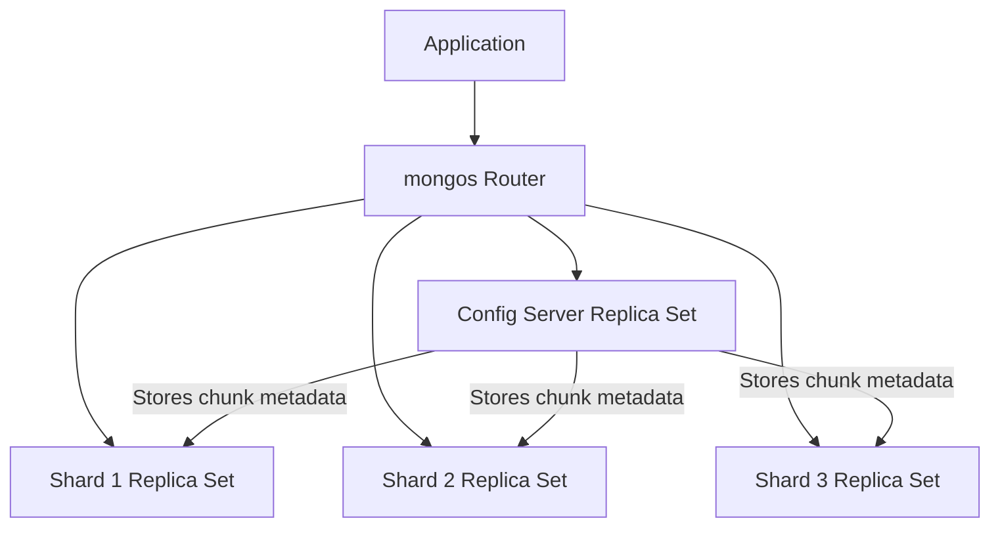

# How to Set Up MongoDB Sharded Cluster

Author: [nawazdhandala](https://www.github.com/nawazdhandala)

Tags: MongoDB, Sharding, Sharded Cluster, Scalability, Horizontal Scaling

Description: Learn how to set up a MongoDB sharded cluster from scratch, including config servers, shards, and mongos routers, with step-by-step configuration examples.

---

## Sharded Cluster Architecture

A MongoDB sharded cluster consists of three components:

- **Shards** - Replica sets that store a partition of the data.
- **Config servers** - A 3-member replica set that stores cluster metadata and shard key ranges.
- **Mongos routers** - Stateless query routers that direct client requests to the correct shard(s).



## Prerequisites

- MongoDB installed on all servers.
- Network connectivity between all components.
- Hostnames that resolve correctly (or use IP addresses).

## Step-by-Step Setup

### Step 1: Start the Config Server Replica Set

Config servers are deployed as a 3-member replica set named `configReplSet`:

Create config server configuration file (`/etc/mongod-config.conf`):

```yaml
sharding:
  clusterRole: configsvr
replication:
  replSetName: configReplSet
net:
  port: 27019
  bindIp: 0.0.0.0
storage:
  dbPath: /data/configdb
systemLog:
  destination: file
  path: /var/log/mongodb/configsvr.log
  logAppend: true
```

Start config servers on 3 hosts and initiate the replica set:

```bash
# Start on all 3 config server hosts
mongod --config /etc/mongod-config.conf
```

```javascript
// Connect to one config server and initiate
mongosh --port 27019
rs.initiate({
  _id: "configReplSet",
  configsvr: true,
  members: [
    { _id: 0, host: "config1:27019" },
    { _id: 1, host: "config2:27019" },
    { _id: 2, host: "config3:27019" }
  ]
})
```

### Step 2: Start the Shard Replica Sets

Each shard is itself a replica set. Create the config for shard 1 (`/etc/mongod-shard1.conf`):

```yaml
sharding:
  clusterRole: shardsvr
replication:
  replSetName: rs-shard1
net:
  port: 27018
  bindIp: 0.0.0.0
storage:
  dbPath: /data/shard1
systemLog:
  destination: file
  path: /var/log/mongodb/shard1.log
  logAppend: true
```

Start shard 1 on its replica set members and initiate:

```bash
mongod --config /etc/mongod-shard1.conf
```

```javascript
mongosh --port 27018
rs.initiate({
  _id: "rs-shard1",
  members: [
    { _id: 0, host: "shard1a:27018" },
    { _id: 1, host: "shard1b:27018" },
    { _id: 2, host: "shard1c:27018" }
  ]
})
```

Repeat for shard 2 with `rs-shard2` and shard 3 with `rs-shard3`.

### Step 3: Start the mongos Router

Create `/etc/mongos.conf`:

```yaml
sharding:
  configDB: configReplSet/config1:27019,config2:27019,config3:27019
net:
  port: 27017
  bindIp: 0.0.0.0
systemLog:
  destination: file
  path: /var/log/mongodb/mongos.log
  logAppend: true
```

Start mongos:

```bash
mongos --config /etc/mongos.conf
```

### Step 4: Add Shards to the Cluster

Connect to mongos and add each shard:

```javascript
mongosh --port 27017

sh.addShard("rs-shard1/shard1a:27018,shard1b:27018,shard1c:27018")
sh.addShard("rs-shard2/shard2a:27018,shard2b:27018,shard2c:27018")
sh.addShard("rs-shard3/shard3a:27018,shard3b:27018,shard3c:27018")

// Verify shards are added
sh.status()
```

Expected output includes all three shards listed.

### Step 5: Enable Sharding on a Database

```javascript
sh.enableSharding("myapp")
```

### Step 6: Shard a Collection

```javascript
// Create an index on the shard key first
db.orders.createIndex({ customerId: "hashed" })

// Shard the collection
sh.shardCollection("myapp.orders", { customerId: "hashed" })
```

For range sharding:

```javascript
db.events.createIndex({ timestamp: 1 })
sh.shardCollection("myapp.events", { timestamp: 1 })
```

### Step 7: Verify the Cluster Status

```javascript
sh.status()
```

Output shows:

```text
--- Sharding Status ---
sharding version: { "_id" : 1, "minCompatibleVersion" : 5, ... }
shards:
  {  "_id" : "rs-shard1",  "host" : "rs-shard1/shard1a:27018,shard1b:27018",  "state" : 1 }
  {  "_id" : "rs-shard2",  "host" : "rs-shard2/shard2a:27018,shard2b:27018",  "state" : 1 }
  {  "_id" : "rs-shard3",  "host" : "rs-shard3/shard3a:27018,shard3b:27018",  "state" : 1 }
databases:
  {  "_id" : "myapp",  "primary" : "rs-shard1",  "partitioned" : true }
    myapp.orders
      shard key: { "customerId" : "hashed" }
      chunks:
        rs-shard1  2
        rs-shard2  2
        rs-shard3  2
```

### Step 8: Connect Your Application to mongos

Application clients connect to mongos as if it were a regular mongod:

```javascript
const { MongoClient } = require("mongodb");

// Connect to mongos (can have multiple mongos instances for HA)
const uri = "mongodb://mongos1:27017,mongos2:27017/?replicaSet=rs0";
const client = new MongoClient("mongodb://mongos1:27017");

await client.connect();

const orders = client.db("myapp").collection("orders");
await orders.insertOne({ customerId: "cust_001", amount: 250 });
```

## Testing Single Shard vs Multi-Shard Queries

```javascript
// Targeted query - shard key in filter, goes to one shard
db.orders.find({ customerId: "cust_001" }).explain()
// Shows: "SINGLE_SHARD" in the winning plan

// Scatter-gather query - no shard key, goes to all shards
db.orders.find({ status: "active" }).explain()
// Shows: "SHARD_MERGE" - queries all shards and merges results
```

## Best Practices

- **Run at least 2 mongos instances** for high availability. Load-balance with a reverse proxy.
- **Deploy config servers in 3 separate availability zones** - losing the config server set halts the cluster.
- **Pre-split chunks** for hashed shard keys before large imports to avoid hot-spotting during initial data load.
- **Use targeted queries with the shard key** whenever possible to avoid scatter-gather.
- **Monitor the balancer** with `sh.getBalancerState()` and `sh.isBalancerRunning()`.
- **Do not shard small collections.** The overhead of sharding is only worthwhile for large, high-throughput collections.

## Summary

A MongoDB sharded cluster consists of config servers (metadata storage), shards (data storage, each a replica set), and mongos routers (query routing). Set up config servers first, then shards, then mongos. Enable sharding on the database and collection with `sh.enableSharding()` and `sh.shardCollection()`. Applications connect to mongos as if it were a normal MongoDB instance. Use targeted queries with the shard key to avoid expensive scatter-gather operations across all shards.
