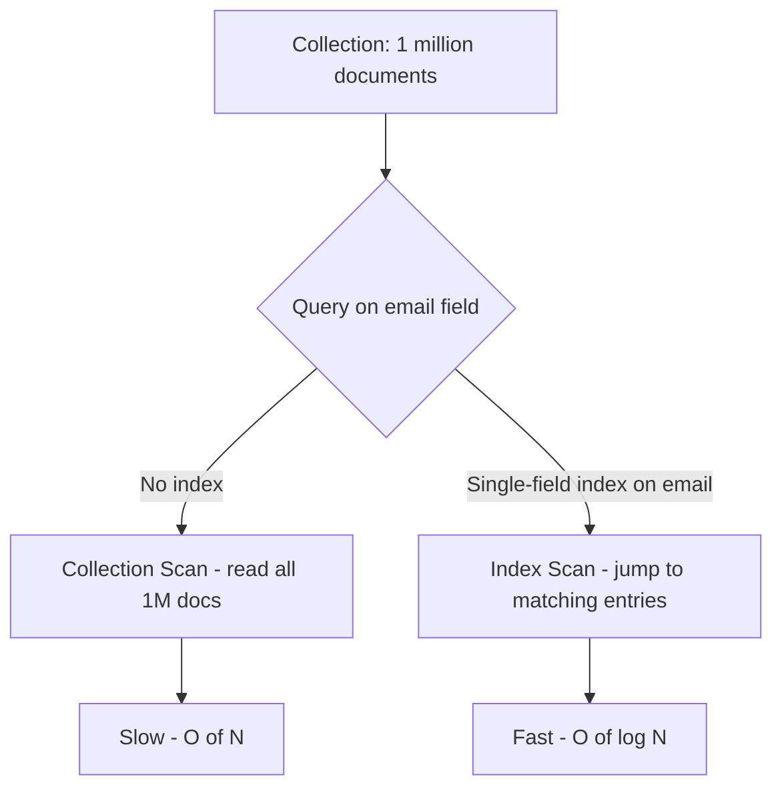
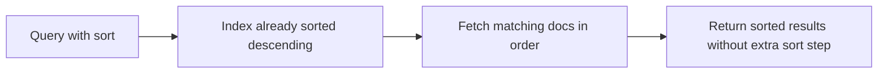

# How to Create a Single-Field Index in MongoDB

Author: [nawazdhandala](https://www.github.com/nawazdhandala)

Tags: MongoDB, Index, Single-Field Index, Query Optimization, Performance

Description: Learn how to create single-field indexes in MongoDB, understand ascending vs descending order, and use explain() to confirm index usage for faster queries.

---

## What is a Single-Field Index

A single-field index is the simplest index type in MongoDB. It stores a sorted reference to one field across all documents in a collection. MongoDB uses it to answer queries that filter or sort on that field without scanning every document.

MongoDB automatically creates a single-field index on `_id` for every collection. All other indexes must be created explicitly.



## Creating a Single-Field Index

```javascript
// Ascending index (1) - useful for range queries and sorting low-to-high
db.users.createIndex({ email: 1 });

// Descending index (-1) - useful for sorting high-to-low
db.users.createIndex({ createdAt: -1 });
```

For single-field indexes, ascending and descending are equivalent for equality queries. The direction matters only when combining with other fields in a compound index or when sorting.

## Naming the Index

MongoDB auto-generates a name like `email_1`. You can provide a custom name:

```javascript
db.users.createIndex(
  { email: 1 },
  { name: "idx_users_email" }
);
```

## Verifying the Index Was Created

```javascript
db.users.getIndexes();
// Returns an array including:
// { "key": { "email": 1 }, "name": "email_1", "v": 2 }
```

## Confirming Index Usage with explain()

```javascript
db.users.find({ email: "alice@example.com" }).explain("executionStats");
```

Look for these fields in the output:

```javascript
{
  "winningPlan": {
    "stage": "FETCH",
    "inputStage": {
      "stage": "IXSCAN",          // Index scan - index is being used
      "keyPattern": { "email": 1 }
    }
  },
  "executionStats": {
    "totalDocsExamined": 1,       // Only 1 doc examined
    "totalKeysExamined": 1,
    "nReturned": 1
  }
}
```

Compare with a collection scan (COLLSCAN) which examines every document.

## Range Queries

Single-field indexes are highly effective for range queries:

```javascript
db.orders.createIndex({ totalAmount: 1 });

// Range query uses the index efficiently
db.orders.find({
  totalAmount: { $gte: 100, $lte: 500 }
});
```

## Sorting with a Single-Field Index

MongoDB can use a single-field index to satisfy a sort without an in-memory sort:

```javascript
db.articles.createIndex({ publishedAt: -1 });

// This sort is served by the index - no in-memory sort needed
db.articles.find({ status: "published" }).sort({ publishedAt: -1 });
```



## Index on Nested Fields

You can index fields inside embedded documents using dot notation:

```javascript
db.users.createIndex({ "address.city": 1 });

// Now this query uses the index
db.users.find({ "address.city": "New York" });
```

## Index Options

### Unique Index

```javascript
// Enforce uniqueness on the field
db.users.createIndex({ email: 1 }, { unique: true });
```

### Sparse Index

```javascript
// Only index documents where the field exists
db.users.createIndex({ phoneNumber: 1 }, { sparse: true });
```

### TTL Index

```javascript
// Automatically expire documents after a duration
db.sessions.createIndex(
  { expiresAt: 1 },
  { expireAfterSeconds: 0 }
);
```

### Background Build (MongoDB < 4.2)

In MongoDB 4.2 and later, all index builds use an optimized algorithm. In older versions, use `background: true` to avoid blocking:

```javascript
db.users.createIndex({ email: 1 }, { background: true });
```

## Checking Index Size and Usage

```javascript
// View index sizes
db.users.stats().indexSizes;

// View index usage statistics (MongoDB 3.2+)
db.users.aggregate([{ $indexStats: {} }]);
```

## When a Single-Field Index Is Not Used

MongoDB may skip your index and do a collection scan when:

- The query returns a large percentage of documents (low selectivity)
- The field has very few distinct values (e.g., a boolean field on a large collection)
- The collection is very small and a scan is faster than index overhead
- The query uses an operator that cannot leverage the index (e.g., `$where`)

```javascript
// Low selectivity - index on "active" boolean may not help
db.users.find({ active: true });  // If 95% of docs have active=true, scan is faster

// High selectivity - index on email is very useful
db.users.find({ email: "alice@example.com" });  // Likely unique or near-unique
```

## Dropping an Unused Index

```javascript
db.users.dropIndex("email_1");
// or
db.users.dropIndex({ email: 1 });
```

## Best Practices

- Index fields that appear frequently in query filters, sort clauses, and join conditions.
- Prefer high-cardinality fields (many distinct values) for maximum index selectivity.
- Avoid indexing fields that change very frequently, as writes must update the index.
- Use `$indexStats` periodically to identify indexes that are never used and drop them.
- Keep the total number of indexes per collection reasonable; each index adds write overhead.

## Summary

A single-field index in MongoDB stores a sorted reference to one field and allows MongoDB to jump directly to matching documents instead of scanning the entire collection. Create one with `db.collection.createIndex({ field: 1 })`, verify it with `getIndexes()`, and confirm it is being used with `explain("executionStats")`. Choose high-cardinality fields for maximum query speedup and remove unused indexes to keep write performance healthy.
