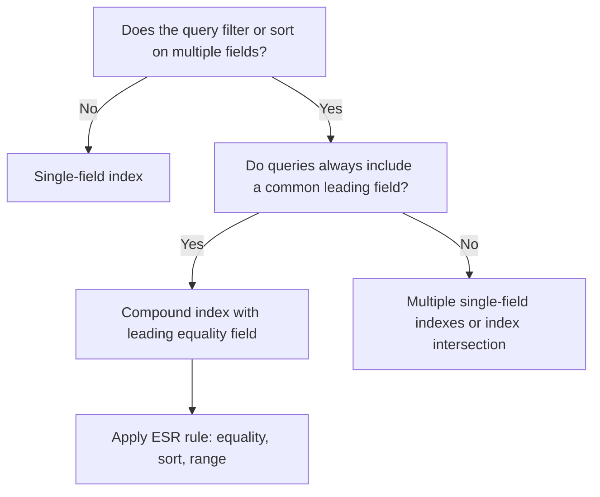

# How to Choose Between Single Field and Compound Indexes in MongoDB

Choosing the right index type is one of the highest-leverage decisions in MongoDB schema design. Single-field indexes are simple and flexible, while compound indexes are more powerful but narrower in scope. Understanding the trade-offs between them helps you build a lean, effective index strategy.

## Single Field Index

A single-field index covers queries that filter or sort on exactly one field.

```javascript
// Create a single-field index on email
db.users.createIndex({ email: 1 });

// Efficiently handled by the index
db.users.find({ email: "alice@example.com" });
db.users.find().sort({ email: 1 });
```

Single-field indexes are bidirectional: an index on `{ email: 1 }` satisfies both ascending and descending sorts on `email` because MongoDB can scan it in either direction.

## Compound Index

A compound index stores multiple fields in a single index structure. The field order matters.

```javascript
// Compound index on status and createdAt
db.orders.createIndex({ status: 1, createdAt: -1 });

// Efficiently handled
db.orders.find({ status: "pending" }).sort({ createdAt: -1 });

// Also handled (prefix rule -- first field is usable alone)
db.orders.find({ status: "pending" });
```

## The Prefix Rule

A compound index on `{ a: 1, b: 1, c: 1 }` implicitly supports queries on the following prefixes:

- `{ a: 1 }`
- `{ a: 1, b: 1 }`
- `{ a: 1, b: 1, c: 1 }`

It does not support queries that skip the leading field (for example, a query filtering only on `b` or `c` without `a`).

```javascript
db.events.createIndex({ type: 1, userId: 1, createdAt: -1 });

// Covered by prefix
db.events.find({ type: "login" });
db.events.find({ type: "login", userId: "u1" });
db.events.find({ type: "login", userId: "u1" }).sort({ createdAt: -1 });

// NOT covered -- skips the prefix
db.events.find({ userId: "u1" });
db.events.find({ createdAt: { $gte: new Date("2025-01-01") } });
```

## Decision Framework



## When to Use Single Field Indexes

Use a single-field index when:

- A query filters on exactly one field with high selectivity (for example, `userId` or `email`)
- The field is used independently across many different query patterns
- You want to cover a sort on that field with minimal overhead
- The field is used in a text, geospatial, or TTL index context

```javascript
// High-selectivity lookups -- single field is ideal
db.users.createIndex({ email: 1 }, { unique: true });
db.sessions.createIndex({ token: 1 }, { unique: true });
db.logs.createIndex({ createdAt: 1 }, { expireAfterSeconds: 2592000 });
```

## When to Use Compound Indexes

Use a compound index when:

- Queries consistently filter on multiple fields together
- You need an index that both filters and sorts efficiently
- You want to achieve a covered query (all projected fields are in the index)
- Multiple related queries share a common leading field

```javascript
// Status + createdAt used together in many queries
db.orders.createIndex({ status: 1, createdAt: -1 });

// Covered query: no document fetch needed
db.orders.find(
  { status: "shipped" },
  { _id: 0, status: 1, createdAt: 1 }
).sort({ createdAt: -1 });
```

## Index Size Comparison

Single-field indexes are smaller. Each additional field in a compound index increases the index entry size, consuming more RAM and disk.

```javascript
// Check index sizes
db.orders.stats().indexSizes;
// {
//   "_id_": 12345,
//   "status_1": 8192,
//   "status_1_createdAt_-1": 16384
// }
```

## Avoiding Redundant Indexes

A single-field index on `status` is made redundant if you already have a compound index with `status` as its leading field, because the compound index satisfies all queries that the single-field index would serve.

```javascript
// If this compound index exists:
db.orders.createIndex({ status: 1, createdAt: -1 });

// This single-field index is now redundant -- remove it
db.orders.dropIndex({ status: 1 });
```

Redundant indexes waste RAM, slow writes, and add no query benefit.

## Practical Example: User Activity Queries

```javascript
// Query patterns:
// 1. Find all activity for a user (userId filter)
// 2. Find recent activity for a user (userId filter + createdAt sort)
// 3. Find activity by type for a user (userId + type filter)

// One compound index handles all three patterns
db.activities.createIndex({ userId: 1, type: 1, createdAt: -1 });

// Pattern 1
db.activities.find({ userId: "u1" });

// Pattern 2
db.activities.find({ userId: "u1" }).sort({ createdAt: -1 });

// Pattern 3
db.activities.find({ userId: "u1", type: "purchase" }).sort({ createdAt: -1 });
```

## Summary

Single-field indexes are best for high-selectivity lookups on independent fields. Compound indexes excel when queries combine multiple fields and especially when sort satisfaction is needed. Apply the prefix rule to understand which queries a compound index covers, use the ESR ordering strategy to maximize index efficiency, and remove single-field indexes that are made redundant by a compound index with the same leading field. Always measure actual query plans with `explain("executionStats")` rather than guessing which index MongoDB will choose.
