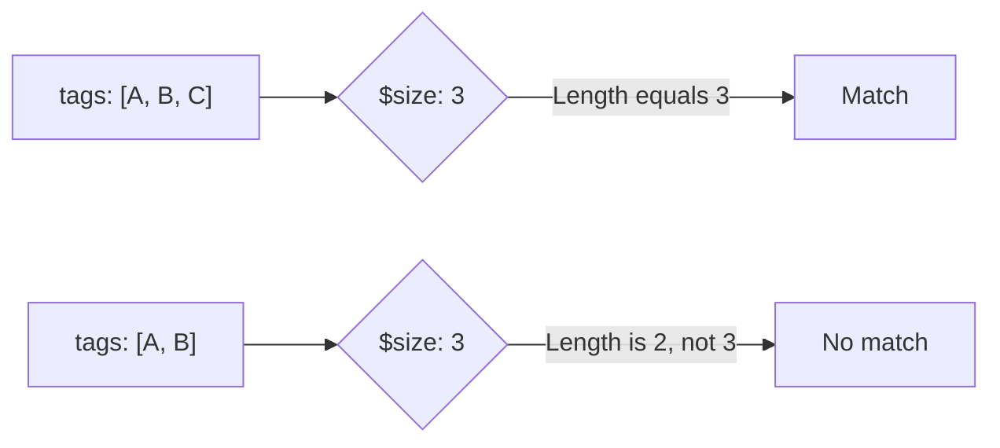

# How to Use $size Operator in MongoDB to Query by Array Length

Author: [nawazdhandala](https://www.github.com/nawazdhandala)

Tags: MongoDB, $size, Array, Query, Operator

Description: Learn how to use MongoDB's $size operator to find documents based on the exact number of elements in an array field, and alternatives for range-based length queries.

---

## How $size Works

The `$size` operator matches documents where an array field contains exactly the specified number of elements. It is a simple and direct way to filter by array length.



## Syntax

```javascript
{ field: { $size: <number> } }
```

The `<number>` must be a non-negative integer.

## Basic Example

Find articles with exactly three tags:

```javascript
db.articles.insertMany([
  { title: "Post A", tags: ["mongodb", "nosql"] },
  { title: "Post B", tags: ["mongodb", "nosql", "database"] },
  { title: "Post C", tags: ["mongodb"] },
  { title: "Post D", tags: [] }
])

// Find articles with exactly 3 tags
db.articles.find({ tags: { $size: 3 } })
// Returns "Post B"
```

## Finding Documents with Empty Arrays

```javascript
// Find users with no addresses
db.users.find({ addresses: { $size: 0 } })

// Find products with no images
db.products.find({ images: { $size: 0 } })
```

## Limitation - No Range Queries with $size

`$size` only accepts an exact number - you cannot use it with comparison operators directly:

```javascript
// This does NOT work - $size does not accept operators
db.articles.find({ tags: { $size: { $gt: 2 } } })  // INVALID
```

For range-based array length queries, use `$expr` with `$size` from the aggregation expression:

```javascript
// Find articles with more than 2 tags
db.articles.find({
  $expr: { $gt: [{ $size: "$tags" }, 2] }
})

// Find users with at least 1 address
db.users.find({
  $expr: { $gte: [{ $size: "$addresses" }, 1] }
})

// Find articles with between 2 and 5 tags
db.articles.find({
  $expr: {
    $and: [
      { $gte: [{ $size: "$tags" }, 2] },
      { $lte: [{ $size: "$tags" }, 5] }
    ]
  }
})
```

## Using $size in Aggregation Pipeline

```javascript
db.articles.aggregate([
  {
    $match: { tags: { $size: 3 } }
  },
  {
    $project: {
      title: 1,
      tagCount: { $size: "$tags" }
    }
  }
])
```

## Comparing Array Sizes Across Fields

In aggregation, you can compare array sizes between fields:

```javascript
// Find documents where comments array is larger than likes array
db.posts.aggregate([
  {
    $match: {
      $expr: {
        $gt: [{ $size: "$comments" }, { $size: "$likes" }]
      }
    }
  }
])
```

## Indexing Considerations

MongoDB cannot use a standard field index for `$size` queries. For frequent length-based queries, consider maintaining a separate count field:

```javascript
// When inserting, maintain a tagCount field
db.articles.insertOne({
  title: "My Post",
  tags: ["mongodb", "database"],
  tagCount: 2  // maintained alongside the array
})

// Index the count field
db.articles.createIndex({ tagCount: 1 })

// Query using the indexed count field
db.articles.find({ tagCount: { $gt: 2 } })
```

## Use Cases

- Finding users with exactly one address on file
- Finding posts with no comments (empty array)
- Validating data integrity for fields requiring a specific number of elements
- Finding carts with a specific number of items
- Filtering survey responses by number of answered questions

## Summary

The `$size` operator provides a straightforward way to query documents by exact array length. Its key limitation is that it only accepts exact values - not comparison operators. For range-based length queries, use `$expr` combined with the `$size` aggregation operator. For performance on large collections with frequent length-based queries, consider maintaining a separate count field alongside the array and indexing that field instead.
