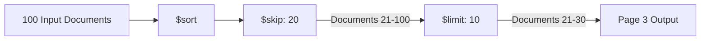

# How to Use $skip in MongoDB Aggregation for Pagination

Author: [nawazdhandala](https://www.github.com/nawazdhandala)

Tags: MongoDB, Aggregation, $skip, $limit, Pipeline, Stage, Pagination

Description: Learn how to use the $skip stage in MongoDB aggregation to implement pagination by skipping a specified number of documents in the pipeline.

---

## How $skip Works

The `$skip` stage skips over a specified number of documents and passes the remaining documents to the next stage. Combined with `$sort` and `$limit`, it is the classic method for implementing offset-based pagination in MongoDB.



## Syntax

```javascript
{ $skip: <positive integer> }
```

The value must be a non-negative integer. A value of `0` skips no documents.

## Pagination Formula

For a given page size and page number (1-indexed):

```text
skip  = (pageNumber - 1) * pageSize
limit = pageSize
```

## Examples

### Input Documents

A `products` collection with 10 documents:

```javascript
[
  { _id: 1, name: "Product A", price: 10 },
  { _id: 2, name: "Product B", price: 20 },
  { _id: 3, name: "Product C", price: 15 },
  { _id: 4, name: "Product D", price: 30 },
  { _id: 5, name: "Product E", price: 25 },
  { _id: 6, name: "Product F", price: 12 },
  { _id: 7, name: "Product G", price: 18 },
  { _id: 8, name: "Product H", price: 22 },
  { _id: 9, name: "Product I", price: 35 },
  { _id: 10, name: "Product J", price: 8  }
]
```

### Example 1 - Basic Pagination (Page 1)

Retrieve page 1 with 3 items per page. Skip 0 documents:

```javascript
db.products.aggregate([
  { $sort: { _id: 1 } },
  { $skip: 0 },
  { $limit: 3 }
])
```

Output (items 1-3):

```javascript
[
  { _id: 1, name: "Product A", price: 10 },
  { _id: 2, name: "Product B", price: 20 },
  { _id: 3, name: "Product C", price: 15 }
]
```

### Example 2 - Page 2

Skip 3 documents to get page 2:

```javascript
db.products.aggregate([
  { $sort: { _id: 1 } },
  { $skip: 3 },
  { $limit: 3 }
])
```

Output (items 4-6):

```javascript
[
  { _id: 4, name: "Product D", price: 30 },
  { _id: 5, name: "Product E", price: 25 },
  { _id: 6, name: "Product F", price: 12 }
]
```

### Example 3 - Dynamic Pagination

A reusable pattern using variables for `page` and `pageSize`:

```javascript
function getPage(page, pageSize) {
  return db.products.aggregate([
    { $sort: { _id: 1 } },
    { $skip: (page - 1) * pageSize },
    { $limit: pageSize }
  ]).toArray();
}

// Get page 3 with 3 items per page
getPage(3, 3);
```

Output (items 7-9):

```javascript
[
  { _id: 7, name: "Product G", price: 18 },
  { _id: 8, name: "Product H", price: 22 },
  { _id: 9, name: "Product I", price: 35 }
]
```

### Example 4 - Pagination with Total Count Using $facet

A common requirement is to return both the paginated results and the total count in one query. Use `$facet` for this:

```javascript
db.products.aggregate([
  { $sort: { _id: 1 } },
  {
    $facet: {
      metadata: [{ $count: "total" }],
      data: [{ $skip: 3 }, { $limit: 3 }]
    }
  }
])
```

Output:

```javascript
[
  {
    metadata: [{ total: 10 }],
    data: [
      { _id: 4, name: "Product D", price: 30 },
      { _id: 5, name: "Product E", price: 25 },
      { _id: 6, name: "Product F", price: 12 }
    ]
  }
]
```

### Example 5 - Pagination After $match and $group

You can paginate on aggregated results as well:

```javascript
db.orders.aggregate([
  { $match: { status: "completed" } },
  { $group: { _id: "$customerId", totalSpent: { $sum: "$amount" } } },
  { $sort: { totalSpent: -1 } },
  { $skip: 10 },
  { $limit: 5 }
])
```

## Performance Considerations

Offset-based pagination using `$skip` works well for small offsets but degrades at large page numbers because MongoDB must still scan and discard all skipped documents.

For large datasets or deep pagination, use cursor-based (keyset) pagination instead:

```javascript
// Instead of skip/limit, use a "last seen" value
db.products.aggregate([
  { $match: { _id: { $gt: lastSeenId } } },
  { $sort: { _id: 1 } },
  { $limit: 3 }
])
```

This approach is more efficient because MongoDB only scans documents starting from the given `_id`.

## Use Cases

- Implementing page-based navigation in web applications
- Paginating large result sets from reports and dashboards
- Combining with `$facet` to return paginated data and total counts together

## Summary

The `$skip` stage skips a specified number of documents and is almost always paired with `$sort` and `$limit` to implement offset-based pagination. The standard formula is `skip = (page - 1) * pageSize`. While convenient, offset pagination can be slow at large page numbers; for high-performance deep pagination, prefer cursor-based pagination using a range filter on an indexed field.
