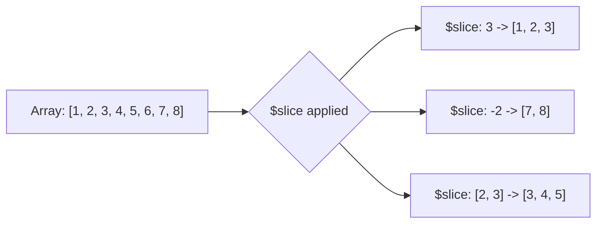

# How to Use $slice in MongoDB for Array Projection

Author: [nawazdhandala](https://www.github.com/nawazdhandala)

Tags: MongoDB, $slice, Array, Projection, Query

Description: Learn how to use MongoDB's $slice projection operator to return a subset of array elements, including first N, last N, and range-based slicing.

---

## How $slice Works

`$slice` is a projection operator that limits the number of array elements returned in a query result. It is used in the projection argument of `find()` and returns a slice of the array rather than the entire array. This is useful for paginating through array contents or previewing the most recent items in an array.



## Syntax

```javascript
// Return first N elements
{ field: { $slice: N } }

// Return last N elements (use negative number)
{ field: { $slice: -N } }

// Return M elements starting at position skip
{ field: { $slice: [skip, limit] } }
```

## Returning the First N Elements

Return only the first 3 comments on a post:

```javascript
db.posts.insertOne({
  title: "My Blog Post",
  comments: [
    { user: "Alice", text: "Great post!" },
    { user: "Bob", text: "Very helpful." },
    { user: "Carol", text: "Thanks for sharing." },
    { user: "Dave", text: "Could be clearer." },
    { user: "Eve", text: "Excellent!" }
  ]
})

// Return only the first 3 comments
db.posts.find(
  { title: "My Blog Post" },
  { title: 1, comments: { $slice: 3 } }
)
```

Result:

```javascript
{
  title: "My Blog Post",
  comments: [
    { user: "Alice", text: "Great post!" },
    { user: "Bob", text: "Very helpful." },
    { user: "Carol", text: "Thanks for sharing." }
  ]
}
```

## Returning the Last N Elements

Use a negative number to return elements from the end of the array:

```javascript
// Return the last 2 comments
db.posts.find(
  {},
  { title: 1, comments: { $slice: -2 } }
)
```

This is useful for "most recent" patterns where new items are appended to the end.

## Returning a Range with Skip and Limit

Use the two-element array form to skip elements and then return a count:

```javascript
// Skip the first 2 comments, then return the next 3
db.posts.find(
  {},
  { title: 1, comments: { $slice: [2, 3] } }
)
```

This is similar to `OFFSET 2 LIMIT 3` in SQL and enables pagination through array elements.

## Pagination through Array Elements

For paginating comments on a single post:

```javascript
const page = 2
const pageSize = 5
const skip = (page - 1) * pageSize  // = 5

db.posts.find(
  { _id: ObjectId("64a1b2c3d4e5f6789012345a") },
  { title: 1, comments: { $slice: [skip, pageSize] } }
)
```

## $slice with Other Projections

`$slice` can be combined with other field projections:

```javascript
// Return title, first 3 comments, and rating - exclude _id
db.posts.find(
  {},
  {
    title: 1,
    rating: 1,
    comments: { $slice: 3 },
    _id: 0
  }
)
```

Note: when `$slice` is used in the projection, other fields can be included or excluded using the standard `0` and `1` notation.

## $slice with Negative Skip (Skipping from End)

A negative skip value in the two-argument form counts from the end:

```javascript
// Start 3 positions from the end, return 2 elements
// For array [1, 2, 3, 4, 5]: skip=-3 positions from end = start at index 2, return 2 -> [3, 4]
db.collection.find({}, { arrayField: { $slice: [-3, 2] } })
```

## When $slice Returns the Full Array

If the requested slice size exceeds the array length, `$slice` returns the full array without error:

```javascript
// Array has 3 elements, requesting first 10 - returns all 3
db.posts.find({}, { comments: { $slice: 10 } })
```

## Use Cases

- Showing the first N comments or reviews for a preview
- Returning the most recent N activity log entries
- Implementing pagination through array elements in a document
- Displaying a brief excerpt of a long embedded list
- Returning only the latest version in a version history array

## Summary

`$slice` is the projection operator for returning a subset of array elements. Use a positive integer to get the first N elements, a negative integer to get the last N, and a `[skip, limit]` pair for range-based access. It integrates with other projection fields and does not throw errors when the requested slice exceeds the array length. For pagination patterns, `$slice` with a computed skip offset provides a simple way to page through array contents without loading the entire array.
