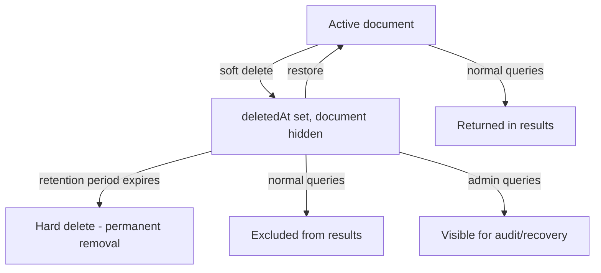

# How to Implement Soft Deletes in MongoDB

Author: [nawazdhandala](https://www.github.com/nawazdhandala)

Tags: MongoDB, Soft delete, Schema design, Data modeling, Query

Description: Learn how to implement soft deletes in MongoDB using a deletedAt flag, keep queries clean with partial indexes, and safely purge old records.

---

## What Is a Soft Delete

A soft delete marks a document as deleted without removing it from the collection. The original data is preserved for auditing, recovery, or regulatory compliance. A later hard-delete job can permanently remove records after a retention period.



## Schema Design

Add two optional fields to every soft-deletable collection: `deletedAt` (a Date or null) and optionally `deletedBy` (the actor who deleted it).

```javascript
// User document - active
{
  _id: ObjectId("64a1..."),
  name: "Alice",
  email: "alice@example.com",
  createdAt: ISODate("2026-01-15T09:00:00Z"),
  deletedAt: null,
  deletedBy: null
}

// User document - soft deleted
{
  _id: ObjectId("64a1..."),
  name: "Alice",
  email: "alice@example.com",
  createdAt: ISODate("2026-01-15T09:00:00Z"),
  deletedAt: ISODate("2026-03-31T14:22:00Z"),
  deletedBy: "admin-user-id"
}
```

## Performing a Soft Delete

```javascript
const { MongoClient, ObjectId } = require("mongodb");

const client = new MongoClient(process.env.MONGO_URI);
const db = client.db("myapp");

async function softDelete(collectionName, id, deletedBy) {
  const result = await db.collection(collectionName).updateOne(
    { _id: new ObjectId(id), deletedAt: null },
    {
      $set: {
        deletedAt: new Date(),
        deletedBy: deletedBy
      }
    }
  );
  return result.modifiedCount === 1;
}

async function restore(collectionName, id) {
  const result = await db.collection(collectionName).updateOne(
    { _id: new ObjectId(id), deletedAt: { $ne: null } },
    { $set: { deletedAt: null, deletedBy: null } }
  );
  return result.modifiedCount === 1;
}
```

## Querying Active Documents

Every query must filter out deleted documents. Centralise this logic so it cannot be forgotten.

```javascript
// Centralise the active-only filter
function activeFilter(extra = {}) {
  return { ...extra, deletedAt: null };
}

// List active users
const users = await db.collection("users")
  .find(activeFilter({ role: "editor" }))
  .sort({ name: 1 })
  .toArray();

// Find one active user by email
const user = await db.collection("users")
  .findOne(activeFilter({ email: "alice@example.com" }));

// Count active posts by a user
const count = await db.collection("posts")
  .countDocuments(activeFilter({ authorId: userId }));
```

## Using a Partial Index to Keep Queries Fast

A partial index on `deletedAt: null` indexes only active documents, making the index small and query lookups fast.

```javascript
// Partial index - indexes only active (non-deleted) documents
db.users.createIndex(
  { email: 1 },
  {
    unique: true,
    partialFilterExpression: { deletedAt: null }
  }
);

// This allows two users to have the same email if one is soft-deleted
// while still enforcing uniqueness among active users

// Index for paginating active users by name
db.users.createIndex(
  { name: 1, _id: 1 },
  { partialFilterExpression: { deletedAt: null } }
);

// Index to support the admin "find deleted items" query
db.users.createIndex(
  { deletedAt: 1 },
  { sparse: true }  // only index documents where deletedAt exists and is non-null
);
```

## Listing Deleted Documents for Admin / Recovery

```javascript
// All soft-deleted documents for a given collection
async function listDeleted(collectionName, { limit = 50, skip = 0 } = {}) {
  return db.collection(collectionName)
    .find({ deletedAt: { $ne: null } })
    .sort({ deletedAt: -1 })
    .skip(skip)
    .limit(limit)
    .toArray();
}

// Deleted within the last 30 days
const recentlyDeleted = await db.collection("orders").find({
  deletedAt: { $gte: new Date(Date.now() - 30 * 24 * 60 * 60 * 1000) }
}).toArray();
```

## Enforcing Unique Constraints with Soft Deletes

Without a partial index a deleted user blocks a new registration with the same email. The partial index above solves this. Here is a demonstration:

```javascript
// Active user: alice@example.com
await db.collection("users").insertOne({
  email: "alice@example.com",
  deletedAt: null
});

// Soft delete Alice
await softDelete("users", aliceId, "admin");

// Re-register with the same email - succeeds because the partial unique index
// only covers { deletedAt: null } documents
await db.collection("users").insertOne({
  email: "alice@example.com",
  deletedAt: null
});
```

## Hard-Delete Purge Job

Schedule a job that permanently removes records whose `deletedAt` is older than the retention period.

```javascript
async function purgeExpiredDeletes(db, collectionName, retentionDays = 90) {
  const cutoff = new Date(Date.now() - retentionDays * 24 * 60 * 60 * 1000);

  const result = await db.collection(collectionName).deleteMany({
    deletedAt: { $ne: null, $lt: cutoff }
  });

  console.log(`Purged ${result.deletedCount} records from ${collectionName}`);
  return result.deletedCount;
}

// Run nightly
await purgeExpiredDeletes(db, "users", 90);
await purgeExpiredDeletes(db, "posts", 90);
```

## Handling References to Soft-Deleted Documents

When a document is soft-deleted, related collections may still reference it. Decide upfront whether to cascade soft deletes or leave orphaned references.

```javascript
// Cascade soft delete: soft-delete all comments when a post is deleted
async function softDeletePost(db, postId, deletedBy) {
  const now = new Date();
  const session = db.client.startSession();

  try {
    await session.withTransaction(async () => {
      await db.collection("posts").updateOne(
        { _id: postId, deletedAt: null },
        { $set: { deletedAt: now, deletedBy } },
        { session }
      );
      await db.collection("comments").updateMany(
        { postId, deletedAt: null },
        { $set: { deletedAt: now, deletedBy: "cascade" } },
        { session }
      );
    });
  } finally {
    await session.endSession();
  }
}
```

## Summary

Implementing soft deletes in MongoDB requires adding a `deletedAt` field, filtering all normal queries with `{ deletedAt: null }`, and using a partial index to keep both performance and uniqueness constraints intact. A separate purge job handles permanent removal after the retention period. Centralising the active-filter function prevents the pattern from leaking inconsistencies into application code.
