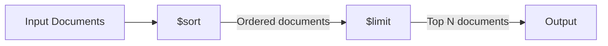

# How to Use $sort and $limit in MongoDB Aggregation

Author: [nawazdhandala](https://www.github.com/nawazdhandala)

Tags: MongoDB, Aggregation, $sort, $limit, Pipeline, Stage

Description: Learn how to use $sort and $limit stages in MongoDB aggregation pipelines to order results and restrict the number of output documents.

---

## How $sort and $limit Work

The `$sort` stage reorders documents in the pipeline based on one or more fields. The `$limit` stage restricts the number of documents passed to the next stage. Together they are used to implement "top N" queries, leaderboards, and paged results.



## Syntax

```javascript
// $sort
{ $sort: { <field1>: <1 or -1>, <field2>: <1 or -1>, ... } }

// $limit
{ $limit: <positive integer> }
```

- `1` = ascending order
- `-1` = descending order

## Examples

### Input Documents

```javascript
[
  { _id: 1, name: "Alice", score: 92, department: "Engineering" },
  { _id: 2, name: "Bob",   score: 78, department: "Marketing"   },
  { _id: 3, name: "Carol", score: 95, department: "Engineering" },
  { _id: 4, name: "Dave",  score: 85, department: "Marketing"   },
  { _id: 5, name: "Eve",   score: 88, department: "Engineering" }
]
```

### Example 1 - Sort Ascending

Sort employees by score from lowest to highest:

```javascript
db.employees.aggregate([
  { $sort: { score: 1 } }
])
```

Output:

```javascript
[
  { _id: 2, name: "Bob",   score: 78, department: "Marketing"   },
  { _id: 4, name: "Dave",  score: 85, department: "Marketing"   },
  { _id: 5, name: "Eve",   score: 88, department: "Engineering" },
  { _id: 1, name: "Alice", score: 92, department: "Engineering" },
  { _id: 3, name: "Carol", score: 95, department: "Engineering" }
]
```

### Example 2 - Sort Descending and Limit (Top N)

Get the top 3 highest-scoring employees:

```javascript
db.employees.aggregate([
  { $sort: { score: -1 } },
  { $limit: 3 }
])
```

Output:

```javascript
[
  { _id: 3, name: "Carol", score: 95, department: "Engineering" },
  { _id: 1, name: "Alice", score: 92, department: "Engineering" },
  { _id: 5, name: "Eve",   score: 88, department: "Engineering" }
]
```

### Example 3 - Multi-Field Sort

Sort by `department` ascending, then by `score` descending within each department:

```javascript
db.employees.aggregate([
  { $sort: { department: 1, score: -1 } }
])
```

Output:

```javascript
[
  { _id: 3, name: "Carol", score: 95, department: "Engineering" },
  { _id: 1, name: "Alice", score: 92, department: "Engineering" },
  { _id: 5, name: "Eve",   score: 88, department: "Engineering" },
  { _id: 4, name: "Dave",  score: 85, department: "Marketing"   },
  { _id: 2, name: "Bob",   score: 78, department: "Marketing"   }
]
```

### Example 4 - $sort After $group

Find the department with the highest average score:

```javascript
db.employees.aggregate([
  {
    $group: {
      _id: "$department",
      avgScore: { $avg: "$score" }
    }
  },
  { $sort: { avgScore: -1 } },
  { $limit: 1 }
])
```

Output:

```javascript
[
  { _id: "Engineering", avgScore: 91.67 }
]
```

### Example 5 - $limit Without $sort

`$limit` can be used on its own to cap results, though without a sort the returned documents are indeterminate:

```javascript
db.employees.aggregate([
  { $match: { department: "Engineering" } },
  { $limit: 2 }
])
```

## Performance Tips

**$sort on indexed fields.** When `$sort` is the first stage (or follows an early `$match`), MongoDB can use an index to avoid in-memory sorting.

```javascript
// Create an index to support this sort
db.employees.createIndex({ score: -1 })
```

**Combine $sort + $limit for efficiency.** When `$sort` is immediately followed by `$limit`, MongoDB performs an optimized sort that only tracks the top N documents in memory rather than sorting the entire set.

```javascript
// This combination is automatically optimized
db.employees.aggregate([
  { $sort: { score: -1 } },
  { $limit: 10 }
])
```

**Memory limit.** By default, `$sort` uses up to 100 MB of RAM. For larger datasets, enable `allowDiskUse`:

```javascript
db.employees.aggregate(
  [{ $sort: { score: -1 } }],
  { allowDiskUse: true }
)
```

## Use Cases

- Building leaderboards (top scores, most sales, highest revenue)
- Getting the most recent N records after sorting by a timestamp
- Sorting paginated results consistently before applying `$skip` and `$limit`
- Finding the highest or lowest value document without `$group`

## Summary

`$sort` orders pipeline documents by one or more fields in ascending or descending order, and `$limit` caps the number of documents flowing to subsequent stages. When used together, they form the backbone of "top N" queries. For best performance, sort on indexed fields and use `allowDiskUse` for large datasets that exceed the 100 MB in-memory sort limit.
