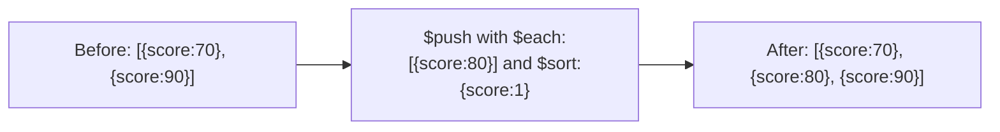

# How to Use $sort with $push in MongoDB to Sort Arrays on Update

Author: [nawazdhandala](https://www.github.com/nawazdhandala)

Tags: MongoDB, $sort, $push, Array, Update, Operator

Description: Learn how to use MongoDB's $sort modifier with $push to automatically sort an array after adding new elements, keeping embedded document arrays organized on every update.

---

## How $sort Works with $push

The `$sort` modifier sorts the entire array after new elements are pushed. It must be used with `$each` (even if `$each` receives an empty array `[]` - which sorts without adding new elements). `$sort` can sort by embedded document fields or by the element value itself for arrays of scalars.



## Syntax

```javascript
{
  $push: {
    arrayField: {
      $each: [elements],
      $sort: { field: 1 }    // 1 for ascending, -1 for descending
    }
  }
}
```

For arrays of scalar values, sort by the element itself:

```javascript
{ $sort: 1 }   // ascending
{ $sort: -1 }  // descending
```

## Sorting Arrays of Embedded Documents

Maintain a leaderboard sorted by score in descending order:

```javascript
// Before:
// {
//   _id: 1,
//   leaderboard: [
//     { player: "Alice", score: 700 },
//     { player: "Bob", score: 900 }
//   ]
// }

db.games.updateOne(
  { _id: 1 },
  {
    $push: {
      leaderboard: {
        $each: [{ player: "Carol", score: 800 }],
        $sort: { score: -1 }
      }
    }
  }
)

// After:
// leaderboard: [
//   { player: "Bob", score: 900 },
//   { player: "Carol", score: 800 },
//   { player: "Alice", score: 700 }
// ]
```

## Sorting Arrays of Scalar Values

For arrays of numbers or strings, use `$sort: 1` or `$sort: -1` directly:

```javascript
// Before: { _id: 2, numbers: [5, 1, 3] }

db.lists.updateOne(
  { _id: 2 },
  {
    $push: {
      numbers: {
        $each: [4, 2],
        $sort: 1
      }
    }
  }
)

// After: { _id: 2, numbers: [1, 2, 3, 4, 5] }
```

## Sorting Without Adding New Elements

Use `$each: []` with `$sort` to sort an existing array without adding new elements:

```javascript
// Sort the existing array without pushing anything new
db.events.updateOne(
  { _id: 3 },
  {
    $push: {
      attendees: {
        $each: [],
        $sort: { name: 1 }
      }
    }
  }
)
```

## Multi-Field Sort

Sort by multiple fields using the standard sort document:

```javascript
db.products.updateOne(
  { storeId: "store-001" },
  {
    $push: {
      inventory: {
        $each: [{ name: "Widget", category: "A", stock: 50 }],
        $sort: { category: 1, name: 1 }
      }
    }
  }
)
```

## Combining $sort with $slice

Push, sort, and cap the array in one atomic operation:

```javascript
// Keep only the top 10 scores
db.games.updateOne(
  { _id: 4 },
  {
    $push: {
      topScores: {
        $each: [
          { player: "Dave", score: 1100 },
          { player: "Eve", score: 950 }
        ],
        $sort: { score: -1 },
        $slice: 10
      }
    }
  }
)
```

The operation order is: insert with `$each`, then sort with `$sort`, then trim with `$slice`.

## Combining $sort with $position and $slice

```javascript
db.articles.updateOne(
  { _id: 5 },
  {
    $push: {
      comments: {
        $each: [{ author: "Frank", likes: 25, text: "Great!" }],
        $position: 0,
        $sort: { likes: -1 },
        $slice: 20
      }
    }
  }
)
```

## Sorting Stability

MongoDB's array sort is not guaranteed to be stable for equal values. If two elements have the same sort key value, their relative order may not be preserved. For stable sorting of ties, include a secondary sort key like a timestamp or ID.

## Use Cases

- Maintaining a leaderboard sorted by score after each new entry
- Keeping a list of comments sorted by likes or timestamp
- Maintaining a sorted tag or category list on a document
- Tracking price history sorted by date
- Keeping inventory sorted alphabetically or by stock level

## Summary

The `$sort` modifier with `$push` and `$each` sorts the entire array after new elements are added, enabling self-sorting arrays in MongoDB. Use a document with field names for sorting arrays of embedded objects and a plain `1` or `-1` for scalar arrays. Use `$each: []` with `$sort` to sort an existing array without adding new elements. Combine with `$slice` to maintain a sorted, bounded array in a single atomic operation - ideal for leaderboards, top-N lists, and sorted history arrays.
