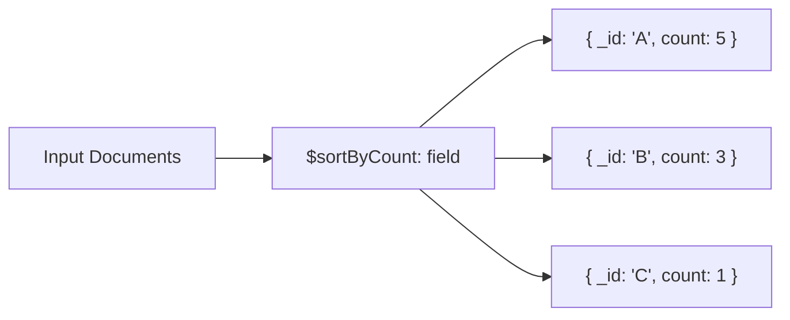

# How to Use $sortByCount in MongoDB Aggregation

Author: [nawazdhandala](https://www.github.com/nawazdhandala)

Tags: MongoDB, Aggregation, $sortByCount, Pipeline, Stage

Description: Learn how to use $sortByCount in MongoDB aggregation as a shorthand for grouping by a field and sorting by the count of documents in each group.

---

## How $sortByCount Works

The `$sortByCount` stage groups documents by a specified expression, counts the number of documents in each group, and sorts the results by count in descending order. It is shorthand for a `$group` followed by a `$sort`:

```javascript
{ $sortByCount: "$field" }
// is equivalent to:
{ $group: { _id: "$field", count: { $sum: 1 } } },
{ $sort: { count: -1 } }
```



## Syntax

```javascript
{ $sortByCount: <expression> }
```

The expression is typically a field reference like `"$category"` or a more complex expression that evaluates to a groupable value.

## Examples

### Input Documents

```javascript
[
  { _id: 1, product: "Laptop",  category: "Electronics", tag: "new" },
  { _id: 2, product: "Phone",   category: "Electronics", tag: "sale" },
  { _id: 3, product: "Desk",    category: "Furniture",   tag: "new" },
  { _id: 4, product: "Chair",   category: "Furniture",   tag: "new" },
  { _id: 5, product: "Monitor", category: "Electronics", tag: "sale" },
  { _id: 6, product: "Lamp",    category: "Furniture",   tag: "new" }
]
```

### Example 1 - Count by Category

```javascript
db.products.aggregate([
  { $sortByCount: "$category" }
])
```

Output:

```javascript
[
  { _id: "Furniture",   count: 3 },
  { _id: "Electronics", count: 3 }
]
```

When counts are equal, the order is undefined (no secondary sort is applied).

### Example 2 - Count by Tag

```javascript
db.products.aggregate([
  { $sortByCount: "$tag" }
])
```

Output:

```javascript
[
  { _id: "new",  count: 4 },
  { _id: "sale", count: 2 }
]
```

### Example 3 - $sortByCount on Array Elements (After $unwind)

Given products with an array of tags, count each tag's frequency:

```javascript
// Input: { _id: 1, name: "Laptop", tags: ["electronics", "computers", "sale"] }
db.products.aggregate([
  { $unwind: "$tags" },
  { $sortByCount: "$tags" }
])
```

Output:

```javascript
[
  { _id: "electronics", count: 8 },
  { _id: "sale",        count: 5 },
  { _id: "computers",   count: 3 }
]
```

### Example 4 - $sortByCount with an Expression

Group by a computed value - for example, the first character of the product name:

```javascript
db.products.aggregate([
  {
    $sortByCount: { $substr: ["$product", 0, 1] }
  }
])
```

Output:

```javascript
[
  { _id: "L", count: 2 },
  { _id: "P", count: 1 },
  { _id: "D", count: 1 },
  { _id: "C", count: 1 },
  { _id: "M", count: 1 }
]
```

### Example 5 - $match Before $sortByCount

Filter before counting to focus on a subset of documents:

```javascript
db.orders.aggregate([
  { $match: { date: { $gte: new Date("2026-01-01") } } },
  { $sortByCount: "$customerId" }
])
```

This gives you the most active customers in 2026, sorted from most to fewest orders.

### Example 6 - $limit After $sortByCount

Get the top 3 most common categories:

```javascript
db.products.aggregate([
  { $sortByCount: "$category" },
  { $limit: 3 }
])
```

## Comparison with Explicit $group + $sort

```javascript
// $sortByCount
db.products.aggregate([
  { $sortByCount: "$category" }
])

// Equivalent explicit pipeline
db.products.aggregate([
  { $group: { _id: "$category", count: { $sum: 1 } } },
  { $sort: { count: -1 } }
])
```

Use `$sortByCount` when you only need the count. Use the explicit form when you also need additional accumulators like `$avg`, `$push`, or `$sum` on other fields.

## Use Cases

- Finding the most common values in a field (top tags, categories, error types)
- Analyzing log data to find the most frequent error codes or endpoints
- Building tag clouds where word size corresponds to frequency
- Quickly identifying data distribution without a full `$group` pipeline

## Summary

`$sortByCount` is a concise shorthand for grouping by an expression, counting documents per group, and sorting by count descending. It outputs documents with `_id` (the group key) and `count` (the number of documents). Use `$limit` after `$sortByCount` for top-N frequency analysis, and `$unwind` before it to count individual array elements.
