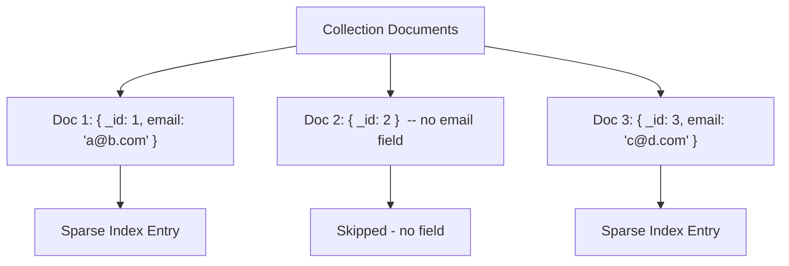

# How to Create a Sparse Index in MongoDB

Author: [nawazdhandala](https://www.github.com/nawazdhandala)

Tags: MongoDB, Index, Sparse Index, Optional Fields, Storage Optimization

Description: Learn how to create sparse indexes in MongoDB to index only documents that contain a specific field, saving storage and write overhead for optional or infrequently set fields.

---

## How Sparse Indexes Work

A sparse index only contains entries for documents that have the indexed field, even if the field value is `null`. Documents that do not contain the indexed field are excluded from the index entirely.

This contrasts with a standard (non-sparse) index, which includes an index entry for every document - even those without the field (where the value is treated as `null`).



## When to Use Sparse Indexes

Use a sparse index when:
- A field is optional and only present in a subset of documents.
- You want a unique constraint only on documents that have the field (not enforcing uniqueness for missing values).
- You want to save memory by not indexing documents that lack the field.

## Syntax

```javascript
db.collection.createIndex(
  { field: 1 },
  { sparse: true }
)
```

## Examples

### Basic Sparse Index

Create a sparse index on an optional `referralCode` field that only exists for some users:

```javascript
db.users.createIndex(
  { referralCode: 1 },
  { sparse: true, name: "idx_referralCode_sparse" }
)
```

Documents without `referralCode` are excluded from the index:

```javascript
db.users.insertMany([
  { _id: 1, name: "Alice", referralCode: "REF123" },  // indexed
  { _id: 2, name: "Bob" },                            // NOT in index
  { _id: 3, name: "Carol", referralCode: "REF456" }   // indexed
])
```

### Sparse Unique Index

A common use case is a unique sparse index: enforce uniqueness for documents that have the field, but allow multiple documents without the field:

```javascript
db.users.createIndex(
  { email: 1 },
  { unique: true, sparse: true }
)
```

This allows multiple documents with no `email` field while still preventing two documents from having the same email address.

### Querying with a Sparse Index

The sparse index is used when the query filter includes the indexed field:

```javascript
// Uses the sparse index
db.users.find({ referralCode: "REF123" })

// Does NOT use the sparse index (field absent from filter)
db.users.find({ name: "Bob" })
```

Important: a query that explicitly checks for documents where a field does not exist (`$exists: false`) will not use a sparse index and will do a collection scan:

```javascript
// Collection scan - sparse index is NOT used
db.users.find({ referralCode: { $exists: false } })
```

### Impact on Sort and Count

Be careful using sparse indexes with `sort()` or `count()` - they only include indexed documents, which can give unexpected results:

```javascript
// May return fewer results than expected if sorted field is sparse-indexed
db.users.find().sort({ referralCode: 1 })
```

MongoDB will use the sparse index for the sort and skip documents without `referralCode`. To avoid this, hint to use the `_id` index instead:

```javascript
db.users.find().sort({ referralCode: 1 }).hint({ _id: 1 })
```

### Node.js Example

```javascript
const { MongoClient } = require("mongodb");

async function main() {
  const client = new MongoClient("mongodb://localhost:27017");
  await client.connect();

  const users = client.db("myapp").collection("users");

  // Create sparse unique index on email
  await users.createIndex(
    { email: 1 },
    { unique: true, sparse: true, name: "idx_email_sparse_unique" }
  );

  // Insert documents - some with email, some without
  await users.insertMany([
    { _id: 1, name: "Alice", email: "alice@example.com" },
    { _id: 2, name: "Bob" },                              // no email - allowed
    { _id: 3, name: "Carol" },                            // no email - allowed
    { _id: 4, name: "Dave", email: "dave@example.com" }
  ]);

  // This would throw an error - duplicate email
  try {
    await users.insertOne({ _id: 5, name: "Eve", email: "alice@example.com" });
  } catch (err) {
    console.log("Duplicate email rejected:", err.message);
  }

  // Query using the sparse index
  const user = await users.findOne({ email: "dave@example.com" });
  console.log("Found:", user.name);

  // Count all users (includes those without email)
  const total = await users.countDocuments();
  console.log("Total users:", total); // 4

  await client.close();
}

main().catch(console.error);
```

## Partial Index vs Sparse Index

In modern MongoDB (3.2+), partial indexes are more flexible than sparse indexes:

- A sparse index is equivalent to a partial index with `{ filterExpression: { field: { $exists: true } } }`.
- Partial indexes let you filter on any condition, not just field existence.
- Prefer partial indexes for new work; sparse indexes are maintained for backward compatibility.

```javascript
// These two are equivalent:

// Sparse index (older approach)
db.users.createIndex({ email: 1 }, { sparse: true })

// Partial index (preferred modern approach)
db.users.createIndex(
  { email: 1 },
  { partialFilterExpression: { email: { $exists: true } } }
)
```

## Best Practices

- **Use sparse indexes for optional fields** that only appear in a fraction of documents to reduce index size.
- **Combine `sparse: true` with `unique: true`** when you want uniqueness among documents that have the field.
- **Prefer partial indexes for complex conditions.** Sparse indexes only filter on field existence; partial indexes support any filter expression.
- **Watch out for sort and count queries** - a sparse index changes which documents are included.
- **Use `explain()`** to verify when the sparse index is and is not being used.

## Summary

A sparse index in MongoDB stores entries only for documents that contain the indexed field, skipping documents where the field is absent. Create it with `{ sparse: true }` in the options. It is most useful for optional fields or for enforcing uniqueness only on documents that have the field. For more fine-grained control over which documents are indexed, use a partial index with `partialFilterExpression`.
