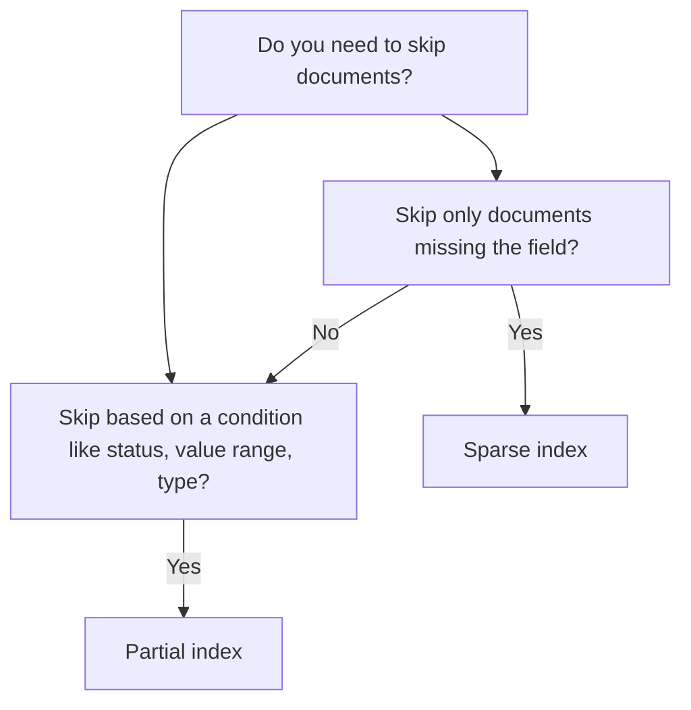

# How to Choose Between Sparse and Partial Indexes in MongoDB

MongoDB offers two mechanisms for creating indexes that skip certain documents: sparse indexes and partial indexes. While they overlap in some use cases, partial indexes are the more general and powerful tool. Understanding their differences helps you reduce index size, avoid null-related issues, and optimize write performance.

## Sparse Indexes

A sparse index only includes documents that contain the indexed field. Documents that are missing the field (or have `null` as the value) are excluded.

```javascript
// Create a sparse index on phoneNumber
db.users.createIndex({ phoneNumber: 1 }, { sparse: true });

// Only users WITH a phoneNumber are indexed
db.users.insertOne({ name: "Alice", email: "alice@example.com" });
// This document is NOT in the sparse index

db.users.insertOne({ name: "Bob", phoneNumber: "+1-555-1234", email: "bob@example.com" });
// This document IS in the sparse index
```

### Sparse Index and Unique Constraints

The most common use of sparse indexes is combining them with unique constraints to allow multiple documents to omit a field while still enforcing uniqueness where the field exists.

```javascript
db.users.createIndex({ phoneNumber: 1 }, { unique: true, sparse: true });

// Both of these succeed because phoneNumber is absent in both
db.users.insertMany([
  { name: "Alice" },
  { name: "Bob" }
]);

// This fails because +1-555-1234 already exists
db.users.insertOne({ name: "Carol", phoneNumber: "+1-555-1234" });
```

Without `sparse: true`, the first two inserts would fail because the unique index would treat `null` as the same value for both documents.

## Partial Indexes

A partial index includes only documents that match a specified filter expression. The filter can use any valid query predicate including `$exists`, `$gt`, `$lt`, `$in`, `$type`, or logical operators.

```javascript
// Index only active users
db.users.createIndex(
  { email: 1 },
  { partialFilterExpression: { status: "active" } }
);

// Index only documents where score is above threshold
db.results.createIndex(
  { userId: 1, score: -1 },
  { partialFilterExpression: { score: { $gt: 50 } } }
);
```

## Key Differences

| Feature | Sparse Index | Partial Index |
|---|---|---|
| Filter basis | Field existence | Any query expression |
| Null exclusion | Always excluded | Only if filter excludes null |
| Flexibility | Low | High |
| Filter expression | Implicit | Explicit |
| Unique constraint support | Yes | Yes |



## When to Use Sparse Indexes

- The indexed field is optional and you only want to find documents that have it
- You want to combine `unique: true` with an optional field
- The filter logic is simply "the field must exist and not be null"

```javascript
// Index optional metadata.externalId field
db.products.createIndex({ "metadata.externalId": 1 }, { sparse: true });
```

## When to Use Partial Indexes

Use partial indexes when you need more control than a simple existence check.

```javascript
// Only index unprocessed jobs -- processed jobs are rarely queried
db.jobs.createIndex(
  { createdAt: 1 },
  { partialFilterExpression: { status: { $in: ["pending", "in_progress"] } } }
);

// Only index high-value orders for fast lookup
db.orders.createIndex(
  { customerId: 1, total: -1 },
  { partialFilterExpression: { total: { $gte: 1000 } } }
);
```

Partial indexes keep the index small by excluding documents you rarely query, improving both memory efficiency and write throughput.

## Partial Index with Unique Constraint

Partial indexes also support unique constraints, scoped to the filtered document set.

```javascript
// Ensure email is unique among active users, but allow multiple inactive users
// to share an email (e.g., archived/deactivated accounts)
db.users.createIndex(
  { email: 1 },
  {
    unique: true,
    partialFilterExpression: { status: "active" }
  }
);
```

## Query Eligibility Requirement

For a query to use a partial index, the query filter must be a superset of the index filter expression. MongoDB will not use the partial index if the query could theoretically return documents that are not in the index.

```javascript
db.jobs.createIndex(
  { createdAt: 1 },
  { partialFilterExpression: { status: "pending" } }
);

// This query CAN use the partial index
// because the filter implies only pending documents
db.jobs.find({ status: "pending" }).sort({ createdAt: 1 });

// This query CANNOT use the partial index
// because it might return non-pending documents
db.jobs.find({}).sort({ createdAt: 1 });
```

## Checking Index Usage

```javascript
const plan = await db.collection("jobs")
  .find({ status: "pending" })
  .sort({ createdAt: 1 })
  .explain("executionStats");

console.log(plan.queryPlanner.winningPlan);
// Should show IXSCAN using the partial index
```

## Migration: Sparse to Partial

Sparse indexes are a special case of partial indexes. The equivalent partial index for a sparse index on field `f` is:

```javascript
// Sparse equivalent
db.col.createIndex({ f: 1 }, { sparse: true });

// Explicit partial equivalent
db.col.createIndex(
  { f: 1 },
  { partialFilterExpression: { f: { $exists: true } } }
);
```

Partial indexes are preferred in new code because they are more explicit about intent and support richer filter expressions.

## Summary

Sparse indexes are a simple way to exclude documents missing a field from an index, most commonly used with unique constraints on optional fields. Partial indexes are the more powerful successor, allowing you to define any query expression as the inclusion filter. Prefer partial indexes when you need to limit indexing to a meaningful subset of documents (such as active records, recent entries, or high-value items) because they offer smaller index sizes, better write performance, and explicit filter semantics. For queries to benefit from a partial index, the query filter must guarantee that only indexed documents could be returned.
