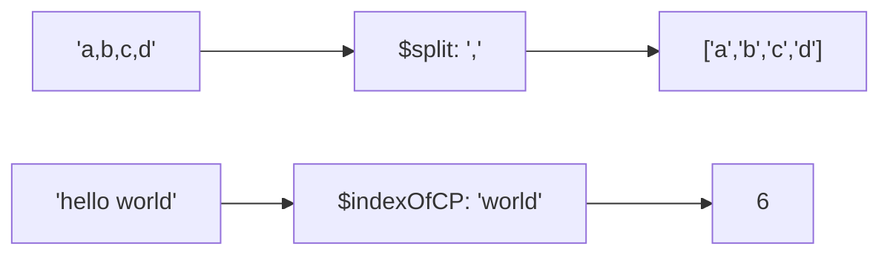

# How to Use $split and $indexOfCP in MongoDB Aggregation

Author: [nawazdhandala](https://www.github.com/nawazdhandala)

Tags: MongoDB, Aggregation, $split, $indexOfCP, Pipeline, String

Description: Learn how to use $split to divide strings into arrays and $indexOfCP to find substring positions in MongoDB aggregation pipelines.

---

## $split and $indexOfCP

`$split` divides a string into an array of substrings using a delimiter. `$indexOfCP` returns the code point index of the first occurrence of a substring within a string (returns `-1` if not found).

Together they enable string parsing tasks like extracting email domains, parsing CSV-like fields, and locating separators for substring extraction.



## Syntax

### $split

```javascript
{ $split: [ <string>, <delimiter> ] }
```

Returns an array of strings. If the delimiter is not found, the entire string is returned as a single-element array.

### $indexOfCP

```javascript
{ $indexOfCP: [ <string>, <substring>, <startIndex>, <endIndex> ] }
```

- `startIndex` and `endIndex` are optional code point bounds for the search.
- Returns `-1` if the substring is not found.
- Returns `null` if the string or substring is null.

## Examples

### Input Documents

```javascript
[
  { _id: 1, email: "alice@example.com",    fullName: "Alice Marie Smith",  tags: "mongodb,nosql,database" },
  { _id: 2, email: "bob@test.org",         fullName: "Bob Jones",          tags: "javascript,nodejs"      },
  { _id: 3, email: "carol@subdomain.io",   fullName: "Carol Davis",        tags: "python"                 }
]
```

### Example 1 - $split: Divide a Comma-Separated String

Split the `tags` string into an array:

```javascript
db.users.aggregate([
  {
    $project: {
      tagArray: { $split: ["$tags", ","] }
    }
  }
])
```

Output:

```javascript
[
  { _id: 1, tagArray: ["mongodb", "nosql", "database"] },
  { _id: 2, tagArray: ["javascript", "nodejs"]          },
  { _id: 3, tagArray: ["python"]                        }
]
```

### Example 2 - $split: Extract First Name

Split `fullName` on a space and take the first element:

```javascript
db.users.aggregate([
  {
    $project: {
      firstName: { $arrayElemAt: [{ $split: ["$fullName", " "] }, 0] },
      lastName:  { $arrayElemAt: [{ $split: ["$fullName", " "] }, -1] }
    }
  }
])
```

Output:

```javascript
[
  { _id: 1, firstName: "Alice", lastName: "Smith" },
  { _id: 2, firstName: "Bob",   lastName: "Jones" },
  { _id: 3, firstName: "Carol", lastName: "Davis" }
]
```

### Example 3 - $indexOfCP: Find Position of @

Find the position of `@` in each email:

```javascript
db.users.aggregate([
  {
    $project: {
      email: 1,
      atPosition: { $indexOfCP: ["$email", "@"] }
    }
  }
])
```

Output:

```javascript
[
  { _id: 1, email: "alice@example.com",  atPosition: 5 },
  { _id: 2, email: "bob@test.org",       atPosition: 3 },
  { _id: 3, email: "carol@subdomain.io", atPosition: 5 }
]
```

### Example 4 - $indexOfCP: Extract Username from Email

Extract everything before `@` using `$indexOfCP` and `$substrCP`:

```javascript
db.users.aggregate([
  {
    $project: {
      emailUser: {
        $substrCP: [
          "$email",
          0,
          { $indexOfCP: ["$email", "@"] }
        ]
      }
    }
  }
])
```

Output:

```javascript
[
  { _id: 1, emailUser: "alice" },
  { _id: 2, emailUser: "bob"   },
  { _id: 3, emailUser: "carol" }
]
```

### Example 5 - $indexOfCP: Extract Domain from Email

Extract everything after `@`:

```javascript
db.users.aggregate([
  {
    $project: {
      domain: {
        $substrCP: [
          "$email",
          { $add: [{ $indexOfCP: ["$email", "@"] }, 1] },
          { $strLenCP: "$email" }
        ]
      }
    }
  }
])
```

Output:

```javascript
[
  { _id: 1, domain: "example.com"  },
  { _id: 2, domain: "test.org"     },
  { _id: 3, domain: "subdomain.io" }
]
```

### Example 6 - Check if Substring Exists

Use `$indexOfCP` with `$gte` to detect whether a string contains a substring:

```javascript
db.users.aggregate([
  {
    $project: {
      email: 1,
      hasSubdomain: {
        $gte: [{ $indexOfCP: ["$email", "subdomain"] }, 0]
      }
    }
  }
])
```

Output:

```javascript
[
  { _id: 1, email: "alice@example.com",    hasSubdomain: false },
  { _id: 2, email: "bob@test.org",         hasSubdomain: false },
  { _id: 3, email: "carol@subdomain.io",   hasSubdomain: true  }
]
```

### Example 7 - $split Then $unwind for Tag Normalization

Split comma-separated tags and process each individually:

```javascript
db.users.aggregate([
  {
    $project: {
      tagArray: { $split: ["$tags", ","] }
    }
  },
  { $unwind: "$tagArray" },
  {
    $group: {
      _id: "$tagArray",
      count: { $sum: 1 }
    }
  },
  { $sort: { count: -1 } }
])
```

Output:

```javascript
[
  { _id: "mongodb",    count: 1 },
  { _id: "nosql",      count: 1 },
  { _id: "database",   count: 1 },
  { _id: "javascript", count: 1 },
  { _id: "nodejs",     count: 1 },
  { _id: "python",     count: 1 }
]
```

## $indexOfCP vs $indexOfBytes

Like `$strLenCP` vs `$strLenBytes`, use `$indexOfCP` for character-correct searching in strings with non-ASCII content.

## Use Cases

- Parsing CSV-like string fields into arrays
- Extracting username and domain from email addresses
- Splitting file paths to get directories or extensions
- Detecting whether a string contains a specific substring

## Summary

`$split` divides a string into an array using a delimiter, enabling array operators to process string segments. `$indexOfCP` finds the character position of a substring, which combines with `$substrCP` to extract string parts before or after a separator. These two operators are the foundation of string parsing patterns in MongoDB aggregation.
