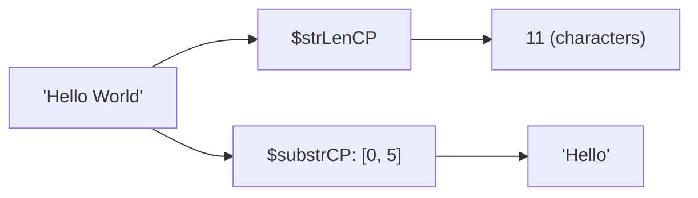

# How to Use $strLenCP and $substrCP in MongoDB Aggregation

Author: [nawazdhandala](https://www.github.com/nawazdhandala)

Tags: MongoDB, Aggregation, $strLenCP, $substrCP, Pipeline, String

Description: Learn how to use $strLenCP and $substrCP in MongoDB aggregation to measure string length and extract substrings using Unicode code point counting.

---

## $strLenCP and $substrCP

MongoDB provides two families of string length and substring operators:

- `$strLenBytes` / `$substrBytes` - operate on raw UTF-8 byte positions
- `$strLenCP` / `$substrCP` - operate on Unicode code point positions (character-aware)

The `CP` (code point) variants are preferred for strings that may contain multibyte Unicode characters (non-ASCII), because they count characters correctly rather than bytes.



## Syntax

### $strLenCP

```javascript
{ $strLenCP: <string expression> }
```

Returns the number of Unicode code points in the string.

### $substrCP

```javascript
{ $substrCP: [ <string expression>, <startIndex>, <length> ] }
```

- `startIndex` - zero-based starting code point index
- `length` - number of code points to extract; if the string is shorter, it returns what is available

## Examples

### Input Documents

```javascript
[
  { _id: 1, username: "alice_smith",   email: "alice@example.com", bio: "Software engineer from NY" },
  { _id: 2, username: "bob123",        email: "bob@test.org",      bio: "ML researcher"             },
  { _id: 3, username: "carol.jones",   email: "carol@company.io",  bio: ""                          }
]
```

### Example 1 - Measure String Length

Get the character count of `username`:

```javascript
db.users.aggregate([
  {
    $project: {
      username: 1,
      usernameLength: { $strLenCP: "$username" }
    }
  }
])
```

Output:

```javascript
[
  { _id: 1, username: "alice_smith",  usernameLength: 11 },
  { _id: 2, username: "bob123",       usernameLength: 6  },
  { _id: 3, username: "carol.jones",  usernameLength: 11 }
]
```

### Example 2 - Validate String Length

Filter users with usernames shorter than 5 characters:

```javascript
db.users.aggregate([
  {
    $match: {
      $expr: { $lt: [{ $strLenCP: "$username" }, 5] }
    }
  }
])
```

### Example 3 - Extract Substring

Get the first 5 characters of `username`:

```javascript
db.users.aggregate([
  {
    $project: {
      shortName: { $substrCP: ["$username", 0, 5] }
    }
  }
])
```

Output:

```javascript
[
  { _id: 1, shortName: "alice" },
  { _id: 2, shortName: "bob12" },
  { _id: 3, shortName: "carol" }
]
```

### Example 4 - Extract Domain from Email

Extract the domain portion (after `@`) from each email:

```javascript
db.users.aggregate([
  {
    $project: {
      email: 1,
      domain: {
        $substrCP: [
          "$email",
          { $add: [{ $indexOfCP: ["$email", "@"] }, 1] },   // start after @
          { $strLenCP: "$email" }                            // length = rest of string
        ]
      }
    }
  }
])
```

Output:

```javascript
[
  { _id: 1, email: "alice@example.com", domain: "example.com" },
  { _id: 2, email: "bob@test.org",      domain: "test.org"    },
  { _id: 3, email: "carol@company.io",  domain: "company.io"  }
]
```

Note: `$indexOfCP` returns the code point index of a substring; see the `$split` and `$indexOfCP` post for more detail.

### Example 5 - Truncate Bio to 10 Characters

Truncate `bio` to at most 10 characters, appending `"..."` if truncated:

```javascript
db.users.aggregate([
  {
    $project: {
      truncatedBio: {
        $cond: {
          if: { $gt: [{ $strLenCP: "$bio" }, 10] },
          then: { $concat: [{ $substrCP: ["$bio", 0, 10] }, "..."] },
          else: "$bio"
        }
      }
    }
  }
])
```

Output:

```javascript
[
  { _id: 1, truncatedBio: "Software e..." },
  { _id: 2, truncatedBio: "ML researc..." },
  { _id: 3, truncatedBio: "" }
]
```

### Example 6 - Extract Initials

Get the first letter of each word in `bio` (using split + map):

```javascript
db.users.aggregate([
  {
    $project: {
      initials: {
        $reduce: {
          input: { $split: ["$bio", " "] },
          initialValue: "",
          in: {
            $concat: [
              "$$value",
              { $substrCP: ["$$this", 0, 1] }
            ]
          }
        }
      }
    }
  }
])
```

Output:

```javascript
[
  { _id: 1, initials: "SefNY" },
  { _id: 2, initials: "MR"    },
  { _id: 3, initials: ""      }
]
```

## Bytes vs Code Points

For pure ASCII strings (a-z, A-Z, 0-9, common punctuation), bytes and code points are identical. For strings with multibyte characters (e.g., Chinese, Arabic, emoji), code point operators give the correct character count:

```javascript
// "Caf\u00e9" = "Café" (4 characters, 5 UTF-8 bytes)
{ $strLenCP:    "Café" }  // returns 4
{ $strLenBytes: "Café" }  // returns 5
```

Always prefer `CP` variants for user-facing string data.

## Use Cases

- Validating field length constraints (username minimum/maximum)
- Extracting substrings for preview snippets or truncated display
- Parsing structured strings (email domains, file extensions, prefixes)
- Building initials or abbreviations from full names or phrases

## Summary

`$strLenCP` returns the Unicode code point length of a string (character count), and `$substrCP` extracts a substring by code point index and length. Together they enable character-aware string length validation and substring extraction. Always prefer the `CP` variants over `Bytes` variants when working with non-ASCII text.
