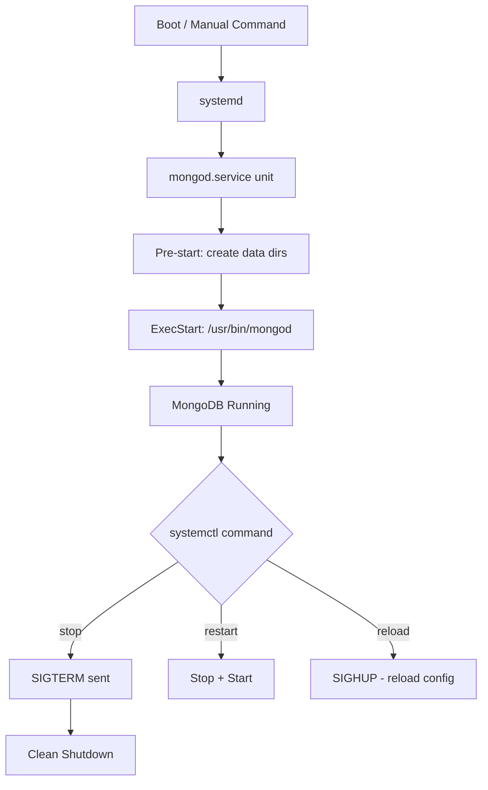

# How to Start and Stop MongoDB with systemd

Author: [nawazdhandala](https://www.github.com/nawazdhandala)

Tags: MongoDB, systemd, Linux, Operations, Administration

Description: Learn how to start, stop, restart, and enable MongoDB using systemd on Linux, including service management, status checks, and common troubleshooting steps.

---

## How systemd Manages MongoDB

On modern Linux distributions, MongoDB runs as a systemd service. systemd is the init system responsible for managing background services, handling startup order, and providing logging through journald. When you install MongoDB via a package manager (apt, yum, dnf), it registers a service unit file automatically.

The MongoDB service unit file is typically located at `/lib/systemd/system/mongod.service` or `/usr/lib/systemd/system/mongod.service`.



## Basic Service Commands

All systemd commands require root privileges or `sudo`.

Start the MongoDB service:

```bash
sudo systemctl start mongod
```

Stop the MongoDB service gracefully:

```bash
sudo systemctl stop mongod
```

Restart the service (useful after configuration changes):

```bash
sudo systemctl restart mongod
```

Reload configuration without a full restart (limited support in MongoDB):

```bash
sudo systemctl reload mongod
```

Check the current status of the service:

```bash
sudo systemctl status mongod
```

Example output from `systemctl status mongod`:

```text
● mongod.service - MongoDB Database Server
     Loaded: loaded (/lib/systemd/system/mongod.service; enabled; vendor preset: enabled)
     Active: active (running) since Mon 2026-03-31 10:00:00 UTC; 2min 3s ago
       Docs: https://docs.mongodb.org/manual
   Main PID: 1234 (mongod)
     CGroup: /system.slice/mongod.service
             └─1234 /usr/bin/mongod --config /etc/mongod.conf
```

## Enable and Disable Auto-Start

Enable MongoDB to start automatically at boot:

```bash
sudo systemctl enable mongod
```

Disable auto-start at boot:

```bash
sudo systemctl disable mongod
```

Check whether the service is enabled:

```bash
sudo systemctl is-enabled mongod
```

## Viewing MongoDB Logs via journald

systemd captures MongoDB's stdout and stderr through journald. View real-time logs with:

```bash
sudo journalctl -u mongod -f
```

View logs from the current boot session only:

```bash
sudo journalctl -u mongod -b
```

View the last 100 lines:

```bash
sudo journalctl -u mongod -n 100
```

Filter logs by time range:

```bash
sudo journalctl -u mongod --since "2026-03-31 09:00:00" --until "2026-03-31 10:00:00"
```

## The mongod.service Unit File

The default service unit file looks similar to the following. Understanding it helps you customize startup behavior.

```text
[Unit]
Description=MongoDB Database Server
Documentation=https://docs.mongodb.org/manual
After=network-online.target
Wants=network-online.target

[Service]
User=mongodb
Group=mongodb
EnvironmentFile=-/etc/default/mongod
ExecStart=/usr/bin/mongod --config /etc/mongod.conf
PIDFile=/var/run/mongodb/mongod.pid
# file size
LimitFSIZE=infinity
# cpu time
LimitCPU=infinity
# virtual memory size
LimitAS=infinity
# open files
LimitNOFILE=64000
# processes/threads
LimitNPROC=64000
# locked memory
LimitMEMLOCK=infinity
# total threads (user+kernel)
TasksMax=infinity
TasksAccounting=false

# Recommended limits for mongod as specified in
# https://docs.mongodb.com/manual/reference/ulimit/#recommended-ulimit-settings
# (file size, cpu time, virtual memory, open files, processes)

[Install]
WantedBy=multi-user.target
```

## Creating a Custom Override

Instead of modifying the default unit file directly (which gets overwritten on package upgrades), use a drop-in override:

```bash
sudo systemctl edit mongod
```

This opens an editor for a drop-in file at `/etc/systemd/system/mongod.service.d/override.conf`. Add custom settings such as a higher open file limit:

```text
[Service]
LimitNOFILE=128000
```

After editing, reload the systemd daemon:

```bash
sudo systemctl daemon-reload
sudo systemctl restart mongod
```

## Checking MongoDB is Listening After Start

After starting, confirm MongoDB is accepting connections on its port (default 27017):

```bash
ss -tlnp | grep 27017
```

Or use mongosh to verify:

```bash
mongosh --eval "db.adminCommand({ ping: 1 })"
```

Expected output:

```text
{ ok: 1 }
```

## Common Troubleshooting

If `systemctl start mongod` fails, check the journal for errors:

```bash
sudo journalctl -u mongod --no-pager | tail -50
```

Common reasons for startup failure:

- Data directory `/var/lib/mongodb` does not exist or has wrong ownership.
- Port 27017 already in use by another process.
- Invalid syntax in `/etc/mongod.conf`.
- SELinux or AppArmor policy blocking file access.

Fix data directory ownership:

```bash
sudo chown -R mongodb:mongodb /var/lib/mongodb
sudo chown mongodb:mongodb /tmp/mongodb-27017.sock
```

Validate the configuration file:

```bash
mongod --config /etc/mongod.conf --configTest
```

## Best Practices

- Always use `systemctl stop mongod` rather than killing the process with `kill -9` to allow MongoDB to flush data and close files cleanly.
- Enable the service at boot with `systemctl enable mongod` in production to ensure automatic recovery after reboots.
- Use `systemctl edit mongod` for customizations rather than modifying the package-owned unit file.
- Forward journald logs to a centralized logging system so you retain logs beyond the default journald retention period.
- Monitor the service with a health check tool that checks both the systemd state and the actual MongoDB ping response.

## Summary

Managing MongoDB with systemd is straightforward once you understand the key commands: `start`, `stop`, `restart`, `status`, `enable`, and `disable`. The `journalctl -u mongod` command gives you access to logs without needing to locate MongoDB's log file manually. For production systems, always enable the service at boot, use drop-in overrides for customizations, and verify that MongoDB is truly responsive after starting by running a ping command via mongosh.
