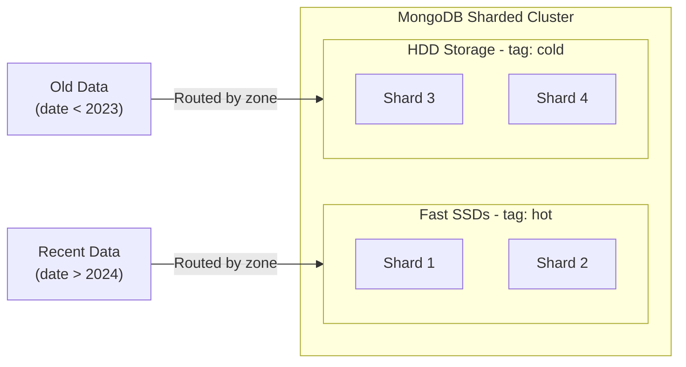

# How to Tag-Aware Sharding in MongoDB

Author: [OneUptime](https://www.github.com/oneuptime)

Tags: MongoDB, Sharding, Tag, Zone, Data Locality

Description: Learn how to use tag-aware (zone) sharding in MongoDB to pin specific shard key ranges to designated shards for compliance, performance, or multi-tenancy.

---

## Introduction

Tag-aware sharding (called zone sharding in MongoDB 3.4+) lets you assign shard key ranges to specific shards using tags (zones). This is useful for data locality requirements (keeping EU data in EU shards), multi-tenancy isolation (each customer on their own shard), or routing hot data to high-performance hardware and cold data to cheaper storage.

## Architecture: Tags Pinning Data to Shards



## Step 1: Add Tags to Shards

Connect to mongos and assign tags to shards:

```javascript
// Tag shards for hot (fast SSD) tier
sh.addShardTag("rs-shard1", "hot")
sh.addShardTag("rs-shard2", "hot")

// Tag shards for cold (archival) tier
sh.addShardTag("rs-shard3", "cold")
sh.addShardTag("rs-shard4", "cold")
```

Verify tags:

```javascript
use config
db.shards.find({}, { _id: 1, tags: 1 })
```

## Step 2: Enable Sharding with a Compatible Shard Key

The shard key must include the field(s) you want to use for range pinning:

```javascript
// Enable sharding on the database
db.adminCommand({ enableSharding: "analytics" })

// Create the index
use analytics
db.events.createIndex({ tier: 1, eventDate: 1 })

// Shard the collection
db.adminCommand({
  shardCollection: "analytics.events",
  key: { tier: 1, eventDate: 1 }
})
```

## Step 3: Add Tag Ranges

Assign shard key ranges to tags. Documents with shard key values in the range go to shards with that tag:

```javascript
// Hot tier: events with tier "hot"
sh.addTagRange(
  "analytics.events",
  { tier: "hot", eventDate: MinKey },   // Start of range (inclusive)
  { tier: "hot", eventDate: MaxKey },   // End of range (exclusive)
  "hot"                                  // Tag name
)

// Cold tier: events with tier "cold"
sh.addTagRange(
  "analytics.events",
  { tier: "cold", eventDate: MinKey },
  { tier: "cold", eventDate: MaxKey },
  "cold"
)
```

## Step 4: Verify Tag Ranges

```javascript
use config
db.tags.find({ ns: "analytics.events" }).pretty()
```

Expected output:

```javascript
[
  {
    _id: { ns: "analytics.events", min: { tier: "hot", eventDate: MinKey } },
    ns: "analytics.events",
    min: { tier: "hot", eventDate: MinKey },
    max: { tier: "hot", eventDate: MaxKey },
    tag: "hot"
  },
  {
    _id: { ns: "analytics.events", min: { tier: "cold", eventDate: MinKey } },
    ns: "analytics.events",
    min: { tier: "cold", eventDate: MinKey },
    max: { tier: "cold", eventDate: MaxKey },
    tag: "cold"
  }
]
```

## Step 5: Insert Data and Verify Routing

```javascript
use analytics

// Insert a hot event
db.events.insertOne({
  tier: "hot",
  eventDate: new Date(),
  action: "purchase",
  userId: "U-12345"
})

// Insert a cold event
db.events.insertOne({
  tier: "cold",
  eventDate: new Date("2020-01-15"),
  action: "login",
  userId: "U-99999"
})
```

Check where the documents landed:

```javascript
use config
db.chunks.find({
  ns: "analytics.events",
  "min.tier": "hot"
}, { shard: 1, min: 1, max: 1 })
// All hot chunks should be on rs-shard1 or rs-shard2
```

## Step 6: Multi-Tenant Sharding Example

For SaaS applications, pin each tenant to a specific shard:

```javascript
// Tag shards per tenant
sh.addShardTag("rs-shard1", "tenant-A")
sh.addShardTag("rs-shard2", "tenant-B")
sh.addShardTag("rs-shard3", "tenant-C")

// Assign ranges
sh.addTagRange(
  "saas.documents",
  { tenantId: "A", _id: MinKey },
  { tenantId: "A\uffff", _id: MaxKey },
  "tenant-A"
)

sh.addTagRange(
  "saas.documents",
  { tenantId: "B", _id: MinKey },
  { tenantId: "B\uffff", _id: MaxKey },
  "tenant-B"
)
```

## Step 7: Removing Tags

```javascript
// Remove a tag range
sh.removeTagRange(
  "analytics.events",
  { tier: "cold", eventDate: MinKey },
  { tier: "cold", eventDate: MaxKey },
  "cold"
)

// Remove a tag from a shard (zones still exist but shard is untagged)
sh.removeShardTag("rs-shard3", "cold")
```

## Summary

Tag-aware sharding in MongoDB routes documents to designated shards based on shard key ranges. Assign tags to shards with `sh.addShardTag()`, then define key ranges for those tags with `sh.addTagRange()`. This enables data locality for compliance, hardware tier differentiation (hot/cold), and multi-tenant isolation. The balancer enforces zone assignments by migrating chunks to the correct tagged shard automatically after ranges are configured.
