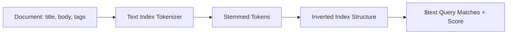

# How to Create a Text Index in MongoDB for Full-Text Search

Author: [nawazdhandala](https://www.github.com/nawazdhandala)

Tags: MongoDB, Index, Text Index, Full-Text Search, Query

Description: Learn how to create a text index in MongoDB to enable full-text search on string fields, including single-field, compound, and wildcard text indexes with scoring.

---

## How Text Indexes Work

A text index tokenizes and stems the words in indexed string fields and stores them in a data structure optimized for text search. When you run a `$text` query, MongoDB uses this index to find documents containing the searched terms and assigns each result a relevance score.

Key characteristics:
- Only one text index is allowed per collection.
- The index can cover multiple fields and assign different weights to each.
- Text indexes support stemming and stop-word removal based on the specified language.



## Syntax

```javascript
db.collection.createIndex(
  { field1: "text", field2: "text" },
  { weights: { field1: 10, field2: 5 }, default_language: "english" }
)
```

Use the special value `"text"` (a string, not 1 or -1) to designate a field as a text index field.

## Examples

### Single-Field Text Index

```javascript
db.articles.createIndex({ title: "text" })
```

### Multi-Field Text Index

A single text index can cover multiple fields. MongoDB treats all of them as one combined index.

```javascript
db.articles.createIndex({
  title: "text",
  body: "text",
  tags: "text"
})
```

### Weighted Text Index

Assign higher weights to more important fields so their matches rank higher in relevance scores.

```javascript
db.articles.createIndex(
  {
    title: "text",
    body: "text",
    tags: "text"
  },
  {
    weights: {
      title: 10,
      tags: 5,
      body: 1
    },
    name: "idx_articles_text"
  }
)
```

### Wildcard Text Index

Index all string fields in the collection using the `$**` wildcard:

```javascript
db.articles.createIndex({ "$**": "text" })
```

Use this sparingly as it indexes every string field, which increases index size and build time.

### Querying with $text

After creating the index, use the `$text` operator with a `$search` expression:

```javascript
// Find documents containing "mongodb" or "database"
db.articles.find({ $text: { $search: "mongodb database" } })

// Phrase search (exact phrase)
db.articles.find({ $text: { $search: "\"full text search\"" } })

// Exclude a term
db.articles.find({ $text: { $search: "mongodb -mysql" } })
```

### Sorting by Relevance Score

Use the `$meta` projection to retrieve and sort by the text score:

```javascript
db.articles.find(
  { $text: { $search: "mongodb index performance" } },
  { score: { $meta: "textScore" } }
).sort({ score: { $meta: "textScore" } })
```

### Node.js Full Example

```javascript
const { MongoClient } = require("mongodb");

async function main() {
  const client = new MongoClient("mongodb://localhost:27017");
  await client.connect();
  const articles = client.db("blog").collection("articles");

  // Create a weighted text index
  await articles.createIndex(
    { title: "text", body: "text", tags: "text" },
    {
      weights: { title: 10, tags: 5, body: 1 },
      name: "idx_articles_text",
      default_language: "english"
    }
  );

  // Insert sample documents
  await articles.insertMany([
    { title: "Getting Started with MongoDB", body: "MongoDB is a NoSQL database.", tags: ["mongodb", "database"] },
    { title: "Indexing in MongoDB", body: "Indexes improve query performance significantly.", tags: ["mongodb", "index"] },
    { title: "PostgreSQL vs MongoDB", body: "Comparing relational and document databases.", tags: ["postgresql", "mongodb"] }
  ]);

  // Full-text search with relevance scoring
  const results = await articles.find(
    { $text: { $search: "mongodb index" } },
    { score: { $meta: "textScore" } }
  ).sort({ score: { $meta: "textScore" } }).toArray();

  results.forEach(doc => {
    console.log(`Score: ${doc.score.toFixed(2)} - ${doc.title}`);
  });

  await client.close();
}

main().catch(console.error);
```

## Language Support

Specify a language for stemming and stop-word filtering:

```javascript
db.articles.createIndex(
  { content: "text" },
  { default_language: "french" }
)
```

To store documents in multiple languages, use a language override field:

```javascript
db.articles.createIndex(
  { content: "text" },
  { language_override: "lang" }
)

// Documents can specify their own language
db.articles.insertOne({
  content: "Bonjour le monde",
  lang: "french"
})
```

## Best Practices

- **Use weighted text indexes** when certain fields (like `title` or `tags`) should contribute more to relevance than others.
- **Avoid wildcard text indexes on large collections** - they significantly increase index size and build time.
- **Only one text index per collection** - plan your text index to cover all fields you need to search.
- **Text indexes do not support collation** - case-insensitive searches are handled automatically by stemming.
- **Combine text queries with other filters** to narrow results before text matching: `{ status: "published", $text: { $search: "mongodb" } }`.
- **Consider MongoDB Atlas Search** for advanced full-text search features like fuzzy matching, autocomplete, and facets.

## Summary

A text index in MongoDB enables full-text search across one or more string fields in a collection. Create it with `createIndex()` using the `"text"` value for each field to index, and optionally assign weights to control relevance scoring. Query using the `$text` operator and retrieve relevance scores with `$meta: "textScore"`. Each collection supports only one text index, so design it to cover all fields you plan to search.
