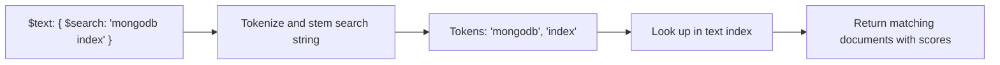

# How to Use $text Search Operator in MongoDB

Author: [nawazdhandala](https://www.github.com/nawazdhandala)

Tags: MongoDB, Full-Text Search, $text, Text Index, Query

Description: Learn how to use MongoDB's $text search operator to perform full-text searches, phrase queries, term exclusions, and relevance-scored results using text indexes.

---

## How $text Works

The `$text` operator performs a text search on fields that have a text index. It tokenizes the search string, stems each token, removes stop words, and matches against the text index entries. Results can be scored by relevance using the `$meta` projection.

Before using `$text`, you must create a text index on the collection:

```javascript
db.articles.createIndex({ title: "text", body: "text" })
```



## Syntax

```javascript
db.collection.find({
  $text: {
    $search: "<search string>",
    $language: "<language>",       // optional
    $caseSensitive: <boolean>,     // optional, default false
    $diacriticSensitive: <boolean> // optional, default false
  }
})
```

## Search String Syntax

The `$search` string supports several modes:

```text
Mode                Example                     Behavior
--------------------------------------------------------------
Word search         "mongodb database"          Matches docs with either word
Phrase search       "\"full text search\""      Matches the exact phrase
Term exclusion      "mongodb -mysql"            Matches "mongodb", excludes "mysql"
Combined            "\"mongodb\" -postgresql"   Phrase + exclusion
```

## Examples

### Setup: Create Collection and Index

```javascript
db.articles.createIndex(
  { title: "text", body: "text", tags: "text" },
  { weights: { title: 10, tags: 5, body: 1 }, name: "idx_articles_text" }
)

db.articles.insertMany([
  {
    _id: 1,
    title: "Getting Started with MongoDB",
    body: "MongoDB is a document-oriented NoSQL database.",
    tags: ["mongodb", "nosql", "database"]
  },
  {
    _id: 2,
    title: "MongoDB Index Types Explained",
    body: "Single-field, compound, text, and geospatial indexes all serve different purposes.",
    tags: ["mongodb", "index", "performance"]
  },
  {
    _id: 3,
    title: "PostgreSQL vs MongoDB: Which to Choose?",
    body: "Relational databases and document databases have different strengths.",
    tags: ["postgresql", "mongodb", "comparison"]
  },
  {
    _id: 4,
    title: "MySQL Performance Tuning",
    body: "Optimizing MySQL with indexes and query planning.",
    tags: ["mysql", "performance", "index"]
  }
])
```

### Word Search (OR Logic)

Find documents that contain either "mongodb" or "database":

```javascript
db.articles.find({ $text: { $search: "mongodb database" } })
// Returns: docs 1, 2, 3 (contain "mongodb" or "database")
```

### Phrase Search

Find documents containing the exact phrase:

```javascript
db.articles.find({ $text: { $search: "\"MongoDB Index Types\"" } })
// Returns: doc 2 only
```

### Term Exclusion

Find documents about databases but not PostgreSQL:

```javascript
db.articles.find({ $text: { $search: "database -postgresql" } })
// Returns: doc 1 (not doc 3 which mentions PostgreSQL)
```

### Search with Relevance Score

Retrieve results ordered by relevance:

```javascript
db.articles.find(
  { $text: { $search: "mongodb index performance" } },
  { score: { $meta: "textScore" }, title: 1, _id: 0 }
).sort({ score: { $meta: "textScore" } })
```

Sample output:

```text
{ title: "MongoDB Index Types Explained", score: 3.75 }
{ title: "Getting Started with MongoDB", score: 1.10 }
{ title: "PostgreSQL vs MongoDB: Which to Choose?", score: 0.75 }
```

### Case-Sensitive Search

By default `$text` is case-insensitive. Enable case sensitivity:

```javascript
db.articles.find({
  $text: {
    $search: "MongoDB",
    $caseSensitive: true
  }
})
// Only matches documents where "MongoDB" appears with that exact casing
```

### Language Specification

Override the default language for stemming:

```javascript
db.articles.find({
  $text: {
    $search: "chercher",
    $language: "french"
  }
})
```

### Combine $text with Other Filters

```javascript
// Find MongoDB articles published in 2026
db.articles.find({
  $text: { $search: "mongodb" },
  publishedYear: 2026
})
```

### Aggregate with $text

Use `$text` in an aggregation pipeline's `$match` stage:

```javascript
db.articles.aggregate([
  { $match: { $text: { $search: "mongodb index" } } },
  { $addFields: { score: { $meta: "textScore" } } },
  { $sort: { score: -1 } },
  { $limit: 5 },
  { $project: { title: 1, score: 1, _id: 0 } }
])
```

### Node.js Example

```javascript
const { MongoClient } = require("mongodb");

async function textSearch(searchTerm) {
  const client = new MongoClient("mongodb://localhost:27017");
  await client.connect();

  const articles = client.db("blog").collection("articles");

  // Ensure text index exists
  await articles.createIndex(
    { title: "text", body: "text", tags: "text" },
    { weights: { title: 10, tags: 5, body: 1 } }
  );

  // Search with scoring
  const results = await articles.find(
    { $text: { $search: searchTerm } },
    { score: { $meta: "textScore" }, title: 1, tags: 1 }
  ).sort({ score: { $meta: "textScore" } }).limit(10).toArray();

  console.log(`Results for "${searchTerm}":`);
  results.forEach(doc => {
    console.log(`  [${doc.score.toFixed(2)}] ${doc.title}`);
  });

  await client.close();
}

textSearch("mongodb index performance").catch(console.error);
```

## Limitations

- Only one text index per collection.
- `$text` can only appear once in a query filter.
- `$text` must be at the top level of the query filter (not inside `$or` or `$and`).
- Relevance scoring is heuristic and not based on TF-IDF by default.
- Does not support fuzzy matching or autocomplete (use Atlas Search for those).

## Best Practices

- **Use weights** to boost matches in important fields like titles and tags.
- **Always include `$text` condition in queries** to ensure the text index is used.
- **Sort by `$meta: "textScore"`** to return the most relevant results first.
- **Combine with other filters** (like `{ status: "published" }`) to narrow results before text matching.
- **For advanced features** (fuzzy search, synonyms, autocomplete), use MongoDB Atlas Search (`$search`).

## Summary

The `$text` operator performs full-text search using a text index. Use it with a `$search` string that supports word search (OR logic), exact phrases (quoted strings), and term exclusion (minus prefix). Retrieve relevance scores with `{ $meta: "textScore" }` and sort by score for the best user experience. For more advanced text search capabilities, consider upgrading to MongoDB Atlas Search.
