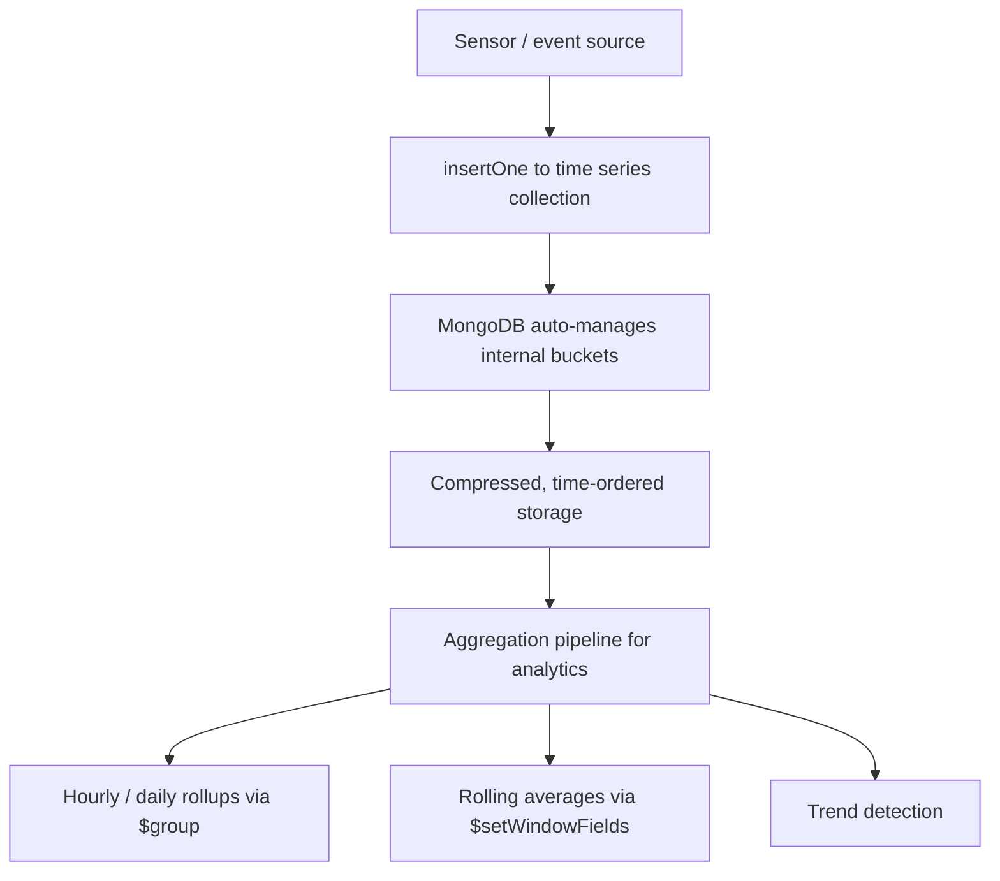

# How to Implement Time-Series Analytics with MongoDB 5.0+

Author: [nawazdhandala](https://www.github.com/nawazdhandala)

Tags: MongoDB, Time Series, Analytics, Aggregation, Performance

Description: Learn how to build time-series analytics in MongoDB 5.0+ using time series collections, $setWindowFields, and aggregation pipelines for trends and rollups.

---

## Overview

MongoDB 5.0 introduced native time series collections that store measurements grouped into compressed internal buckets. They deliver better compression, faster range scans, and automatic bucket management compared to plain collections.



## Step 1: Create a Time Series Collection

```javascript
db.createCollection("metrics", {
  timeseries: {
    timeField: "ts",          // field containing the measurement timestamp
    metaField: "metadata",    // field containing device/sensor identity (optional)
    granularity: "minutes"    // hint: seconds | minutes | hours
  },
  expireAfterSeconds: 90 * 24 * 60 * 60  // optional TTL: 90 days
});
```

## Step 2: Insert Time Series Data

```javascript
const { MongoClient } = require("mongodb");

const client = new MongoClient(process.env.MONGO_URI);
const db = client.db("iot");

async function recordMetric(sensorId, value) {
  await db.collection("metrics").insertOne({
    ts: new Date(),
    metadata: { sensorId, unit: "celsius" },
    temperature: value
  });
}

// Bulk insert for high-frequency ingestion
async function bulkRecord(readings) {
  await db.collection("metrics").insertMany(readings, { ordered: false });
}

bulkRecord([
  { ts: new Date("2026-03-31T10:00:00Z"), metadata: { sensorId: "s-1" }, temperature: 22.1 },
  { ts: new Date("2026-03-31T10:01:00Z"), metadata: { sensorId: "s-1" }, temperature: 22.3 },
  { ts: new Date("2026-03-31T10:00:00Z"), metadata: { sensorId: "s-2" }, temperature: 19.8 }
]);
```

## Step 3: Hourly Rollup with $group

```javascript
async function hourlyRollup(sensorId, startDate, endDate) {
  return db.collection("metrics").aggregate([
    {
      $match: {
        "metadata.sensorId": sensorId,
        ts: { $gte: startDate, $lt: endDate }
      }
    },
    {
      $group: {
        _id: {
          year:  { $year:   "$ts" },
          month: { $month:  "$ts" },
          day:   { $dayOfMonth: "$ts" },
          hour:  { $hour:   "$ts" }
        },
        avgTemp: { $avg: "$temperature" },
        minTemp: { $min: "$temperature" },
        maxTemp: { $max: "$temperature" },
        count:   { $sum: 1 }
      }
    },
    { $sort: { "_id.year": 1, "_id.month": 1, "_id.day": 1, "_id.hour": 1 } }
  ]).toArray();
}

const hourly = await hourlyRollup(
  "s-1",
  new Date("2026-03-31T00:00:00Z"),
  new Date("2026-04-01T00:00:00Z")
);
```

## Step 4: Rolling Average with $setWindowFields

`$setWindowFields` (MongoDB 5.0+) computes window functions like moving averages without multiple pipeline passes.

```javascript
async function rollingAverage(sensorId, startDate, endDate) {
  return db.collection("metrics").aggregate([
    {
      $match: {
        "metadata.sensorId": sensorId,
        ts: { $gte: startDate, $lt: endDate }
      }
    },
    { $sort: { ts: 1 } },
    {
      $setWindowFields: {
        partitionBy: "$metadata.sensorId",
        sortBy: { ts: 1 },
        output: {
          movingAvg5m: {
            $avg: "$temperature",
            window: { range: [-5, 0], unit: "minute" }
          },
          movingAvg1h: {
            $avg: "$temperature",
            window: { range: [-60, 0], unit: "minute" }
          },
          runningCount: {
            $sum: 1,
            window: { documents: ["unbounded", "current"] }
          }
        }
      }
    },
    {
      $project: {
        ts: 1,
        temperature: 1,
        movingAvg5m: { $round: ["$movingAvg5m", 2] },
        movingAvg1h: { $round: ["$movingAvg1h", 2] }
      }
    }
  ]).toArray();
}
```

## Step 5: Detect Anomalies with $setWindowFields

```javascript
async function detectAnomalies(sensorId, startDate, endDate, thresholdSigma = 2) {
  return db.collection("metrics").aggregate([
    {
      $match: {
        "metadata.sensorId": sensorId,
        ts: { $gte: startDate, $lt: endDate }
      }
    },
    { $sort: { ts: 1 } },
    {
      $setWindowFields: {
        partitionBy: "$metadata.sensorId",
        sortBy: { ts: 1 },
        output: {
          windowAvg: {
            $avg: "$temperature",
            window: { range: [-30, 0], unit: "minute" }
          },
          windowStdDev: {
            $stdDevPop: "$temperature",
            window: { range: [-30, 0], unit: "minute" }
          }
        }
      }
    },
    {
      $addFields: {
        zScore: {
          $cond: [
            { $gt: ["$windowStdDev", 0] },
            { $divide: [{ $subtract: ["$temperature", "$windowAvg"] }, "$windowStdDev"] },
            0
          ]
        }
      }
    },
    {
      $match: { zScore: { $gt: thresholdSigma } }
    },
    { $project: { ts: 1, temperature: 1, windowAvg: 1, zScore: { $round: ["$zScore", 2] } } }
  ]).toArray();
}
```

## Step 6: Daily Summary with $merge (Materialised View)

```javascript
async function refreshDailySummary(date) {
  const start = new Date(date);
  start.setHours(0, 0, 0, 0);
  const end = new Date(start);
  end.setDate(end.getDate() + 1);

  await db.collection("metrics").aggregate([
    { $match: { ts: { $gte: start, $lt: end } } },
    {
      $group: {
        _id: {
          date:     { $dateToString: { format: "%Y-%m-%d", date: "$ts" } },
          sensorId: "$metadata.sensorId"
        },
        avg:   { $avg: "$temperature" },
        min:   { $min: "$temperature" },
        max:   { $max: "$temperature" },
        p95:   { $percentile: { input: "$temperature", p: [0.95], method: "approximate" } },
        count: { $sum: 1 }
      }
    },
    {
      $merge: {
        into: "metrics_daily",
        on: "_id",
        whenMatched: "replace",
        whenNotMatched: "insert"
      }
    }
  ]).toArray();
}
```

## Step 7: Query the Dashboard

```javascript
// 7-day trend for a sensor
async function sevenDayTrend(sensorId) {
  const sevenDaysAgo = new Date(Date.now() - 7 * 24 * 60 * 60 * 1000);

  return db.collection("metrics_daily").find({
    "_id.sensorId": sensorId,
    "_id.date": { $gte: sevenDaysAgo.toISOString().slice(0, 10) }
  }).sort({ "_id.date": 1 }).toArray();
}
```

## Performance Tips

- Set `granularity` to match your write frequency (`seconds` for sub-second, `minutes` for per-minute, `hours` for hourly).
- Use `metaField` for device/sensor identity; MongoDB co-locates measurements from the same source in the same bucket.
- Query with `$match` on `timeField` and `metaField` fields first; these are the only fields indexed automatically.
- Add secondary indexes on measurement fields only when aggregations on those fields are too slow.

## Summary

MongoDB 5.0+ time series collections provide automatic bucketing, compression, and time-ordered storage for measurement data. Combine them with `$group` for period rollups, `$setWindowFields` for rolling averages and anomaly detection, and `$merge` to materialise daily summary collections that power fast dashboard queries.
