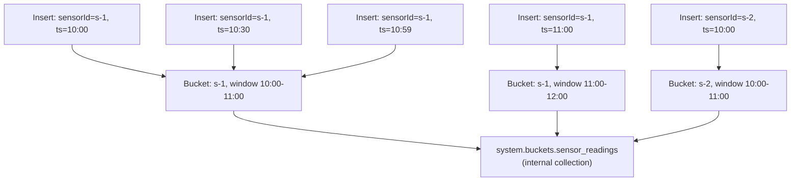

# How to Query Time Series Buckets in MongoDB

Author: [nawazdhandala](https://www.github.com/nawazdhandala)

Tags: MongoDB, Time Series, Bucket, Query, Internal

Description: Learn how MongoDB time series collections store data in internal buckets and how to query efficiently by understanding bucket boundaries and metadata.

---

## How MongoDB Stores Time Series Data

When you insert documents into a time series collection MongoDB does not store them individually. It groups measurements from the same `metaField` value into compressed internal buckets. Each bucket covers a time window determined by the collection's `granularity` setting.



The internal bucket collection is named `system.buckets.<collectionName>`. You can query it directly for diagnostics, but normally you query through the user-facing collection.

## Inspecting Internal Buckets

```javascript
// View the raw bucket documents (diagnostics / understanding storage)
db.getCollection("system.buckets.sensor_readings").findOne();

// Example bucket document shape (simplified):
// {
//   _id: ObjectId("..."),
//   control: {
//     version: 1,
//     min: { ts: ISODate("2026-03-31T10:00:00Z"), temperature: 21.1 },
//     max: { ts: ISODate("2026-03-31T10:59:59Z"), temperature: 24.7 }
//   },
//   meta: { sensorId: "s-1", location: "room-A" },
//   data: { /* compressed columnar data */ }
// }

// Count buckets per sensor
db.getCollection("system.buckets.sensor_readings").aggregate([
  {
    $group: {
      _id: "$meta.sensorId",
      bucketCount: { $sum: 1 }
    }
  }
]);
```

## Querying Efficiently Across Bucket Boundaries

MongoDB uses `control.min.ts` and `control.max.ts` on each bucket to skip buckets that fall entirely outside the query range. This means range queries on the `timeField` are very fast even over large datasets.

```javascript
// This query leverages bucket-level pruning
// MongoDB skips all buckets where control.max.ts < start or control.min.ts > end
db.sensor_readings.find({
  "sensorInfo.sensorId": "s-1",
  timestamp: {
    $gte: new Date("2026-03-31T00:00:00Z"),
    $lt:  new Date("2026-04-01T00:00:00Z")
  }
});
```

## Aligning Queries to Bucket Boundaries

Bucket boundaries align to calendar units based on `granularity`. Querying within a single bucket boundary is faster than straddling many buckets.

```javascript
// granularity: "hours" -> buckets align to hourly boundaries
// A query for exactly one hour hits at most one bucket per sensor
const start = new Date("2026-03-31T10:00:00Z");
const end   = new Date("2026-03-31T11:00:00Z");

db.sensor_readings.find({
  "sensorInfo.sensorId": "s-1",
  timestamp: { $gte: start, $lt: end }
});
```

## Using $dateTrunc to Group by Bucket-Aligned Periods

`$dateTrunc` rounds timestamps down to a period boundary, making groupings consistent with bucket windows.

```javascript
async function bucketAlignedGrouping(sensorId, unit = "hour") {
  return db.collection("sensor_readings").aggregate([
    {
      $match: {
        "sensorInfo.sensorId": sensorId,
        timestamp: { $gte: new Date("2026-03-31T00:00:00Z") }
      }
    },
    {
      $group: {
        _id: {
          bucket: { $dateTrunc: { date: "$timestamp", unit } }
        },
        avg: { $avg: "$temperature" },
        min: { $min: "$temperature" },
        max: { $max: "$temperature" },
        count: { $sum: 1 }
      }
    },
    { $sort: { "_id.bucket": 1 } }
  ]).toArray();
}

// Hourly summary
const hourly = await bucketAlignedGrouping("s-1", "hour");
// 15-minute summary
const quarterly = await db.collection("sensor_readings").aggregate([
  { $match: { "sensorInfo.sensorId": "s-1" } },
  {
    $group: {
      _id: { $dateTrunc: { date: "$timestamp", unit: "minute", binSize: 15 } },
      avg: { $avg: "$temperature" }
    }
  },
  { $sort: { "_id": 1 } }
]).toArray();
```

## Querying the Last N Buckets

Time series buckets are written in time order. To get the most recent data, query with a descending sort on the `timeField`.

```javascript
// Last 1000 readings for a sensor (hits the most recent buckets first)
async function getRecentReadings(sensorId, limit = 1000) {
  return db.collection("sensor_readings")
    .find({ "sensorInfo.sensorId": sensorId })
    .sort({ timestamp: -1 })
    .limit(limit)
    .toArray();
}

// First reading in the collection (oldest bucket)
async function getOldestReading(sensorId) {
  return db.collection("sensor_readings")
    .findOne(
      { "sensorInfo.sensorId": sensorId },
      { sort: { timestamp: 1 } }
    );
}
```

## Bucket Statistics and Storage Analysis

```javascript
// Validate the time series collection stats
db.runCommand({ collStats: "sensor_readings" });

// Check how many buckets exist
db.getCollection("system.buckets.sensor_readings").countDocuments();

// Approximate compression ratio
const userCount = await db.collection("sensor_readings").estimatedDocumentCount();
const bucketCount = await db.getCollection("system.buckets.sensor_readings").estimatedDocumentCount();
console.log(`Measurements per bucket: ~${Math.round(userCount / bucketCount)}`);

// Storage size
const stats = await db.command({ dbStats: 1 });
console.log(`Storage size: ${stats.storageSize} bytes`);
```

## Cross-Bucket Aggregation with $densify

`$densify` fills gaps in time series data where no measurement exists for a period.

```javascript
async function denseTimeline(sensorId, start, end) {
  return db.collection("sensor_readings").aggregate([
    {
      $match: {
        "sensorInfo.sensorId": sensorId,
        timestamp: { $gte: start, $lt: end }
      }
    },
    {
      $group: {
        _id: { $dateTrunc: { date: "$timestamp", unit: "minute" } },
        avg: { $avg: "$temperature" }
      }
    },
    { $project: { timestamp: "$_id", avg: 1, _id: 0 } },
    {
      $densify: {
        field: "timestamp",
        range: {
          step: 1,
          unit: "minute",
          bounds: [start, end]
        }
      }
    },
    { $sort: { timestamp: 1 } }
  ]).toArray();
}
```

## Summary

MongoDB time series collections store measurements in internal compressed buckets aligned to `granularity` windows. Each bucket carries `control.min` and `control.max` metadata that enables bucket-level pruning during range queries. Query efficiently by always providing both `metaField` and `timeField` predicates, use `$dateTrunc` for bucket-aligned groupings, and inspect `system.buckets.<collection>` for diagnostics on bucket distribution and compression ratios.
