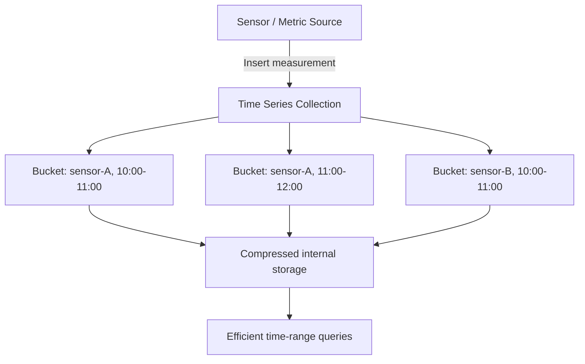

# How to Use Time Series Collections in MongoDB 5.0+

Author: [nawazdhandala](https://www.github.com/nawazdhandala)

Tags: MongoDB, Time Series, IoT, Analytics, Performance

Description: Learn how to create and query MongoDB time series collections for efficient storage of sensor data, metrics, and event streams with automatic bucketing and compression.

---

## What are Time Series Collections

Introduced in MongoDB 5.0, time series collections are optimized for storing sequential measurements over time. MongoDB automatically groups documents with the same metadata into internal buckets, dramatically reducing storage space and improving query performance for time-range queries.

Typical use cases include IoT sensor data, server metrics, application events, financial tick data, and user activity streams.



## Creating a Time Series Collection

Use `db.createCollection()` with `timeseries` options:

```javascript
db.createCollection("sensorReadings", {
  timeseries: {
    timeField: "timestamp",    // required: field containing the measurement time
    metaField: "metadata",     // optional: field with unchanging metadata for this series
    granularity: "seconds"     // "seconds", "minutes", or "hours"
  },
  expireAfterSeconds: 2592000  // optional: auto-delete documents older than 30 days
})
```

**timeField** - the field that contains the measurement's timestamp (must be a BSON Date).

**metaField** - the field that identifies the series (e.g., sensor ID, hostname). Documents with the same `metaField` value are bucketed together.

**granularity** - hints to MongoDB how frequently measurements arrive. Use `seconds` for high-frequency data (sub-minute), `minutes` for 1-5 minute intervals, `hours` for hourly data. This controls how documents are bucketed internally.

## Inserting Measurements

Insert a single measurement:

```javascript
db.sensorReadings.insertOne({
  timestamp: new Date(),
  metadata: {
    sensorId: "sensor-001",
    location: "warehouse-A",
    type: "temperature"
  },
  temperature: 22.4,
  humidity: 65.2
})
```

Insert multiple measurements in bulk (preferred for efficiency):

```javascript
const readings = [];
const now = Date.now();

for (let i = 0; i < 100; i++) {
  readings.push({
    timestamp: new Date(now - i * 1000),
    metadata: { sensorId: "sensor-001", location: "warehouse-A" },
    temperature: 20 + Math.random() * 5,
    humidity: 60 + Math.random() * 10
  });
}

db.sensorReadings.insertMany(readings)
```

## Querying Time Series Data

Query by time range (the most efficient query pattern):

```javascript
db.sensorReadings.find({
  timestamp: {
    $gte: ISODate("2026-03-31T08:00:00Z"),
    $lt: ISODate("2026-03-31T09:00:00Z")
  },
  "metadata.sensorId": "sensor-001"
})
```

## Aggregation Examples

Calculate hourly averages:

```javascript
db.sensorReadings.aggregate([
  {
    $match: {
      timestamp: {
        $gte: ISODate("2026-03-31T00:00:00Z"),
        $lt: ISODate("2026-04-01T00:00:00Z")
      },
      "metadata.sensorId": "sensor-001"
    }
  },
  {
    $group: {
      _id: {
        hour: { $dateTrunc: { date: "$timestamp", unit: "hour" } },
        sensorId: "$metadata.sensorId"
      },
      avgTemp: { $avg: "$temperature" },
      maxTemp: { $max: "$temperature" },
      minTemp: { $min: "$temperature" },
      count: { $sum: 1 }
    }
  },
  { $sort: { "_id.hour": 1 } }
])
```

Calculate a rolling 5-minute average using `$setWindowFields` (MongoDB 5.0+):

```javascript
db.sensorReadings.aggregate([
  {
    $match: {
      "metadata.sensorId": "sensor-001",
      timestamp: {
        $gte: ISODate("2026-03-31T10:00:00Z"),
        $lt: ISODate("2026-03-31T11:00:00Z")
      }
    }
  },
  {
    $setWindowFields: {
      partitionBy: "$metadata.sensorId",
      sortBy: { timestamp: 1 },
      output: {
        rollingAvgTemp: {
          $avg: "$temperature",
          window: { range: [-300, 0], unit: "second" }  // last 5 minutes
        }
      }
    }
  },
  { $project: { timestamp: 1, temperature: 1, rollingAvgTemp: 1 } }
])
```

Find the last measurement per sensor:

```javascript
db.sensorReadings.aggregate([
  { $sort: { timestamp: -1 } },
  {
    $group: {
      _id: "$metadata.sensorId",
      lastReading: { $first: "$temperature" },
      lastTimestamp: { $first: "$timestamp" }
    }
  }
])
```

## Downsampling with $merge

Aggregate hourly averages into a summary collection for long-term storage:

```javascript
db.sensorReadings.aggregate([
  {
    $match: {
      timestamp: {
        $gte: ISODate("2026-03-31T00:00:00Z"),
        $lt: ISODate("2026-04-01T00:00:00Z")
      }
    }
  },
  {
    $group: {
      _id: {
        hour: { $dateTrunc: { date: "$timestamp", unit: "hour" } },
        sensorId: "$metadata.sensorId"
      },
      avgTemp: { $avg: "$temperature" },
      maxTemp: { $max: "$temperature" }
    }
  },
  {
    $merge: {
      into: "sensorHourlyAverages",
      whenMatched: "replace",
      whenNotMatched: "insert"
    }
  }
])
```

## Checking Collection Statistics

```javascript
db.sensorReadings.stats()
```

Look at `storageSize` compared to `size` to see the compression ratio. Time series collections typically achieve 50-90% compression over regular collections for numeric measurement data.

## Secondary Indexes on Time Series Collections

Add an index to speed up queries on metadata fields:

```javascript
db.sensorReadings.createIndex({ "metadata.sensorId": 1, timestamp: 1 })
```

Note: The `timeField` and `metaField` are automatically indexed. You cannot create indexes on the internal bucket fields.

## TTL and Data Retention

Set automatic expiration when creating the collection:

```javascript
db.createCollection("sensorReadings", {
  timeseries: {
    timeField: "timestamp",
    metaField: "metadata",
    granularity: "seconds"
  },
  expireAfterSeconds: 86400 * 90   // retain 90 days of data
})
```

Modify expiration on an existing collection:

```javascript
db.runCommand({
  collMod: "sensorReadings",
  expireAfterSeconds: 86400 * 365   // extend to 1 year
})
```

## Limitations

Time series collections have some restrictions:

- Documents cannot be deleted individually (delete by time range using the TTL mechanism or a ranged delete).
- Documents cannot be updated after insertion.
- Shard key must include the `metaField`.
- The `timeField` and `metaField` values cannot be changed after collection creation.
- Capped collections and change streams on time series collections have limited support.

## Best Practices

- Always use `insertMany()` instead of `insertOne()` for batch inserts - batch inserts fill buckets more efficiently.
- Choose `granularity` carefully: too fine-grained leads to small, inefficient buckets; too coarse leads to large buckets that are slow to fill and query.
- Use `expireAfterSeconds` to automatically manage data retention.
- Store only genuinely time-varying data in the measurement fields; put stable metadata in `metaField`.
- For long-term storage, downsample raw data into hourly or daily aggregates using `$merge`.

## Summary

MongoDB time series collections (MongoDB 5.0+) provide automatic bucketing, compression, and optimized query performance for sequential measurement data. Create them with `db.createCollection()` specifying `timeField`, `metaField`, and `granularity`. Query with time range filters on the `timeField` for best performance, and use `$group` with `$dateTrunc` for time-based aggregations. Set `expireAfterSeconds` for automatic data retention and downsample older data into summary collections to manage storage costs.
