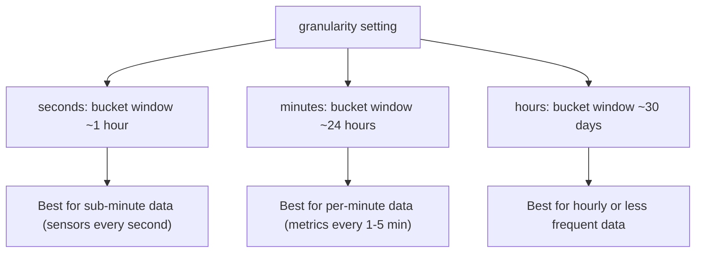

# How to Configure Time Series Collection Granularity in MongoDB

Author: [nawazdhandala](https://www.github.com/nawazdhandala)

Tags: MongoDB, Time series, Granularity, Collection, Performance

Description: Learn how to choose and configure the granularity setting for MongoDB time series collections to optimise bucket size, compression, and query performance.

---

## What Is Granularity

The `granularity` parameter on a time series collection tells MongoDB how frequently measurements arrive from the same source. MongoDB uses this hint to size the internal time windows (buckets) that group measurements together. Smaller buckets improve write performance for sparse data; larger buckets improve compression and scan speed for dense data.



## Granularity Values and Bucket Windows

| `granularity` | Approximate bucket window | Recommended for |
|---|---|---|
| `"seconds"` | 1 hour | Sub-second to per-minute writes |
| `"minutes"` | 24 hours | Per-minute to per-hour writes |
| `"hours"` | 30 days | Per-hour or less frequent writes |

## Creating a Collection with Explicit Granularity

```javascript
// For a sensor that emits every 5 seconds use "seconds"
db.createCollection("high_freq_readings", {
  timeseries: {
    timeField:   "ts",
    metaField:   "sensor",
    granularity: "seconds"
  }
});

// For a metrics aggregator that writes once per minute use "minutes"
db.createCollection("minute_metrics", {
  timeseries: {
    timeField:   "ts",
    metaField:   "host",
    granularity: "minutes"
  }
});

// For a daily weather summary use "hours"
db.createCollection("daily_weather", {
  timeseries: {
    timeField:   "ts",
    metaField:   "station",
    granularity: "hours"
  }
});
```

## Using bucketMaxSpanSeconds and bucketRoundingSeconds (MongoDB 6.3+)

MongoDB 6.3 introduced `bucketMaxSpanSeconds` and `bucketRoundingSeconds` for custom bucket boundaries instead of the preset granularity values.

```javascript
// 15-minute buckets: custom bucket span
db.createCollection("custom_buckets", {
  timeseries: {
    timeField:             "ts",
    metaField:             "deviceId",
    bucketMaxSpanSeconds:  900,  // 15 minutes (max span of a single bucket)
    bucketRoundingSeconds: 900   // align bucket starts to 15-minute boundaries
  }
});

// Verify the collection options
db.runCommand({ listCollections: 1, filter: { name: "custom_buckets" } });
```

## Modifying Granularity After Creation

You can increase granularity (from `seconds` to `minutes`, or from `minutes` to `hours`) but not decrease it. This is because increasing granularity only affects future bucket creation; existing data is not rewritten.

```javascript
// Increase granularity from "seconds" to "minutes"
db.runCommand({
  collMod: "high_freq_readings",
  timeseries: { granularity: "minutes" }
});

// Verify the change
db.runCommand({
  listCollections: 1,
  filter: { name: "high_freq_readings" }
});
```

## Effect of Granularity on Bucket Count and Compression

```javascript
// Compare bucket counts for two collections with different granularity
// (same data, different settings)

const secBuckets = await db.getCollection("system.buckets.high_freq_readings")
  .countDocuments();
const minBuckets = await db.getCollection("system.buckets.minute_metrics")
  .countDocuments();

console.log(`seconds granularity buckets: ${secBuckets}`);
console.log(`minutes granularity buckets: ${minBuckets}`);

// Fewer buckets = better compression (more measurements per bucket)
// More buckets = faster individual bucket lookup for very recent data
```

## Choosing the Right Granularity

```javascript
// Rule of thumb: pick the granularity one level coarser than your write frequency

function recommendGranularity(writeIntervalSeconds) {
  if (writeIntervalSeconds < 60) return "seconds";        // writes every few seconds
  if (writeIntervalSeconds < 3600) return "minutes";      // writes every few minutes
  return "hours";                                         // writes every hour or less
}

console.log(recommendGranularity(10));    // "seconds"
console.log(recommendGranularity(300));   // "minutes"
console.log(recommendGranularity(7200));  // "hours"
```

## Diagnosing Suboptimal Granularity

Too many small buckets suggest granularity is too fine for the actual write rate. Too few large buckets suggest granularity is too coarse and writes may be slow due to bucket contention.

```javascript
async function diagnoseBuckets(collectionName) {
  const totalMeasurements = await db.collection(collectionName)
    .estimatedDocumentCount();
  const totalBuckets = await db.getCollection(`system.buckets.${collectionName}`)
    .estimatedDocumentCount();

  const avgPerBucket = totalMeasurements / totalBuckets;
  console.log(`Collection: ${collectionName}`);
  console.log(`Measurements: ${totalMeasurements}`);
  console.log(`Buckets: ${totalBuckets}`);
  console.log(`Avg measurements/bucket: ${avgPerBucket.toFixed(1)}`);

  if (avgPerBucket < 10) {
    console.log("Recommendation: consider increasing granularity");
  } else if (avgPerBucket > 10000) {
    console.log("Recommendation: consider decreasing granularity");
  } else {
    console.log("Granularity looks appropriate");
  }
}
```

## Granularity and the expireAfterSeconds Interaction

The TTL expiry on a time series collection operates at the bucket level. When all measurements in a bucket are older than `expireAfterSeconds`, the entire bucket is deleted. Coarser granularity means fewer, larger buckets; the oldest data may be retained longer than expected if recent data shares a bucket with old data.

```javascript
// Fine granularity + short TTL: expired data is removed quickly
db.createCollection("short_lived_events", {
  timeseries: {
    timeField:   "ts",
    metaField:   "source",
    granularity: "seconds"
  },
  expireAfterSeconds: 3600  // 1 hour
});

// Coarse granularity + short TTL: a 30-day bucket won't expire until all
// measurements in it are older than expireAfterSeconds
db.createCollection("long_lived_summary", {
  timeseries: {
    timeField:   "ts",
    metaField:   "source",
    granularity: "hours"
  },
  expireAfterSeconds: 90 * 24 * 60 * 60  // 90 days
});
```

## Summary

MongoDB time series collection `granularity` controls internal bucket window size. Set `"seconds"` for sub-minute writes, `"minutes"` for per-minute to hourly writes, and `"hours"` for infrequent data. MongoDB 6.3+ allows custom bucket spans via `bucketMaxSpanSeconds`. Granularity can only be increased after collection creation. Monitor average measurements per bucket to confirm the setting is appropriate, and keep in mind that bucket size affects how quickly TTL expiry removes old data.
