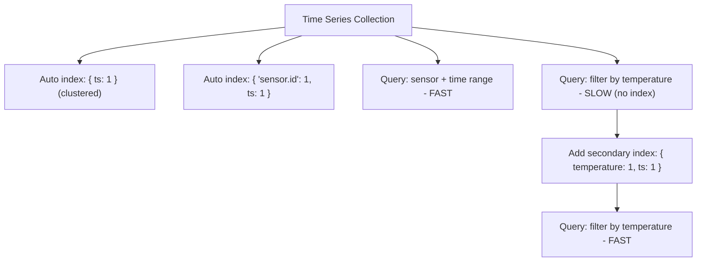

# How to Add Secondary Indexes to Time Series Collections in MongoDB

Author: [nawazdhandala](https://www.github.com/nawazdhandala)

Tags: MongoDB, Time Series, Index, Secondary Index, Performance

Description: Learn how to create secondary indexes on MongoDB time series collections to speed up queries that filter on measurement or metadata fields beyond the default time index.

---

## Default Indexes on Time Series Collections

When you create a time series collection MongoDB automatically creates a clustered index on the `timeField` and a compound index on `{ metaField: 1, timeField: 1 }`. These cover the most common queries but not measurement-field filters.



## Viewing Existing Indexes

```javascript
// List all indexes on a time series collection
db.sensor_readings.getIndexes();

// Output will show the automatic indexes:
// [
//   { key: { _id: 1 }, name: "_id_", clustered: true },
//   { key: { "metadata.sensorId": 1, ts: 1 }, name: "metadata.sensorId_1_ts_1" }
// ]
```

## Adding a Secondary Index on a Measurement Field

```javascript
// Index for alert queries: find readings where temperature exceeds a threshold
db.sensor_readings.createIndex({ temperature: 1 });

// Compound index: filter by sensor AND temperature, sorted by time
db.sensor_readings.createIndex({
  "metadata.sensorId": 1,
  temperature: 1,
  ts: -1
});

// Verify the index was created
db.sensor_readings.getIndexes();
```

## Index on a Nested Metadata Field

```javascript
// metaField is "metadata"; sub-fields of metaField can be indexed
db.sensor_readings.createIndex({ "metadata.location": 1, ts: -1 });

// Query: all readings from a specific location in the last hour
const since = new Date(Date.now() - 60 * 60 * 1000);
db.sensor_readings.find({
  "metadata.location": "floor-3",
  ts: { $gte: since }
});
```

## Index on Multiple Measurement Fields

```javascript
// Query that filters by both temperature and humidity outliers
db.sensor_readings.createIndex({ temperature: 1, humidity: 1 });

// Find readings with high temperature AND low humidity
db.sensor_readings.find({
  temperature: { $gt: 35 },
  humidity:    { $lt: 20 }
}).sort({ ts: -1 });
```

## Partial Index on a Time Series Collection

Partial indexes only index documents that match a filter expression, reducing index size for sparse conditions.

```javascript
// Index only high-severity readings
db.sensor_readings.createIndex(
  { ts: -1, "metadata.sensorId": 1 },
  {
    partialFilterExpression: { temperature: { $gt: 40 } },
    name: "hot_readings_idx"
  }
);

// This query uses the partial index efficiently
db.sensor_readings.find({
  temperature: { $gt: 40 },
  ts: { $gte: new Date("2026-03-01") }
});
```

## Explaining a Query to Verify Index Usage

```javascript
const explanation = await db.collection("sensor_readings")
  .find({
    "metadata.sensorId": "s-1",
    temperature: { $gt: 30 },
    ts: { $gte: new Date("2026-03-31T00:00:00Z") }
  })
  .explain("executionStats");

// Check the winning plan
console.log(JSON.stringify(explanation.queryPlanner.winningPlan, null, 2));
// Should show "IXSCAN" for the index scan, not "COLLSCAN"

// Check execution stats
const stats = explanation.executionStats;
console.log(`Docs examined: ${stats.totalDocsExamined}`);
console.log(`Docs returned: ${stats.nReturned}`);
// Low totalDocsExamined relative to nReturned = efficient index use
```

## Dropping an Unused Index

```javascript
// List indexes by name
db.sensor_readings.getIndexes().forEach((idx) => {
  console.log(idx.name, JSON.stringify(idx.key));
});

// Drop an index by name
db.sensor_readings.dropIndex("hot_readings_idx");

// Drop by key specification
db.sensor_readings.dropIndex({ temperature: 1, humidity: 1 });
```

## Limitations of Indexes on Time Series Collections

- Indexes on the `timeField` itself are managed automatically; you cannot drop the clustered index.
- Unique indexes are not supported on time series collections (measurements are not uniquely constrained).
- Hashed indexes are not supported.
- Text indexes are not supported on time series collections.
- `$**` wildcard indexes are not supported.

```javascript
// These will fail on time series collections:
db.sensor_readings.createIndex({ temperature: 1 }, { unique: true });     // unsupported
db.sensor_readings.createIndex({ description: "text" });                   // unsupported
db.sensor_readings.createIndex({ temperature: "hashed" });                 // unsupported
```

## Performance Recommendations

```javascript
// Rule: only add secondary indexes if your query is demonstrably slow
// Step 1: identify slow queries in the profiler
db.setProfilingLevel(1, { slowms: 100 });
db.system.profile.find({ ns: /sensor_readings/, millis: { $gt: 100 } })
  .sort({ millis: -1 })
  .limit(5);

// Step 2: explain the slow query
db.sensor_readings.explain("executionStats").find({ temperature: { $gt: 35 } });

// Step 3: add the targeted index
db.sensor_readings.createIndex({ temperature: 1 });

// Step 4: confirm improvement
db.sensor_readings.explain("executionStats").find({ temperature: { $gt: 35 } });
```

## Summary

MongoDB time series collections automatically index the `timeField` and `metaField`, but queries filtering on measurement values require explicit secondary indexes. Create compound indexes that include `metaField` fields and the `timeField` alongside measurement fields for the best coverage. Use `explain("executionStats")` to confirm index usage, apply partial indexes for sparse alert conditions, and avoid adding unnecessary indexes since each one adds write overhead during ingestion.
