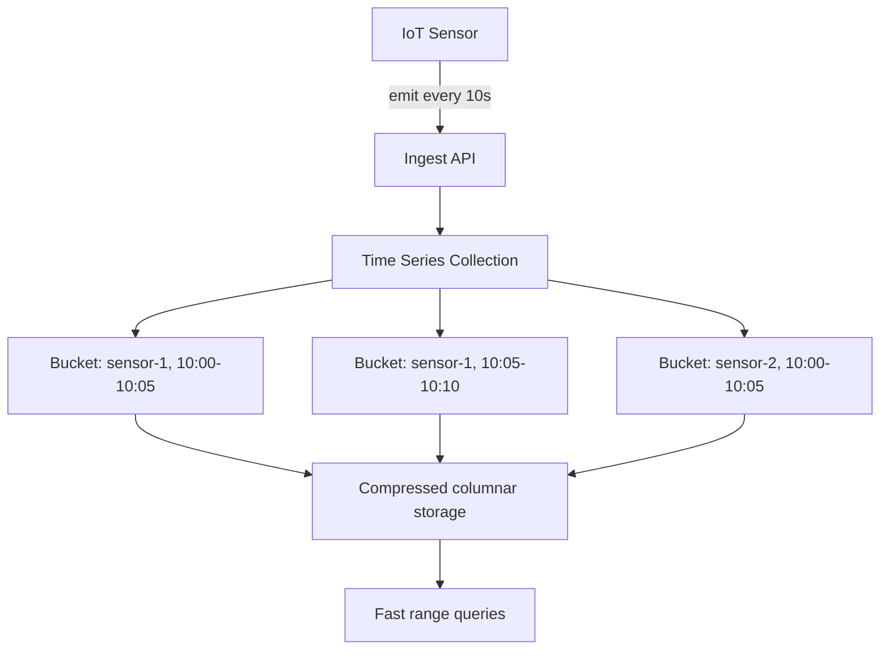

# How to Use the MongoDB Time Series Collection for Sensor Data

Author: [nawazdhandala](https://www.github.com/nawazdhandala)

Tags: MongoDB, Time Series, Sensor Data, IoT, Collection

Description: Learn how to create and use MongoDB time series collections to ingest, store, and query IoT sensor data efficiently with automatic bucketing and compression.

---

## Why Time Series Collections for Sensor Data

Sensors produce a continuous stream of timestamped measurements. Traditional collections store each measurement as an independent document, leading to large storage footprints and slow range scans. Time series collections automatically group measurements from the same sensor into compressed internal buckets, reducing storage by up to 80% and dramatically speeding up range queries.



## Step 1: Create the Time Series Collection

```javascript
db.createCollection("sensor_readings", {
  timeseries: {
    timeField:   "timestamp",   // must be a BSON Date
    metaField:   "sensorInfo",  // device identity - kept out of measurements
    granularity: "seconds"      // seconds | minutes | hours
  },
  expireAfterSeconds: 30 * 24 * 60 * 60  // auto-delete after 30 days
});
```

The `metaField` value groups measurements from the same sensor into the same bucket. The `timeField` is always indexed automatically.

## Step 2: Insert Sensor Measurements

```javascript
const { MongoClient } = require("mongodb");

const client = new MongoClient(process.env.MONGO_URI);
const db = client.db("plant_monitoring");

async function recordReading(reading) {
  return db.collection("sensor_readings").insertOne({
    timestamp: new Date(),
    sensorInfo: {
      sensorId: reading.sensorId,
      location: reading.location,
      unit: reading.unit
    },
    temperature: reading.temperature,
    humidity:    reading.humidity,
    pressure:    reading.pressure
  });
}

// High-frequency batch insert
async function recordBatch(readings) {
  const docs = readings.map((r) => ({
    timestamp:  r.ts,
    sensorInfo: { sensorId: r.sensorId, location: r.location, unit: r.unit },
    temperature: r.temperature,
    humidity:    r.humidity
  }));

  return db.collection("sensor_readings").insertMany(docs, { ordered: false });
}
```

## Step 3: Query Recent Readings for a Sensor

```javascript
async function getLatestReadings(sensorId, minutes = 60) {
  const since = new Date(Date.now() - minutes * 60 * 1000);

  return db.collection("sensor_readings")
    .find({
      "sensorInfo.sensorId": sensorId,
      timestamp: { $gte: since }
    })
    .sort({ timestamp: -1 })
    .limit(100)
    .toArray();
}
```

## Step 4: Aggregate Per-Minute Averages

```javascript
async function minuteAverages(sensorId, start, end) {
  return db.collection("sensor_readings").aggregate([
    {
      $match: {
        "sensorInfo.sensorId": sensorId,
        timestamp: { $gte: start, $lt: end }
      }
    },
    {
      $group: {
        _id: {
          year:   { $year: "$timestamp" },
          month:  { $month: "$timestamp" },
          day:    { $dayOfMonth: "$timestamp" },
          hour:   { $hour: "$timestamp" },
          minute: { $minute: "$timestamp" }
        },
        avgTemp:     { $avg: "$temperature" },
        avgHumidity: { $avg: "$humidity" },
        count:       { $sum: 1 }
      }
    },
    {
      $addFields: {
        ts: {
          $dateFromParts: {
            year: "$_id.year", month: "$_id.month", day: "$_id.day",
            hour: "$_id.hour", minute: "$_id.minute"
          }
        }
      }
    },
    { $sort: { ts: 1 } },
    { $project: { _id: 0, ts: 1, avgTemp: 1, avgHumidity: 1, count: 1 } }
  ]).toArray();
}
```

## Step 5: Detect Out-of-Range Alerts

```javascript
const THRESHOLDS = {
  temperature: { min: 10, max: 35 },
  humidity:    { min: 20, max: 80 }
};

async function detectAlerts(sensorId, since) {
  return db.collection("sensor_readings").find({
    "sensorInfo.sensorId": sensorId,
    timestamp: { $gte: since },
    $or: [
      { temperature: { $lt: THRESHOLDS.temperature.min } },
      { temperature: { $gt: THRESHOLDS.temperature.max } },
      { humidity:    { $lt: THRESHOLDS.humidity.min } },
      { humidity:    { $gt: THRESHOLDS.humidity.max } }
    ]
  }).sort({ timestamp: -1 }).toArray();
}
```

## Step 6: Multi-Sensor Comparison

```javascript
async function comparesensors(sensorIds, start, end) {
  return db.collection("sensor_readings").aggregate([
    {
      $match: {
        "sensorInfo.sensorId": { $in: sensorIds },
        timestamp: { $gte: start, $lt: end }
      }
    },
    {
      $group: {
        _id: {
          sensorId: "$sensorInfo.sensorId",
          hour: {
            $dateTrunc: { date: "$timestamp", unit: "hour" }
          }
        },
        avgTemp: { $avg: "$temperature" },
        maxTemp: { $max: "$temperature" },
        minTemp: { $min: "$temperature" }
      }
    },
    { $sort: { "_id.hour": 1, "_id.sensorId": 1 } }
  ]).toArray();
}
```

## Step 7: List All Sensors and Their Last Reading

```javascript
async function getAllSensorsLatest() {
  return db.collection("sensor_readings").aggregate([
    { $sort: { timestamp: -1 } },
    {
      $group: {
        _id: "$sensorInfo.sensorId",
        lastSeen:    { $first: "$timestamp" },
        lastTemp:    { $first: "$temperature" },
        lastHumidity: { $first: "$humidity" },
        location:    { $first: "$sensorInfo.location" }
      }
    }
  ]).toArray();
}
```

## Step 8: Add an Additional Index on Measurement Fields

The `timeField` and `metaField` are indexed automatically. For queries that filter on measurement values add a secondary index.

```javascript
// Index for alert queries that filter by temperature outside normal range
db.sensor_readings.createIndex({ "sensorInfo.sensorId": 1, temperature: 1, timestamp: -1 });
```

## Granularity Guide

| `granularity` | Best for | Bucket window |
|---|---|---|
| `seconds` | Sub-minute sensor data | ~1 hour |
| `minutes` | Per-minute readings | ~24 hours |
| `hours` | Per-hour aggregations | ~30 days |

## Summary

MongoDB time series collections simplify IoT sensor data storage by automatically compressing measurements into buckets grouped by `metaField` (sensor identity) and `timeField` (timestamp). Insert with `insertMany` for throughput, query with `$match` on sensor ID and timestamp range, and use `$group` with `$dateTrunc` or date extraction operators for period rollups. Set `granularity` to match your write frequency for optimal bucket size and compression.
