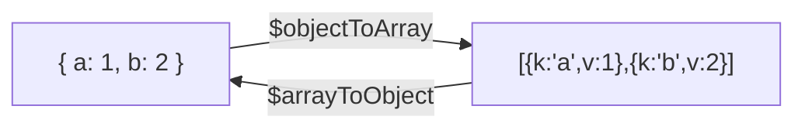

# How to Use $toArray and $toObject in MongoDB Aggregation

Author: [nawazdhandala](https://www.github.com/nawazdhandala)

Tags: MongoDB, Aggregation, Pipeline, Array, Expression

Description: Learn how to use $toArray and $toObject in MongoDB aggregation to convert between arrays and objects, enabling flexible document reshaping transformations.

---

## Overview

Two operators bridge the gap between arrays and objects in aggregation pipelines:

- `$toArray` (available in MongoDB 5.0+) - converts a value to an array
- `$objectToArray` - converts an embedded document to an array of `{ k, v }` pairs (the inverse of `$arrayToObject`)

For converting an array of `{ k, v }` pairs back to an object, use `$arrayToObject`.



## $objectToArray

### Syntax

```javascript
{ $objectToArray: <object expression> }
```

Converts each field of an embedded document into an element `{ k: <fieldName>, v: <fieldValue> }` in an output array.

### Examples

#### Convert an embedded document to a key-value array

```javascript
// Input: { _id: 1, dimensions: { width: 10, height: 20, depth: 5 } }
db.products.aggregate([
  {
    $project: {
      dimArray: { $objectToArray: "$dimensions" }
    }
  }
])
```

Output:

```javascript
[
  {
    _id: 1,
    dimArray: [
      { k: "width",  v: 10 },
      { k: "height", v: 20 },
      { k: "depth",  v: 5  }
    ]
  }
]
```

#### Sum all values of a dynamic object

When field names are unknown at query time, iterate using `$reduce`:

```javascript
// Input: { _id: 1, monthlySales: { jan: 1000, feb: 1500, mar: 1200 } }
db.reports.aggregate([
  {
    $project: {
      totalSales: {
        $reduce: {
          input: { $objectToArray: "$monthlySales" },
          initialValue: 0,
          in: { $add: ["$$value", "$$this.v"] }
        }
      }
    }
  }
])
```

Output:

```javascript
[
  { _id: 1, totalSales: 3700 }
]
```

#### Find the key with the highest value

```javascript
db.scores.aggregate([
  {
    $project: {
      topSubject: {
        $reduce: {
          input: { $objectToArray: "$subjectScores" },
          initialValue: { k: "", v: -1 },
          in: {
            $cond: {
              if: { $gt: ["$$this.v", "$$value.v"] },
              then: "$$this",
              else: "$$value"
            }
          }
        }
      }
    }
  }
])
```

## $arrayToObject

### Syntax

```javascript
{ $arrayToObject: <array expression> }
```

Accepts either:

1. An array of `{ k, v }` objects: `[{ k: "name", v: "Alice" }]`
2. An array of two-element arrays: `[["name", "Alice"]]`

### Convert a key-value array back to an object

```javascript
// Input: { _id: 1, pairs: [{k: "color", v: "red"}, {k: "size", v: "L"}] }
db.items.aggregate([
  {
    $project: {
      attributes: { $arrayToObject: "$pairs" }
    }
  }
])
```

Output:

```javascript
[
  { _id: 1, attributes: { color: "red", size: "L" } }
]
```

### Dynamic field renaming with $objectToArray + $arrayToObject

```javascript
// Rename all keys to lowercase
db.records.aggregate([
  {
    $project: {
      normalized: {
        $arrayToObject: {
          $map: {
            input: { $objectToArray: "$metadata" },
            as: "field",
            in: {
              k: { $toLower: "$$field.k" },
              v: "$$field.v"
            }
          }
        }
      }
    }
  }
])
```

## $toArray (MongoDB 5.0+)

### Syntax

```javascript
{ $toArray: <expression> }
```

Converts a scalar value to a single-element array. Returns `null` for null input.

```javascript
// Input: { _id: 1, tag: "mongodb" }
db.posts.aggregate([
  {
    $project: {
      tags: { $toArray: "$tag" }
    }
  }
])
```

Output:

```javascript
[
  { _id: 1, tags: ["mongodb"] }
]
```

## Practical Pipeline: Normalize and Merge Dynamic Objects

Merge two documents with dynamic field names:

```javascript
db.configs.aggregate([
  {
    $project: {
      merged: {
        $arrayToObject: {
          $concatArrays: [
            { $objectToArray: "$defaults" },
            { $objectToArray: "$overrides" }
          ]
        }
      }
    }
  }
])
```

When `overrides` has keys that duplicate `defaults`, the last writer wins because `$arrayToObject` uses the last value for duplicate keys.

## Summary

`$objectToArray` and `$arrayToObject` are a reciprocal pair that lets you treat embedded documents as iterable arrays within an aggregation pipeline. Use `$objectToArray` to iterate or inspect dynamic field names, then use `$arrayToObject` to reassemble the result into a document. Combine them with `$map`, `$reduce`, and `$filter` to rename keys, sum dynamic fields, or merge configurations entirely inside MongoDB without application-side processing.
