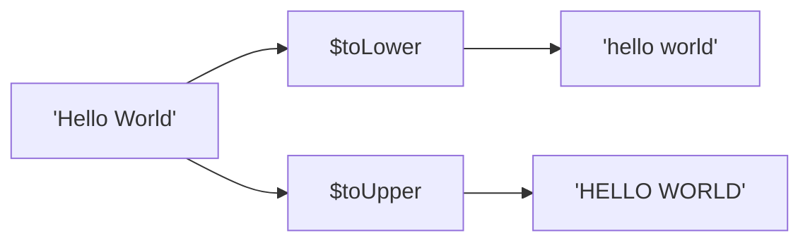

# How to Use $toLower and $toUpper in MongoDB Aggregation

Author: [nawazdhandala](https://www.github.com/nawazdhandala)

Tags: MongoDB, Aggregation, $toLower, $toUpper, Pipeline, String

Description: Learn how to use $toLower and $toUpper in MongoDB aggregation to normalize string case for comparisons, grouping, and output formatting.

---

## How $toLower and $toUpper Work

`$toLower` converts a string to all lowercase letters, and `$toUpper` converts a string to all uppercase letters. Both return the original string unchanged for non-alphabetic characters. They return an empty string if the input is null or missing.



## Syntax

```javascript
{ $toLower: <string expression> }
{ $toUpper: <string expression> }
```

## Examples

### Input Documents

```javascript
[
  { _id: 1, name: "Alice Smith", category: "ELECTRONICS", tag: "New Arrival" },
  { _id: 2, name: "BOB JONES",   category: "Furniture",   tag: "on SALE"     },
  { _id: 3, name: "carol DAVIS", category: "electronics", tag: "CLEARANCE"   }
]
```

### Example 1 - Normalize Category to Lowercase

Standardize the `category` field:

```javascript
db.products.aggregate([
  {
    $project: {
      name: 1,
      category: { $toLower: "$category" }
    }
  }
])
```

Output:

```javascript
[
  { _id: 1, name: "Alice Smith", category: "electronics" },
  { _id: 2, name: "BOB JONES",   category: "furniture"   },
  { _id: 3, name: "carol DAVIS", category: "electronics" }
]
```

### Example 2 - Normalize Category to Uppercase

```javascript
db.products.aggregate([
  {
    $project: {
      name: 1,
      category: { $toUpper: "$category" }
    }
  }
])
```

Output:

```javascript
[
  { _id: 1, name: "Alice Smith", category: "ELECTRONICS" },
  { _id: 2, name: "BOB JONES",   category: "FURNITURE"   },
  { _id: 3, name: "carol DAVIS", category: "ELECTRONICS" }
]
```

### Example 3 - Case-Insensitive Grouping

Group by category regardless of how it was stored (mixed case):

```javascript
db.products.aggregate([
  {
    $group: {
      _id: { $toLower: "$category" },
      count: { $sum: 1 },
      items: { $push: "$name" }
    }
  }
])
```

Output:

```javascript
[
  { _id: "electronics", count: 2, items: ["Alice Smith", "carol DAVIS"] },
  { _id: "furniture",   count: 1, items: ["BOB JONES"] }
]
```

Without `$toLower`, "ELECTRONICS" and "electronics" would be separate groups.

### Example 4 - Case-Insensitive Comparison in $match

Find documents where category is "electronics" regardless of case:

```javascript
db.products.aggregate([
  {
    $match: {
      $expr: {
        $eq: [{ $toLower: "$category" }, "electronics"]
      }
    }
  }
])
```

Output:

```javascript
[
  { _id: 1, name: "Alice Smith", category: "ELECTRONICS", tag: "New Arrival" },
  { _id: 3, name: "carol DAVIS", category: "electronics", tag: "CLEARANCE"   }
]
```

### Example 5 - Normalize for URL Slug Generation

Create a URL-friendly slug from the `name` field:

```javascript
db.products.aggregate([
  {
    $project: {
      slug: {
        $toLower: {
          $replaceAll: {
            input: "$name",
            find: " ",
            replacement: "-"
          }
        }
      }
    }
  }
])
```

Output:

```javascript
[
  { _id: 1, slug: "alice-smith" },
  { _id: 2, slug: "bob-jones"   },
  { _id: 3, slug: "carol-davis" }
]
```

### Example 6 - Capitalize First Letter (Title Case Pattern)

MongoDB does not have a built-in title case operator. Combine `$toUpper`, `$toLower`, and `$substrCP`:

```javascript
db.products.aggregate([
  {
    $project: {
      normalizedName: {
        $concat: [
          { $toUpper:  { $substrCP: ["$name", 0, 1] } },    // first char uppercase
          { $toLower:  { $substrCP: ["$name", 1, { $subtract: [{ $strLenCP: "$name" }, 1] }] } }  // rest lowercase
        ]
      }
    }
  }
])
```

Output:

```javascript
[
  { _id: 1, normalizedName: "Alice smith" },
  { _id: 2, normalizedName: "Bob jones"   },
  { _id: 3, normalizedName: "Carol davis" }
]
```

### Example 7 - Format Tags for Display

Uppercase tags for badge display:

```javascript
db.products.aggregate([
  {
    $project: {
      name: 1,
      badgeText: { $toUpper: "$tag" }
    }
  }
])
```

Output:

```javascript
[
  { _id: 1, name: "Alice Smith", badgeText: "NEW ARRIVAL" },
  { _id: 2, name: "BOB JONES",   badgeText: "ON SALE"     },
  { _id: 3, name: "carol DAVIS", badgeText: "CLEARANCE"   }
]
```

## Behavior with Null and Missing Values

```javascript
// Input: { _id: 1, field: null }
{ $toLower: "$field" }   // returns ""
{ $toUpper: "$field" }   // returns ""

// Input: { _id: 2 }  -- field missing
{ $toLower: "$field" }   // returns ""
{ $toUpper: "$field" }   // returns ""
```

## Use Cases

- Case-insensitive grouping when data was ingested with inconsistent casing
- Case-insensitive comparisons in `$match` via `$expr`
- Generating URL slugs, keys, or identifiers from display strings
- Normalizing user-entered data before storing or displaying

## Summary

`$toLower` and `$toUpper` convert string fields to lowercase or uppercase respectively. They return an empty string for null or missing inputs. The most common practical use is normalizing inconsistently cased data for grouping and comparison: applying `$toLower` in a `$group` `_id` makes grouping case-insensitive without requiring collection-level normalization.
