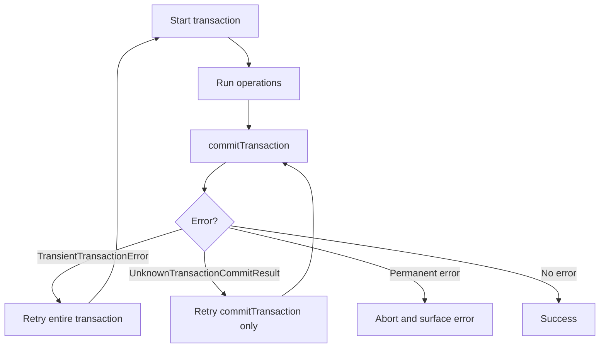

# How to Handle Transaction Errors and Retries in MongoDB

Author: [nawazdhandala](https://www.github.com/nawazdhandala)

Tags: MongoDB, Transaction, Error Handling, Retry, ACID

Description: Learn how to detect, categorise, and retry transient transaction errors in MongoDB including write conflicts, transient transaction errors, and unknown commit results.

---

## Why Transaction Errors Need Special Handling

MongoDB transactions can fail for reasons that are transient (a temporary write conflict, a replica set election, a network hiccup) and reasons that are permanent (a logic error, a schema violation). Retrying a permanent error wastes resources and masks bugs. Retrying a transient error is required for correctness.



## Error Labels Returned by MongoDB

MongoDB attaches `errorLabels` to transaction errors. Two labels require application-level handling:

| Label | Meaning | Action |
|---|---|---|
| `TransientTransactionError` | The entire transaction must be retried from the start | Re-run all operations |
| `UnknownTransactionCommitResult` | The commit may or may not have succeeded | Retry only `commitTransaction` |

## Basic Retry Wrapper

```javascript
const { MongoClient } = require("mongodb");

async function runWithRetry(client, fn, maxRetries = 5) {
  let attempt = 0;

  while (attempt < maxRetries) {
    const session = client.startSession();
    try {
      session.startTransaction({
        readConcern:  { level: "snapshot" },
        writeConcern: { w: "majority" }
      });

      const result = await fn(session);

      await commitWithRetry(session, maxRetries);
      return result;
    } catch (err) {
      await session.abortTransaction().catch(() => {});

      if (err.hasErrorLabel("TransientTransactionError") && attempt < maxRetries - 1) {
        attempt++;
        console.log(`TransientTransactionError on attempt ${attempt}. Retrying...`);
        await sleep(exponentialBackoff(attempt));
        continue;
      }

      throw err;  // non-transient or max retries exceeded
    } finally {
      await session.endSession();
    }
  }
}

async function commitWithRetry(session, maxRetries = 5) {
  let attempt = 0;
  while (attempt < maxRetries) {
    try {
      await session.commitTransaction();
      return;
    } catch (err) {
      if (err.hasErrorLabel("UnknownTransactionCommitResult") && attempt < maxRetries - 1) {
        attempt++;
        console.log(`UnknownTransactionCommitResult on commit attempt ${attempt}. Retrying commit...`);
        await sleep(exponentialBackoff(attempt));
        continue;
      }
      throw err;
    }
  }
}

function sleep(ms) {
  return new Promise((resolve) => setTimeout(resolve, ms));
}

function exponentialBackoff(attempt, baseMs = 50, maxMs = 2000) {
  const delay = Math.min(baseMs * Math.pow(2, attempt), maxMs);
  const jitter = Math.random() * delay * 0.2;
  return delay + jitter;
}
```

## Using the Retry Wrapper

```javascript
const client = new MongoClient(process.env.MONGO_URI);
await client.connect();
const db = client.db("banking");

async function transferFunds(fromId, toId, amount) {
  return runWithRetry(client, async (session) => {
    const accounts = db.collection("accounts");

    const from = await accounts.findOne({ _id: fromId }, { session });
    if (!from || from.balance < amount) {
      throw new Error("Insufficient funds");  // permanent error, not retried
    }

    await accounts.updateOne(
      { _id: fromId },
      { $inc: { balance: -amount } },
      { session }
    );

    await accounts.updateOne(
      { _id: toId },
      { $inc: { balance: amount } },
      { session }
    );

    await db.collection("ledger").insertOne({
      from: fromId,
      to:   toId,
      amount,
      ts:   new Date()
    }, { session });

    return { success: true, amount };
  });
}

try {
  const result = await transferFunds("acc-1", "acc-2", 150);
  console.log("Transfer complete:", result);
} catch (err) {
  console.error("Transfer failed permanently:", err.message);
}
```

## Common Error Codes and Their Meanings

```javascript
function classifyTransactionError(err) {
  // Transient - should retry the whole transaction
  if (err.hasErrorLabel("TransientTransactionError")) {
    return "RETRY_TRANSACTION";
  }

  // Commit result unknown - retry only commitTransaction
  if (err.hasErrorLabel("UnknownTransactionCommitResult")) {
    return "RETRY_COMMIT";
  }

  // Write conflict: code 112 - usually covered by TransientTransactionError label
  if (err.code === 112) {
    return "WRITE_CONFLICT";
  }

  // Session expired or no longer valid
  if (err.code === 217 || err.code === 225) {
    return "SESSION_EXPIRED";
  }

  // Transaction too old (default 60 seconds)
  if (err.codeName === "TransactionExceededLifetimeLimitSeconds") {
    return "TRANSACTION_TIMEOUT";
  }

  return "PERMANENT";
}
```

## Handling the transactionLifetimeLimitSeconds Timeout

By default MongoDB aborts transactions that run longer than 60 seconds. Break long operations into smaller transactions.

```javascript
// Change the server-side limit (requires admin role)
db.adminCommand({
  setParameter: 1,
  transactionLifetimeLimitSeconds: 120
});

// Or break a large bulk operation into smaller transactions
async function processBatch(db, client, items) {
  const CHUNK_SIZE = 500;
  for (let i = 0; i < items.length; i += CHUNK_SIZE) {
    const chunk = items.slice(i, i + CHUNK_SIZE);
    await runWithRetry(client, async (session) => {
      const ops = chunk.map((item) => ({
        updateOne: {
          filter: { _id: item._id },
          update: { $set: { processed: true } }
        }
      }));
      await db.collection("items").bulkWrite(ops, { session });
    });
  }
}
```

## Idempotency: Safe to Re-run

For `UnknownTransactionCommitResult` the commit may have already been applied. Make your operations idempotent so re-running them is safe.

```javascript
// Use upsert instead of insert to avoid duplicate-key errors on retry
await db.collection("invoices").updateOne(
  { _id: invoiceId },
  {
    $set:      { status: "paid", paidAt: new Date(), amount },
    $setOnInsert: { createdAt: new Date() }
  },
  { upsert: true, session }
);
```

## Summary

MongoDB transaction errors fall into two retryable categories: `TransientTransactionError` (retry the entire transaction from the start) and `UnknownTransactionCommitResult` (retry only `commitTransaction`). Use `err.hasErrorLabel()` to detect these labels, apply exponential backoff with jitter between retries, and separate permanent errors (business logic failures) from transient ones so they are not retried. Make transaction bodies idempotent to handle the case where a commit succeeded but the client never received the acknowledgement.
