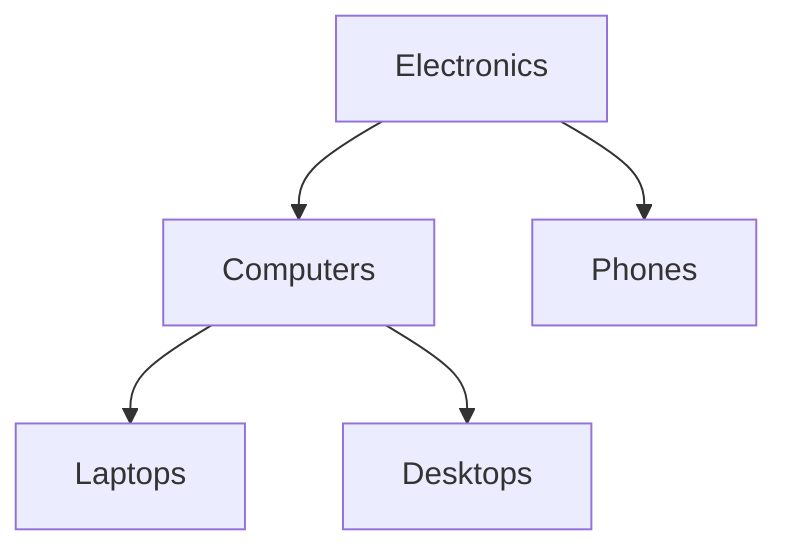

# How to Implement the Tree Pattern in MongoDB (Child References)

The child references pattern stores a tree by embedding an array of direct children's ObjectIds in each parent node. This makes it efficient to retrieve all direct children of a node in a single document read, but requires recursive queries to traverse the full subtree.

## Document Structure

Each node stores its own `_id`, a reference to its parent (`parentId`), and an array of its direct children's `_id` values.

```javascript
// Category tree
db.categories.insertMany([
  {
    _id: ObjectId("64a1b2c3d4e5f6789abc0001"),
    name: "Electronics",
    parentId: null,
    children: [
      ObjectId("64a1b2c3d4e5f6789abc0002"),
      ObjectId("64a1b2c3d4e5f6789abc0003")
    ]
  },
  {
    _id: ObjectId("64a1b2c3d4e5f6789abc0002"),
    name: "Computers",
    parentId: ObjectId("64a1b2c3d4e5f6789abc0001"),
    children: [
      ObjectId("64a1b2c3d4e5f6789abc0004"),
      ObjectId("64a1b2c3d4e5f6789abc0005")
    ]
  },
  {
    _id: ObjectId("64a1b2c3d4e5f6789abc0003"),
    name: "Phones",
    parentId: ObjectId("64a1b2c3d4e5f6789abc0001"),
    children: []
  },
  {
    _id: ObjectId("64a1b2c3d4e5f6789abc0004"),
    name: "Laptops",
    parentId: ObjectId("64a1b2c3d4e5f6789abc0002"),
    children: []
  },
  {
    _id: ObjectId("64a1b2c3d4e5f6789abc0005"),
    name: "Desktops",
    parentId: ObjectId("64a1b2c3d4e5f6789abc0002"),
    children: []
  }
]);
```

## Tree Visualization



## Indexes

Index the `children` array for element lookups and the `parentId` for upward traversal.

```javascript
db.categories.createIndex({ children: 1 });
db.categories.createIndex({ parentId: 1 });
```

## Getting Direct Children

Find a node and its direct children in one query using `$lookup` with the `children` array.

```javascript
const nodeWithChildren = await db.collection("categories").aggregate([
  { $match: { name: "Electronics" } },
  {
    $lookup: {
      from: "categories",
      localField: "children",
      foreignField: "_id",
      as: "directChildren"
    }
  }
]).toArray();

nodeWithChildren[0].directChildren.forEach((c) => console.log(c.name));
// Computers
// Phones
```

## Getting All Descendants (Recursive Traversal)

MongoDB does not have native recursive tree traversal for child reference patterns (use `$graphLookup` with parent references for that). For child references, implement recursion in the application layer.

```javascript
async function getAllDescendants(db, nodeId) {
  const node = await db.collection("categories").findOne({ _id: nodeId });
  if (!node || node.children.length === 0) return [];

  const descendants = [];
  const children = await db.collection("categories")
    .find({ _id: { $in: node.children } })
    .toArray();

  for (const child of children) {
    descendants.push(child);
    const grandchildren = await getAllDescendants(db, child._id);
    descendants.push(...grandchildren);
  }
  return descendants;
}

const allDescendants = await getAllDescendants(
  db,
  ObjectId("64a1b2c3d4e5f6789abc0001")
);
```

For trees of moderate depth, this works well. For very deep trees, prefer the materialized paths or nested sets patterns.

## Using $graphLookup (Alternative Traversal)

`$graphLookup` can traverse the child references pattern by connecting `children` in one document to `_id` in another.

```javascript
const subtree = await db.collection("categories").aggregate([
  { $match: { _id: ObjectId("64a1b2c3d4e5f6789abc0001") } },
  {
    $graphLookup: {
      from: "categories",
      startWith: "$children",
      connectFromField: "children",
      connectToField: "_id",
      as: "allDescendants",
      maxDepth: 10
    }
  }
]).toArray();

subtree[0].allDescendants.forEach((d) => console.log(d.name));
```

## Adding a New Child Node

When inserting a new child, you must also update the parent's `children` array.

```javascript
const session = client.startSession();
await session.withTransaction(async () => {
  const newNode = {
    _id: ObjectId(),
    name: "Tablets",
    parentId: ObjectId("64a1b2c3d4e5f6789abc0001"),
    children: []
  };

  await db.collection("categories").insertOne(newNode, { session });

  await db.collection("categories").updateOne(
    { _id: ObjectId("64a1b2c3d4e5f6789abc0001") },
    { $push: { children: newNode._id } },
    { session }
  );
});
await session.endSession();
```

## Moving a Node

Moving a node requires updating the old parent (remove from children), the new parent (add to children), and the node itself (update parentId).

```javascript
async function moveNode(db, nodeId, newParentId) {
  const node = await db.collection("categories").findOne({ _id: nodeId });
  const oldParentId = node.parentId;

  const session = client.startSession();
  await session.withTransaction(async () => {
    // Remove from old parent
    await db.collection("categories").updateOne(
      { _id: oldParentId },
      { $pull: { children: nodeId } },
      { session }
    );
    // Add to new parent
    await db.collection("categories").updateOne(
      { _id: newParentId },
      { $push: { children: nodeId } },
      { session }
    );
    // Update node's parentId
    await db.collection("categories").updateOne(
      { _id: nodeId },
      { $set: { parentId: newParentId } },
      { session }
    );
  });
  await session.endSession();
}
```

## Pattern Comparison

| Operation | Child References | Parent References |
|---|---|---|
| Get direct children | Very fast (single doc) | Requires query |
| Get all descendants | Application recursion or $graphLookup | $graphLookup native |
| Get ancestors | Application recursion | $graphLookup native |
| Add child | Update parent + insert | Insert only |
| Move node | Update 2 parents + node | Update node only |

## Summary

The child references pattern stores each node's direct children as an array of ObjectIds. It makes reading direct children fast (they are part of the parent document) but requires either application-level recursion or `$graphLookup` to traverse the full subtree. Use this pattern when you frequently need to list a node's direct children, your trees are relatively shallow, and you are comfortable managing the parent update on insertion. For deep trees that require frequent ancestor or descendant lookups, the materialized paths or nested sets patterns are more efficient.
