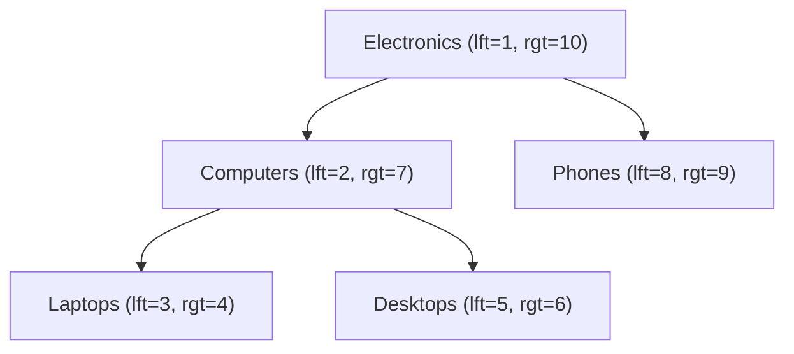

# How to Implement the Tree Pattern in MongoDB (Nested Sets)

The nested sets pattern (also called the modified preorder tree traversal) represents a tree by assigning each node two integers: a left value (`lft`) and a right value (`rgt`). These numbers encode the tree structure in a way that allows you to find all descendants of a node using a simple range query, with no recursion required. The trade-off is that inserts and moves are expensive because they may require updating a large number of nodes.

## How Nested Sets Work

During a depth-first traversal of the tree, assign incrementing integers: assign `lft` when you enter a node and `rgt` when you leave it. A node is a descendant of another if its `lft` and `rgt` fall within the ancestor's range.



## Document Structure

```javascript
db.categories.insertMany([
  { _id: ObjectId("64a1b2c3d4e5f6789abc0001"), name: "Electronics", lft: 1, rgt: 10, depth: 0 },
  { _id: ObjectId("64a1b2c3d4e5f6789abc0002"), name: "Computers", lft: 2, rgt: 7, depth: 1 },
  { _id: ObjectId("64a1b2c3d4e5f6789abc0003"), name: "Phones", lft: 8, rgt: 9, depth: 1 },
  { _id: ObjectId("64a1b2c3d4e5f6789abc0004"), name: "Laptops", lft: 3, rgt: 4, depth: 2 },
  { _id: ObjectId("64a1b2c3d4e5f6789abc0005"), name: "Desktops", lft: 5, rgt: 6, depth: 2 }
]);

// Essential indexes for range queries
db.categories.createIndex({ lft: 1, rgt: 1 });
db.categories.createIndex({ rgt: 1 });
```

## Querying All Descendants

Find all descendants of a node by looking for nodes whose `lft` and `rgt` fall within the parent's range. No recursion needed.

```javascript
// Find the parent node first
const parent = await db.collection("categories").findOne({ name: "Computers" });
// parent.lft = 2, parent.rgt = 7

// Get all descendants in a single query
const descendants = await db.collection("categories").find({
  lft: { $gt: parent.lft },
  rgt: { $lt: parent.rgt }
}).sort({ lft: 1 }).toArray();

descendants.forEach((d) => console.log(" ".repeat(d.depth * 2) + d.name));
// Laptops
// Desktops
```

## Querying All Ancestors

Find all ancestors of a node by looking for nodes whose `lft` and `rgt` wrap around the node's values.

```javascript
const node = await db.collection("categories").findOne({ name: "Laptops" });
// node.lft = 3, node.rgt = 4

const ancestors = await db.collection("categories").find({
  lft: { $lt: node.lft },
  rgt: { $gt: node.rgt }
}).sort({ lft: 1 }).toArray();

ancestors.forEach((a) => console.log(a.name));
// Electronics
// Computers
```

## Counting Descendants

The number of descendants equals `(rgt - lft - 1) / 2`. No query needed.

```javascript
const node = await db.collection("categories").findOne({ name: "Electronics" });
const descendantCount = (node.rgt - node.lft - 1) / 2;
console.log("Descendants:", descendantCount);  // 4
```

## Inserting a New Node

Inserting requires making room by incrementing the `lft` and `rgt` of all nodes to the right of the insertion point.

```javascript
async function insertNode(db, parentName, newNodeName) {
  const parent = await db.collection("categories").findOne({ name: parentName });
  const insertPoint = parent.rgt;

  // Shift all lft values >= insertPoint by 2
  await db.collection("categories").updateMany(
    { lft: { $gte: insertPoint } },
    { $inc: { lft: 2 } }
  );

  // Shift all rgt values >= insertPoint by 2
  await db.collection("categories").updateMany(
    { rgt: { $gte: insertPoint } },
    { $inc: { rgt: 2 } }
  );

  // Insert the new node at the insertion point
  await db.collection("categories").insertOne({
    _id: ObjectId(),
    name: newNodeName,
    lft: insertPoint,
    rgt: insertPoint + 1,
    depth: parent.depth + 1
  });
}

await insertNode(db, "Electronics", "Tablets");
```

Note: Insertions update potentially many documents. In large trees, this can be slow. Wrap in a transaction to prevent inconsistency.

## Deleting a Node and Its Subtree

Delete the node and its entire subtree, then close the gap.

```javascript
async function deleteSubtree(db, nodeName) {
  const node = await db.collection("categories").findOne({ name: nodeName });
  const width = node.rgt - node.lft + 1;

  // Delete the node and all descendants
  await db.collection("categories").deleteMany({
    lft: { $gte: node.lft },
    rgt: { $lte: node.rgt }
  });

  // Close the gap in lft values
  await db.collection("categories").updateMany(
    { lft: { $gt: node.rgt } },
    { $inc: { lft: -width } }
  );

  // Close the gap in rgt values
  await db.collection("categories").updateMany(
    { rgt: { $gt: node.rgt } },
    { $inc: { rgt: -width } }
  );
}
```

## When to Use Nested Sets

| Scenario | Recommendation |
|---|---|
| Frequent subtree queries | Nested sets (single range query) |
| Frequent inserts and moves | Parent references or child references |
| Static or rarely changed trees | Nested sets |
| Need ancestor queries | Nested sets or materialized paths |
| Simple implementation required | Parent references |

## Summary

The nested sets pattern assigns left and right integer markers to each node via a depth-first traversal. Descendants are found with a simple range query (`lft > parent.lft AND rgt < parent.rgt`), and ancestors are found with the inverse range query. This makes subtree and ancestor queries very fast with no recursion. The cost is that inserts and moves require updating many documents to shift the `lft` and `rgt` values. Nested sets are ideal for read-heavy tree structures that change infrequently, such as category hierarchies, organizational charts, or document outlines.
