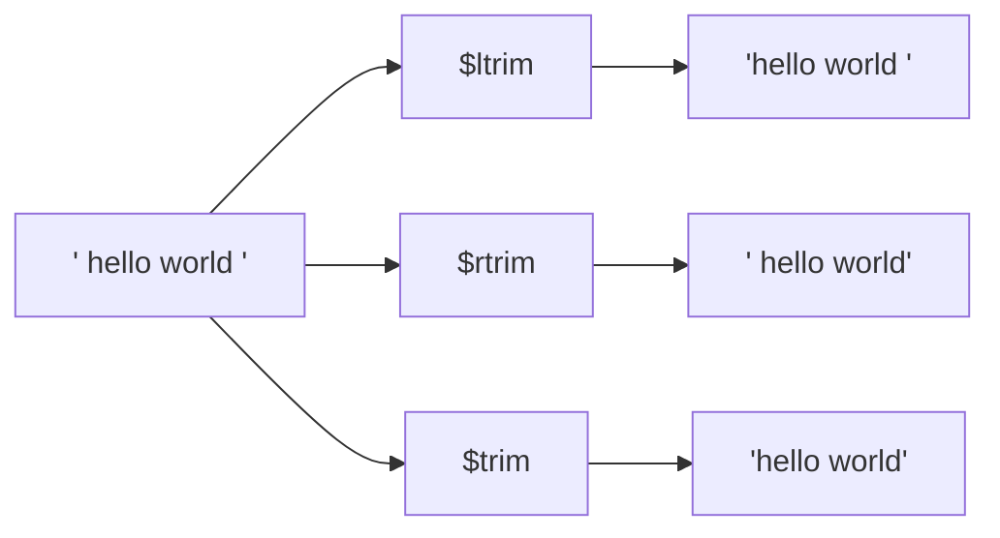

# How to Use $trim, $ltrim, $rtrim in MongoDB Aggregation

Author: [nawazdhandala](https://www.github.com/nawazdhandala)

Tags: MongoDB, Aggregation, Pipeline, String, Expression

Description: Learn how to use $trim, $ltrim, and $rtrim in MongoDB aggregation to remove whitespace or custom characters from the start and end of string fields.

---

## Overview

MongoDB provides three string trimming operators:

- `$trim` - removes characters from both ends of a string
- `$ltrim` - removes characters from the left (start) only
- `$rtrim` - removes characters from the right (end) only

All three were introduced in MongoDB 4.0. By default they remove Unicode whitespace characters. A `chars` option lets you specify custom characters to strip instead.



## Syntax

```javascript
{
  $trim:  { input: <string expression>, chars: <string expression> }
}
{
  $ltrim: { input: <string expression>, chars: <string expression> }
}
{
  $rtrim: { input: <string expression>, chars: <string expression> }
}
```

- `input` - the string to trim (required)
- `chars` - a string whose individual characters are stripped; defaults to whitespace characters if omitted

## Examples

### Example 1 - Remove Whitespace

```javascript
// Input: { _id: 1, username: "  alice  " }
db.users.aggregate([
  {
    $project: {
      cleanUsername: { $trim: { input: "$username" } }
    }
  }
])
```

Output:

```javascript
[
  { _id: 1, cleanUsername: "alice" }
]
```

### Example 2 - Left Trim Only

Remove only leading spaces:

```javascript
// Input: { _id: 1, code: "  ABC123" }
db.inventory.aggregate([
  {
    $project: {
      code: { $ltrim: { input: "$code" } }
    }
  }
])
```

Output:

```javascript
[
  { _id: 1, code: "ABC123" }
]
```

### Example 3 - Right Trim Only

Remove only trailing newlines and spaces:

```javascript
// Input: { _id: 1, log: "Error: timeout\n\n" }
db.logs.aggregate([
  {
    $project: {
      clean: { $rtrim: { input: "$log" } }
    }
  }
])
```

Output:

```javascript
[
  { _id: 1, clean: "Error: timeout" }
]
```

### Example 4 - Strip Custom Characters

Remove leading and trailing slashes from a URL path:

```javascript
// Input: { _id: 1, path: "/api/v1/users/" }
db.routes.aggregate([
  {
    $project: {
      normalizedPath: {
        $trim: {
          input: "$path",
          chars: "/"
        }
      }
    }
  }
])
```

Output:

```javascript
[
  { _id: 1, normalizedPath: "api/v1/users" }
]
```

### Example 5 - Strip Multiple Custom Characters

The `chars` string is treated as a set of individual characters, not a substring:

```javascript
// Input: { _id: 1, tag: "###featured###" }
db.posts.aggregate([
  {
    $project: {
      tag: {
        $trim: {
          input: "$tag",
          chars: "#"
        }
      }
    }
  }
])
```

Output:

```javascript
[
  { _id: 1, tag: "featured" }
]
```

Strip multiple characters (e.g., `#`, `-`, and space):

```javascript
db.posts.aggregate([
  {
    $project: {
      tag: {
        $trim: {
          input: "$tag",
          chars: "# -"
        }
      }
    }
  }
])
```

### Example 6 - Normalize User Input Before $group

Trim whitespace before grouping to avoid duplicate group keys:

```javascript
db.feedback.aggregate([
  {
    $project: {
      category: { $trim: { input: "$category" } }
    }
  },
  {
    $group: {
      _id: { $toLower: "$category" },
      count: { $sum: 1 }
    }
  }
])
```

### Example 7 - Trim After $split

Clean up segments after splitting a CSV-like string:

```javascript
// Input: { _id: 1, csv: " alice , bob , charlie " }
db.data.aggregate([
  {
    $project: {
      names: {
        $map: {
          input: { $split: ["$csv", ","] },
          as: "name",
          in: { $trim: { input: "$$name" } }
        }
      }
    }
  }
])
```

Output:

```javascript
[
  { _id: 1, names: ["alice", "bob", "charlie"] }
]
```

## Behavior Notes

| Input | Result |
|---|---|
| `null` | `null` |
| Missing field | `null` |
| Empty string `""` | `""` |
| String with only trimmed chars | `""` |

## Summary

`$trim`, `$ltrim`, and `$rtrim` clean string fields within an aggregation pipeline without requiring application-side preprocessing. Use `$trim` for symmetric whitespace removal, `$ltrim` or `$rtrim` when only one end needs cleaning, and the `chars` option to strip custom delimiters such as slashes, hashes, or quotes. Combining these operators with `$map` and `$split` enables robust CSV and delimited string normalization entirely inside MongoDB.
