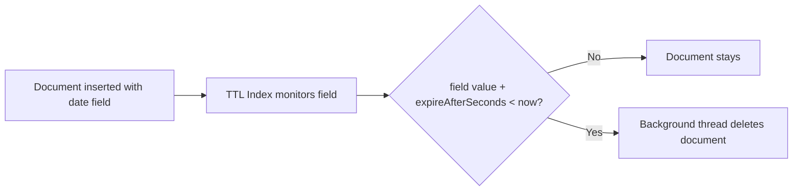

# How to Create a TTL Index in MongoDB for Automatic Document Expiry

Author: [nawazdhandala](https://www.github.com/nawazdhandala)

Tags: MongoDB, Index, TTL Index, Expiry, Data Lifecycle

Description: Learn how to create a TTL index in MongoDB to automatically delete documents after a set time, ideal for sessions, logs, cache records, and time-bound data.

---

## How TTL Indexes Work

A TTL (Time To Live) index is a special single-field index on a date field that automatically removes documents from a collection after a specified number of seconds. MongoDB runs a background thread that checks the TTL index every 60 seconds and deletes expired documents.

TTL indexes are ideal for:
- Session tokens and authentication records
- Temporary cache entries
- Log entries with a retention period
- Event queue items
- Password reset tokens



## Syntax

```javascript
db.collection.createIndex(
  { dateField: 1 },
  { expireAfterSeconds: <seconds> }
)
```

The `dateField` must store a BSON `Date` value. Documents with non-date values or missing the field are not deleted.

## Examples

### Expire Documents After 1 Hour

Create a TTL index that removes session documents 3600 seconds (1 hour) after their `createdAt` date:

```javascript
db.sessions.createIndex(
  { createdAt: 1 },
  { expireAfterSeconds: 3600, name: "idx_sessions_ttl" }
)
```

Insert a session document:

```javascript
db.sessions.insertOne({
  userId: "user_123",
  token: "abc123xyz",
  createdAt: new Date()
})
```

This document will be automatically deleted approximately 1 hour after insertion.

### Expire at a Specific Date/Time

To delete a document at a specific point in time rather than after a fixed duration, set `expireAfterSeconds: 0` and store the exact expiry time in the indexed field:

```javascript
db.passwordResets.createIndex(
  { expiresAt: 1 },
  { expireAfterSeconds: 0 }
)

db.passwordResets.insertOne({
  userId: "user_456",
  token: "reset_token_xyz",
  expiresAt: new Date(Date.now() + 15 * 60 * 1000)  // expires in 15 minutes
})
```

MongoDB deletes the document when `expiresAt` reaches the current time.

### Expire After Inactivity (Last Access Time)

Track last activity and expire documents after 30 minutes of inactivity:

```javascript
db.activeSessions.createIndex(
  { lastAccessedAt: 1 },
  { expireAfterSeconds: 1800 }  // 30 minutes
)

// Update last access on each request
db.activeSessions.updateOne(
  { sessionId: "sess_001" },
  { $set: { lastAccessedAt: new Date() } },
  { upsert: true }
)
```

Each time `lastAccessedAt` is updated, the 30-minute countdown resets.

### Node.js Example

```javascript
const { MongoClient } = require("mongodb");

async function main() {
  const client = new MongoClient("mongodb://localhost:27017");
  await client.connect();

  const db = client.db("myapp");
  const sessions = db.collection("sessions");

  // Create TTL index - expire sessions after 2 hours
  await sessions.createIndex(
    { createdAt: 1 },
    { expireAfterSeconds: 7200, name: "idx_sessions_ttl" }
  );

  // Insert a session
  const session = await sessions.insertOne({
    userId: "user_001",
    token: "token_abc123",
    createdAt: new Date(),
    data: { lastPage: "/dashboard" }
  });
  console.log("Session created:", session.insertedId);

  // Insert a session that expires at a specific time (10 seconds from now, for demo)
  await sessions.insertOne({
    userId: "user_002",
    token: "token_def456",
    createdAt: new Date(Date.now() - 7200 * 1000 - 60000)  // already expired
  });

  // Count sessions before expiry (background thread runs every ~60 seconds)
  const count = await sessions.countDocuments();
  console.log("Session count:", count);

  // List all TTL indexes
  const indexes = await sessions.indexes();
  const ttlIndexes = indexes.filter(i => i.expireAfterSeconds !== undefined);
  console.log("TTL indexes:", ttlIndexes.map(i => ({
    name: i.name,
    field: Object.keys(i.key)[0],
    expireAfterSeconds: i.expireAfterSeconds
  })));

  await client.close();
}

main().catch(console.error);
```

### Modify the TTL Expiry Duration

Change `expireAfterSeconds` on an existing TTL index with `collMod`:

```javascript
db.runCommand({
  collMod: "sessions",
  index: {
    keyPattern: { createdAt: 1 },
    expireAfterSeconds: 86400  // change to 24 hours
  }
})
```

## Constraints and Limitations

- TTL indexes must be on a single `Date` field (not compound).
- The background deletion thread runs approximately every 60 seconds, so document deletion is not instantaneous.
- Documents are deleted in batches; on heavily loaded systems, deletion may lag.
- TTL indexes do not work on capped collections.
- The indexed field must contain a BSON `Date` or an array of `Date` values. If an array, the earliest date is used.

## Handling Arrays of Dates

If the indexed field contains an array of dates, MongoDB uses the smallest (earliest) date to determine expiry:

```javascript
db.notifications.createIndex({ sentAt: 1 }, { expireAfterSeconds: 604800 })  // 7 days

db.notifications.insertOne({
  userId: "user_123",
  message: "Your order shipped",
  sentAt: [new Date("2026-03-01"), new Date("2026-03-02")]
})
// Expires 7 days after 2026-03-01 (the earliest date in the array)
```

## Best Practices

- **Use `expireAfterSeconds: 0` with a specific expiry date field** for fine-grained per-document expiry control.
- **Use `lastAccessedAt` with a fixed `expireAfterSeconds`** for sliding window expiry (e.g., sessions that expire after inactivity).
- **Plan for the 60-second delay** - expired documents are not deleted instantly; do not rely on sub-minute precision.
- **Monitor deletion rate** with `db.collection.stats()` and the TTL monitor via `serverStatus().metrics.ttl`.
- **Avoid TTL on capped collections** - MongoDB does not support TTL indexes on capped collections.

## Summary

A TTL index automatically removes documents after a specified duration by setting `expireAfterSeconds` on a date field index. Use `expireAfterSeconds: N` to delete documents `N` seconds after the date in the field, or `expireAfterSeconds: 0` with an absolute expiry date in the field for per-document control. The background deletion thread runs every 60 seconds, so deletion is eventual rather than instantaneous. TTL indexes are ideal for sessions, tokens, logs, and any time-bound data.
