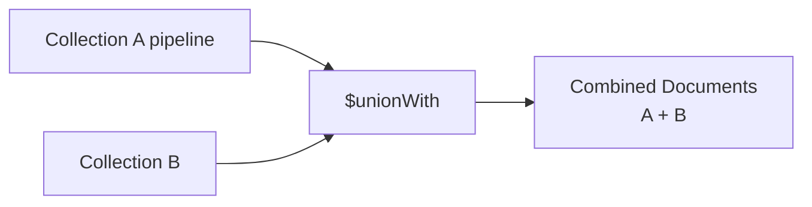

# How to Use $unionWith in MongoDB Aggregation

Author: [nawazdhandala](https://www.github.com/nawazdhandala)

Tags: MongoDB, Aggregation, $unionWith, Pipeline, Stage

Description: Learn how to use $unionWith in MongoDB aggregation to combine documents from multiple collections into a single result set, similar to SQL UNION ALL.

---

## How $unionWith Works

The `$unionWith` stage (introduced in MongoDB 4.4) combines documents from the current pipeline with documents from another collection, similar to SQL's `UNION ALL`. The combined documents are passed to the next pipeline stage. Documents are not deduplicated - if you need distinct results, add a `$group` or `$match` after `$unionWith`.



## Syntax

```javascript
// Simple form - include all documents from another collection
{ $unionWith: "<collectionName>" }

// With a sub-pipeline on the secondary collection
{
  $unionWith: {
    coll: "<collectionName>",
    pipeline: [ <aggregation stage>, ... ]
  }
}
```

## Examples

### Example 1 - Combine Two Collections

Suppose you have `sales2024` and `sales2025` collections with the same schema:

```javascript
// sales2024
[
  { _id: 1, product: "Laptop", amount: 1200, year: 2024 },
  { _id: 2, product: "Phone",  amount: 800,  year: 2024 }
]

// sales2025
[
  { _id: 1, product: "Monitor", amount: 600, year: 2025 },
  { _id: 2, product: "Laptop",  amount: 1300, year: 2025 }
]
```

Combine both collections:

```javascript
db.sales2024.aggregate([
  { $unionWith: "sales2025" }
])
```

Output:

```javascript
[
  { _id: 1, product: "Laptop",  amount: 1200, year: 2024 },
  { _id: 2, product: "Phone",   amount: 800,  year: 2024 },
  { _id: 1, product: "Monitor", amount: 600,  year: 2025 },
  { _id: 2, product: "Laptop",  amount: 1300, year: 2025 }
]
```

Note: `_id` values from different collections can overlap since `$unionWith` is a UNION ALL (not a join).

### Example 2 - Union and Group

Combine sales from both years and compute total revenue per product:

```javascript
db.sales2024.aggregate([
  { $unionWith: "sales2025" },
  {
    $group: {
      _id: "$product",
      totalRevenue: { $sum: "$amount" }
    }
  },
  { $sort: { totalRevenue: -1 } }
])
```

Output:

```javascript
[
  { _id: "Laptop",  totalRevenue: 2500 },
  { _id: "Phone",   totalRevenue: 800  },
  { _id: "Monitor", totalRevenue: 600  }
]
```

### Example 3 - $unionWith with a Sub-Pipeline

Apply a filter and projection to the secondary collection before combining:

```javascript
db.sales2024.aggregate([
  {
    $unionWith: {
      coll: "sales2025",
      pipeline: [
        { $match: { amount: { $gte: 1000 } } },
        { $project: { product: 1, amount: 1 } }
      ]
    }
  }
])
```

Output (only high-value 2025 sales are included):

```javascript
[
  { _id: 1, product: "Laptop", amount: 1200, year: 2024 },
  { _id: 2, product: "Phone",  amount: 800,  year: 2024 },
  { _id: 2, product: "Laptop", amount: 1300 }
]
```

### Example 4 - Union Multiple Collections

Chain multiple `$unionWith` stages to combine more than two collections:

```javascript
db.sales2023.aggregate([
  { $unionWith: "sales2024" },
  { $unionWith: "sales2025" },
  {
    $group: {
      _id: "$product",
      totalRevenue: { $sum: "$amount" },
      years: { $addToSet: "$year" }
    }
  }
])
```

### Example 5 - Combine Active and Archived Records

Merge current records with an archive collection for a unified view:

```javascript
db.activeOrders.aggregate([
  { $match: { customerId: "C1" } },
  {
    $unionWith: {
      coll: "archivedOrders",
      pipeline: [
        { $match: { customerId: "C1" } }
      ]
    }
  },
  { $sort: { orderDate: -1 } }
])
```

### Example 6 - Adding a Source Field Before Union

Tag documents with their source collection before combining:

```javascript
db.sales2024.aggregate([
  { $addFields: { source: "2024" } },
  {
    $unionWith: {
      coll: "sales2025",
      pipeline: [
        { $addFields: { source: "2025" } }
      ]
    }
  }
])
```

## $unionWith vs $lookup

| Feature | $unionWith | $lookup |
|---|---|---|
| Purpose | Combine rows from two collections | Join related documents |
| SQL equivalent | UNION ALL | LEFT OUTER JOIN |
| Deduplication | No (all documents included) | N/A |
| Match condition | No matching required | On field equality |

## Use Cases

- Combining sharded data stored in separate collections (by year, region, etc.)
- Merging active and archived records for historical reporting
- Building cross-collection reports in a single aggregation
- Combining event streams from multiple sources

## Summary

`$unionWith` appends documents from another collection (optionally filtered and projected via a sub-pipeline) to the current pipeline's document stream. It is MongoDB's equivalent of SQL `UNION ALL`. After combining collections, use `$group` to deduplicate or aggregate, and `$sort` to order the combined result. Chain multiple `$unionWith` stages to combine more than two collections.
