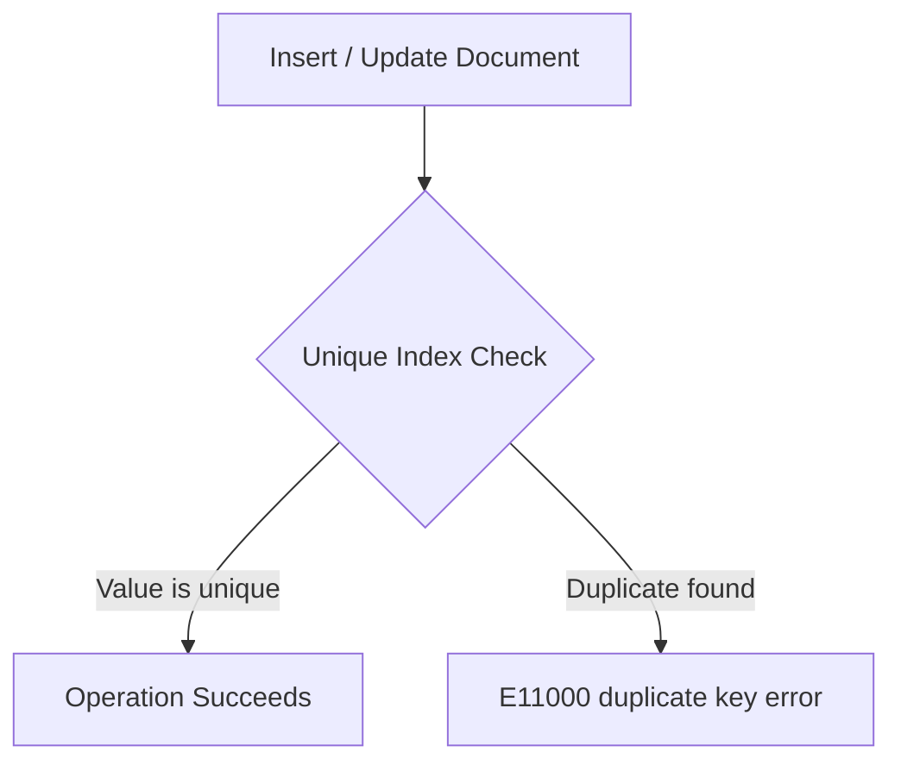

# How to Create a Unique Index in MongoDB

Author: [nawazdhandala](https://www.github.com/nawazdhandala)

Tags: MongoDB, Index, Unique Index, Data Integrity, Constraint

Description: Learn how to create unique indexes in MongoDB to enforce uniqueness constraints on single or multiple fields and handle duplicate key errors gracefully.

---

## How Unique Indexes Work

A unique index ensures that no two documents in a collection share the same value(s) for the indexed field(s). When you attempt to insert or update a document that would create a duplicate value, MongoDB rejects the operation with a `E11000 duplicate key error`.

The `_id` field has a unique index by default. You can add unique indexes to any other field or combination of fields.



## Syntax

```javascript
db.collection.createIndex(
  { field: 1 },
  { unique: true }
)
```

## Examples

### Unique Single-Field Index

Prevent two users from registering with the same email address:

```javascript
db.users.createIndex(
  { email: 1 },
  { unique: true, name: "idx_email_unique" }
)
```

### Unique Compound Index

A compound unique index enforces uniqueness across a combination of fields. Two documents can share individual field values, but not the same combination:

```javascript
db.enrollments.createIndex(
  { studentId: 1, courseId: 1 },
  { unique: true, name: "idx_enrollment_unique" }
)
```

This prevents a student from enrolling in the same course twice, but allows them to enroll in different courses.

### Testing the Unique Constraint

```javascript
db.users.insertOne({ email: "alice@example.com", name: "Alice" })
// Succeeds

db.users.insertOne({ email: "alice@example.com", name: "Another Alice" })
// Fails: E11000 duplicate key error collection: myapp.users index: email_1

// Update to a duplicate email also fails
db.users.updateOne(
  { name: "Another Alice" },
  { $set: { email: "alice@example.com" } }
)
// Fails: E11000 duplicate key error
```

### Unique Index and Null Values

A regular unique index treats `null` as a valid value and only allows one document with a `null` value for the field. To allow multiple documents without the field, combine unique with sparse or use a partial index:

```javascript
// Allows only one document with email: null or no email field
db.users.createIndex({ email: 1 }, { unique: true })

// Allows multiple documents without email, unique among those that have it
db.users.createIndex(
  { email: 1 },
  { unique: true, sparse: true }
)
```

### Creating a Unique Index on an Existing Collection

If the collection already has duplicate values, `createIndex()` will fail. Remove duplicates first:

```javascript
// Find all duplicates
db.users.aggregate([
  { $group: { _id: "$email", count: { $sum: 1 }, ids: { $push: "$_id" } } },
  { $match: { count: { $gt: 1 } } }
])

// Remove duplicates (keep first, delete rest)
db.users.aggregate([
  { $group: { _id: "$email", ids: { $push: "$_id" } } },
  { $match: { "ids.1": { $exists: true } } }
]).forEach(doc => {
  const [keep, ...remove] = doc.ids;
  db.users.deleteMany({ _id: { $in: remove } });
});

// Now create the unique index
db.users.createIndex({ email: 1 }, { unique: true })
```

### Handling E11000 in Node.js

```javascript
const { MongoClient } = require("mongodb");

async function main() {
  const client = new MongoClient("mongodb://localhost:27017");
  await client.connect();

  const users = client.db("myapp").collection("users");

  // Create unique index
  await users.createIndex(
    { email: 1 },
    { unique: true, name: "idx_email_unique" }
  );

  // Insert first user
  await users.insertOne({ email: "alice@example.com", name: "Alice" });
  console.log("Alice inserted successfully");

  // Try to insert duplicate
  try {
    await users.insertOne({ email: "alice@example.com", name: "Duplicate Alice" });
  } catch (err) {
    if (err.code === 11000) {
      console.log("Duplicate email rejected:", err.keyValue);
      // Output: { email: 'alice@example.com' }
    } else {
      throw err;
    }
  }

  // Use upsert to update-or-insert safely
  const result = await users.updateOne(
    { email: "alice@example.com" },
    { $set: { name: "Alice Updated", updatedAt: new Date() } },
    { upsert: true }
  );
  console.log("Upserted:", result.upsertedCount, "Updated:", result.modifiedCount);

  await client.close();
}

main().catch(console.error);
```

### Unique Index with Case Insensitivity

Use a collation to create a case-insensitive unique index:

```javascript
db.users.createIndex(
  { username: 1 },
  {
    unique: true,
    collation: { locale: "en", strength: 2 },
    name: "idx_username_ci_unique"
  }
)
```

With this index, `"Alice"`, `"alice"`, and `"ALICE"` are treated as the same value.

```javascript
// This would fail - "Alice" and "alice" are the same with strength: 2 collation
db.users.insertOne({ username: "Alice" })
db.users.insertOne({ username: "alice" }) // E11000 duplicate key
```

## Best Practices

- **Create unique indexes on natural keys** like email addresses, usernames, and SKU codes.
- **Use compound unique indexes** to model many-to-many uniqueness (e.g., one enrollment per student per course).
- **Handle `E11000` errors in application code** - catch them and return meaningful messages to users.
- **Check for duplicates before creating a unique index** on an existing collection.
- **Use `sparse: true` with unique** to allow multiple documents without the field.
- **Use collation** for case-insensitive unique constraints.
- **Use `upsert`** carefully with unique indexes - it atomically inserts or updates without race conditions.

## Summary

A unique index in MongoDB enforces that no two documents share the same value(s) for the indexed field(s). Create it with `{ unique: true }` in the options. When a duplicate is inserted or updated, MongoDB rejects the operation with an `E11000` error. Handle this error in application code, check for existing duplicates before creating the index on an existing collection, and use `sparse: true` if you need to allow multiple documents without the field.
