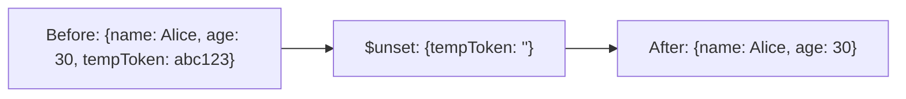

# How to Use $unset Operator in MongoDB to Remove Fields

Author: [nawazdhandala](https://www.github.com/nawazdhandala)

Tags: MongoDB, $unset, Update, Operator, CRUD

Description: Learn how to use MongoDB's $unset operator to remove fields from documents, including nested fields and array elements, with practical migration examples.

---

## How $unset Works

The `$unset` operator removes a specified field from a document. If the field does not exist, the operation has no effect and no error is thrown. It is the counterpart to `$set` - where `$set` adds or changes fields, `$unset` deletes them.



## Syntax

```javascript
{ $unset: { field1: "", field2: "", ... } }
```

The value associated with each field name is ignored - conventionally, an empty string `""` is used, but any value works.

## Basic Field Removal

```javascript
// Before: { _id: 1, name: "Alice", tempToken: "abc123", status: "active" }

db.users.updateOne(
  { _id: 1 },
  { $unset: { tempToken: "" } }
)

// After: { _id: 1, name: "Alice", status: "active" }
```

## Removing Multiple Fields at Once

```javascript
// Before: { _id: 2, name: "Bob", legacyId: 4567, oldEmail: "old@example.com", email: "bob@example.com" }

db.users.updateOne(
  { _id: 2 },
  { $unset: { legacyId: "", oldEmail: "" } }
)

// After: { _id: 2, name: "Bob", email: "bob@example.com" }
```

## Removing a Nested Field

Use dot notation to target fields inside embedded documents:

```javascript
// Before: { _id: 3, profile: { name: "Carol", ssn: "123-45-6789", city: "SF" } }

db.users.updateOne(
  { _id: 3 },
  { $unset: { "profile.ssn": "" } }
)

// After: { _id: 3, profile: { name: "Carol", city: "SF" } }
```

## $unset on Non-Existent Fields

If the field does not exist, the operation succeeds silently with no change:

```javascript
// "phoneNumber" does not exist - no error, no change
db.users.updateOne(
  { _id: 1 },
  { $unset: { phoneNumber: "" } }
)
```

## $unset on Array Elements

When applied to an array element by index, `$unset` sets the element to `null` rather than removing it from the array (preserving array length):

```javascript
// Before: { _id: 4, scores: [85, 90, 78] }

db.results.updateOne(
  { _id: 4 },
  { $unset: { "scores.1": "" } }
)

// After: { _id: 4, scores: [85, null, 78] }
```

To actually remove an array element, use `$pull` instead.

## Bulk Field Removal with updateMany()

Remove a deprecated field from all documents in a collection:

```javascript
// Schema migration: remove the "legacyScore" field from all documents
db.results.updateMany(
  { legacyScore: { $exists: true } },
  { $unset: { legacyScore: "" } }
)
```

## Combining $unset with $set

You can combine operators in a single update:

```javascript
// Migrate field name: remove "phoneNum", add "phoneNumber"
db.users.updateMany(
  { phoneNum: { $exists: true } },
  {
    $rename: { phoneNum: "phoneNumber" }
  }
)

// Or use $unset + $set manually
db.users.updateOne(
  { _id: 5, phoneNum: { $exists: true } },
  {
    $set: { phoneNumber: "555-1234" },
    $unset: { phoneNum: "" }
  }
)
```

## Use Cases

- Removing temporary tokens or session data from user documents
- Cleaning up deprecated fields during schema migrations
- Stripping sensitive information before archiving documents
- Removing optional fields that are no longer needed
- Rolling back partial schema changes

## Summary

`$unset` removes named fields from a document cleanly and safely - if the field does not exist, the operation is a no-op. Use dot notation to target nested fields without disturbing the rest of the embedded document. When removing an array element by index, be aware that `$unset` sets it to `null` rather than splicing it out; use `$pull` to actually remove an element from an array. Combine `$unset` with `$set` in a single update operation to rename or replace fields atomically.
