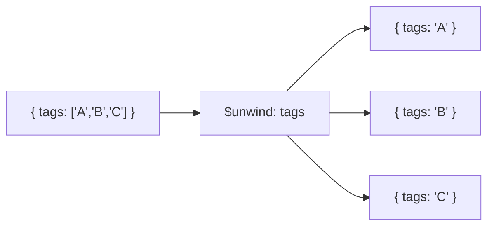

# How to Use $unwind in MongoDB Aggregation to Flatten Arrays

Author: [nawazdhandala](https://www.github.com/nawazdhandala)

Tags: MongoDB, Aggregation, $unwind, Pipeline, Stage, Array

Description: Learn how to use the $unwind stage in MongoDB aggregation to deconstruct arrays into individual documents for further pipeline processing.

---

## How $unwind Works

The `$unwind` stage deconstructs an array field from the input documents and outputs one document for each element in the array. If a document has an array with three elements, `$unwind` produces three output documents - each identical to the original except that the array field is replaced by a single element value.



## Syntax

### Short form

```javascript
{ $unwind: "$<arrayField>" }
```

### Long form (with options)

```javascript
{
  $unwind: {
    path: "$<arrayField>",
    includeArrayIndex: "<indexFieldName>",   // optional: add array index to output
    preserveNullAndEmptyArrays: <boolean>    // optional: keep docs with null/missing/empty array
  }
}
```

## Examples

### Input Documents

```javascript
[
  { _id: 1, product: "Laptop",  tags: ["electronics", "computers", "office"] },
  { _id: 2, product: "Phone",   tags: ["electronics", "mobile"] },
  { _id: 3, product: "Desk",    tags: [] },
  { _id: 4, product: "Pen",     tags: null },
  { _id: 5, product: "Monitor", /* tags field missing */ }
]
```

### Example 1 - Basic $unwind

```javascript
db.products.aggregate([
  { $unwind: "$tags" }
])
```

Output (documents with empty, null, or missing `tags` are dropped by default):

```javascript
[
  { _id: 1, product: "Laptop", tags: "electronics" },
  { _id: 1, product: "Laptop", tags: "computers"   },
  { _id: 1, product: "Laptop", tags: "office"      },
  { _id: 2, product: "Phone",  tags: "electronics" },
  { _id: 2, product: "Phone",  tags: "mobile"      }
]
```

### Example 2 - preserveNullAndEmptyArrays

Keep documents where `tags` is null, missing, or an empty array:

```javascript
db.products.aggregate([
  {
    $unwind: {
      path: "$tags",
      preserveNullAndEmptyArrays: true
    }
  }
])
```

Output:

```javascript
[
  { _id: 1, product: "Laptop",  tags: "electronics" },
  { _id: 1, product: "Laptop",  tags: "computers"   },
  { _id: 1, product: "Laptop",  tags: "office"      },
  { _id: 2, product: "Phone",   tags: "electronics" },
  { _id: 2, product: "Phone",   tags: "mobile"      },
  { _id: 3, product: "Desk"    },                    // empty array - field removed
  { _id: 4, product: "Pen",    tags: null },
  { _id: 5, product: "Monitor" }                     // missing field
]
```

### Example 3 - includeArrayIndex

Add the original array index to each output document:

```javascript
db.products.aggregate([
  {
    $unwind: {
      path: "$tags",
      includeArrayIndex: "tagIndex"
    }
  }
])
```

Output:

```javascript
[
  { _id: 1, product: "Laptop", tags: "electronics", tagIndex: 0 },
  { _id: 1, product: "Laptop", tags: "computers",   tagIndex: 1 },
  { _id: 1, product: "Laptop", tags: "office",      tagIndex: 2 },
  { _id: 2, product: "Phone",  tags: "electronics", tagIndex: 0 },
  { _id: 2, product: "Phone",  tags: "mobile",      tagIndex: 1 }
]
```

### Example 4 - $unwind Then $group (Tag Frequency)

Count how many products have each tag:

```javascript
db.products.aggregate([
  { $unwind: "$tags" },
  {
    $group: {
      _id: "$tags",
      count: { $sum: 1 },
      products: { $push: "$product" }
    }
  },
  { $sort: { count: -1 } }
])
```

Output:

```javascript
[
  { _id: "electronics", count: 2, products: ["Laptop", "Phone"] },
  { _id: "computers",   count: 1, products: ["Laptop"] },
  { _id: "office",      count: 1, products: ["Laptop"] },
  { _id: "mobile",      count: 1, products: ["Phone"]  }
]
```

### Example 5 - $unwind After $lookup

After joining collections with `$lookup`, `$unwind` flattens the joined array:

```javascript
db.orders.aggregate([
  {
    $lookup: {
      from: "customers",
      localField: "customerId",
      foreignField: "_id",
      as: "customer"
    }
  },
  { $unwind: "$customer" }
])
```

### Example 6 - $unwind on Nested Arrays

For documents with nested arrays, use the dot notation path:

```javascript
// Document: { _id: 1, category: { name: "Tech", items: ["laptop", "phone"] } }
db.catalog.aggregate([
  { $unwind: "$category.items" }
])
```

## Use Cases

- Computing tag or category frequency across a collection
- Flattening `$lookup` result arrays into embedded documents
- Processing individual items in an order's line items array
- Running per-element computations before re-grouping with `$push`

## Summary

The `$unwind` stage deconstructs array fields so that each array element becomes a separate document in the pipeline. By default, documents with null, missing, or empty arrays are dropped; use `preserveNullAndEmptyArrays: true` to keep them. `$unwind` is most commonly used to enable `$group` to aggregate by array elements, or to flatten `$lookup` results into a single embedded document.
