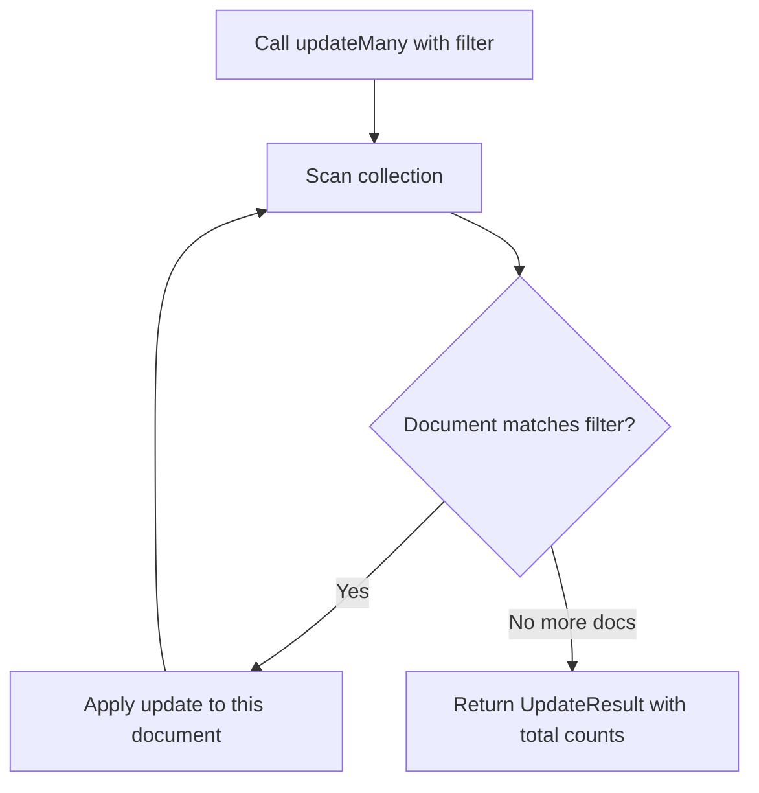

# How to Update Multiple Documents with updateMany() in MongoDB

Author: [nawazdhandala](https://www.github.com/nawazdhandala)

Tags: MongoDB, updateMany, CRUD, Update, Bulk

Description: Learn how to update all matching documents in a MongoDB collection using updateMany(), with practical examples covering field updates, bulk changes, and result verification.

---

## How updateMany() Works

`updateMany()` updates all documents that match the given filter, not just the first one. This is the correct method for bulk updates that need to apply the same change to many documents simultaneously.



## Syntax

```javascript
db.collection.updateMany(filter, update, options)
```

- `filter` - Query to select all documents to update
- `update` - Update operations using update operators
- `options` - Optional settings including `upsert`, `arrayFilters`, `hint`

## Basic Example - Updating a Status Field

Mark all inactive users from a specific year as archived:

```javascript
// Before: multiple documents with { status: "inactive", createdYear: 2021 }

db.users.updateMany(
  { status: "inactive", createdYear: 2021 },
  { $set: { status: "archived", archivedAt: new Date() } }
)

// After: all matching documents have status: "archived" and archivedAt set
```

## Checking the Result

```javascript
const result = db.orders.updateMany(
  { status: "pending", createdAt: { $lt: new Date("2024-01-01") } },
  { $set: { status: "expired" } }
)

print("Documents matched:", result.matchedCount)
print("Documents modified:", result.modifiedCount)
```

## Applying Updates to All Documents

Pass an empty filter `{}` to update every document in the collection:

```javascript
// Add a default "active" status to all documents that lack one
db.users.updateMany(
  { status: { $exists: false } },
  { $set: { status: "active" } }
)
```

## Incrementing a Field on Multiple Documents

Use `$inc` to apply a numeric increment to all matching documents:

```javascript
// Apply a 10% price increase to all products in the Electronics category
db.products.updateMany(
  { category: "Electronics" },
  { $mul: { price: 1.10 } }
)
```

## Adding a New Field to All Documents

Use `$set` to add a field to documents that are missing it:

```javascript
// Add a version field to all documents that don't have one
db.records.updateMany(
  { version: { $exists: false } },
  { $set: { version: 1 } }
)
```

## Removing a Field from All Documents

Use `$unset` to remove a deprecated field:

```javascript
// Remove the legacy "legacyId" field from all documents
db.users.updateMany(
  { legacyId: { $exists: true } },
  { $unset: { legacyId: "" } }
)
```

## Updating Nested Fields in Multiple Documents

```javascript
// Update a nested field across all matching documents
db.employees.updateMany(
  { "department.name": "Engineering" },
  { $set: { "department.budget": 500000, "department.updatedAt": new Date() } }
)
```

## Using arrayFilters with updateMany()

Update specific array elements across many documents:

```javascript
// Set the "active" flag to false for all "trial" subscriptions in all users
db.users.updateMany(
  {},
  { $set: { "subscriptions.$[sub].active": false } },
  { arrayFilters: [{ "sub.type": "trial" }] }
)
```

## Upsert with updateMany()

Upsert with `updateMany()` inserts at most one document if nothing matches:

```javascript
db.counters.updateMany(
  { category: "newCategory" },
  { $setOnInsert: { category: "newCategory", count: 0 } },
  { upsert: true }
)
```

## Performance Considerations

Large `updateMany()` operations can hold locks for extended periods. For very large updates, consider batching:

```javascript
// Process in batches to reduce lock contention
const batchSize = 1000
let processed = 0

do {
  const result = db.largeLogs.updateMany(
    { processed: false },
    { $set: { processed: true } },
    { limit: batchSize }  // Note: limit not supported natively - use find+updateOne loop instead
  )
  processed += result.modifiedCount
  print(`Processed ${processed} records`)
} while (result.modifiedCount === batchSize)
```

## Use Cases

- Migrating all documents to a new schema format
- Bulk-expiring or archiving old records
- Applying a price or discount change to a product category
- Adding default values for new fields during schema evolution
- Revoking permissions or resetting statuses in bulk

## Summary

`updateMany()` is the correct tool for bulk updates that affect multiple documents. It applies the update to every document matching the filter and returns counts of matched and modified documents. Always use update operators (`$set`, `$inc`, `$unset`, etc.) rather than replacement documents. For very large collections, consider batching your updates to reduce lock contention. Use `$exists: false` filters to safely backfill new fields during schema migrations.
