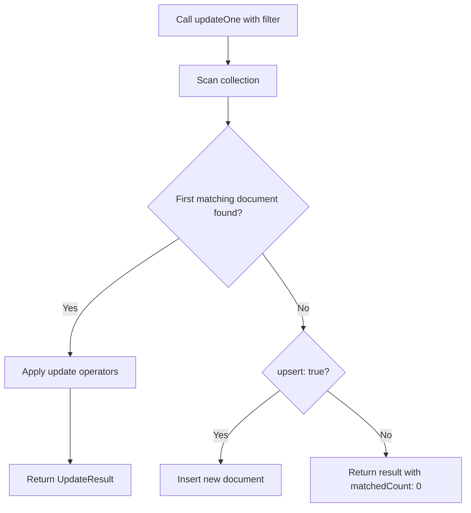

# How to Update a Single Document with updateOne() in MongoDB

Author: [nawazdhandala](https://www.github.com/nawazdhandala)

Tags: MongoDB, updateOne, CRUD, Update, Document

Description: Learn how to update a single document in MongoDB using updateOne(), including update operators, upsert behavior, and result interpretation.

---

## How updateOne() Works

`updateOne()` finds the first document that matches the filter and applies the specified update to it. Only one document is modified, even if multiple documents match the filter. If no document matches, the operation does nothing (unless upsert is enabled).



## Syntax

```javascript
db.collection.updateOne(filter, update, options)
```

- `filter` - Query to select the document to update
- `update` - Update document using update operators
- `options` - Optional settings including `upsert`, `arrayFilters`, `hint`

## Basic Update with $set

Use `$set` to update specific fields without affecting others:

```javascript
// Before: { _id: 1, name: "Alice", status: "inactive", loginCount: 5 }

db.users.updateOne(
  { _id: 1 },
  { $set: { status: "active" } }
)

// After: { _id: 1, name: "Alice", status: "active", loginCount: 5 }
```

## Updating Multiple Fields

Update multiple fields in a single operation:

```javascript
db.users.updateOne(
  { email: "alice@example.com" },
  {
    $set: {
      lastLoginAt: new Date(),
      status: "active"
    },
    $inc: { loginCount: 1 }
  }
)
```

## Reading the Result

The returned `UpdateResult` object tells you what happened:

```javascript
const result = db.products.updateOne(
  { sku: "ELEC-001" },
  { $set: { price: 199.99, updatedAt: new Date() } }
)

print("Matched:", result.matchedCount)   // 1 if document was found
print("Modified:", result.modifiedCount) // 1 if document was changed
```

Note: `matchedCount` can be 1 while `modifiedCount` is 0 if the update value was the same as the existing value.

## Updating Nested Fields

Use dot notation to target fields inside embedded documents:

```javascript
// Before: { _id: 2, address: { city: "SF", zip: "94105" } }

db.users.updateOne(
  { _id: 2 },
  { $set: { "address.city": "Oakland", "address.zip": "94601" } }
)

// After: { _id: 2, address: { city: "Oakland", zip: "94601" } }
```

## Updating Array Elements by Index

```javascript
// Before: { _id: 3, scores: [80, 90, 70] }

db.results.updateOne(
  { _id: 3 },
  { $set: { "scores.1": 95 } }
)

// After: { _id: 3, scores: [80, 95, 70] }
```

## Updating the First Matching Array Element with Positional Operator

Use `$` to update the first array element that matches the filter:

```javascript
// Before: { _id: 4, items: [{ name: "Widget", qty: 10 }, { name: "Gadget", qty: 5 }] }

db.orders.updateOne(
  { _id: 4, "items.name": "Widget" },
  { $set: { "items.$.qty": 20 } }
)

// After: { _id: 4, items: [{ name: "Widget", qty: 20 }, { name: "Gadget", qty: 5 }] }
```

## Using arrayFilters

Target specific array elements by condition:

```javascript
db.students.updateOne(
  { _id: 5 },
  { $set: { "grades.$[elem].score": 100 } },
  { arrayFilters: [{ "elem.subject": "Math" }] }
)
```

## Upsert Option

Create the document if it does not exist:

```javascript
db.counters.updateOne(
  { name: "pageViews" },
  { $inc: { count: 1 } },
  { upsert: true }
)
```

## Use Cases

- Updating a user's last login timestamp
- Changing the status of a specific order
- Correcting a typo in a product name
- Incrementing a view counter on an article
- Updating an address or contact info

## Summary

`updateOne()` is the standard method for modifying a single document in MongoDB. Always use update operators like `$set`, `$inc`, or `$push` rather than replacing the whole document. Check `matchedCount` and `modifiedCount` in the result to verify the operation's effect. For conditional array element updates, use the positional `$` operator or `arrayFilters`. Enable `upsert: true` to perform an insert-or-update in one atomic operation.
