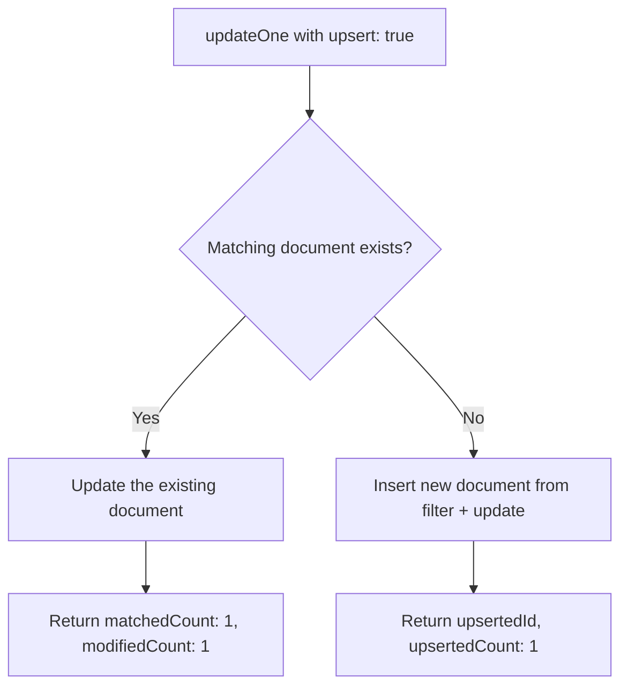

# How to Use upsert Option in MongoDB Update Operations

Author: [nawazdhandala](https://www.github.com/nawazdhandala)

Tags: MongoDB, Upsert, Update, Insert, CRUD

Description: Learn how to use the upsert option in MongoDB to insert a document when no matching document exists, combining insert and update into a single atomic operation.

---

## How Upsert Works

The `upsert` option enables "update-or-insert" behavior. When `upsert: true` is set on an update operation:

- If a matching document is found, it is updated normally
- If no matching document is found, a new document is inserted using the filter fields and the update expression

This eliminates the need for a separate "check if exists, then insert or update" pattern and makes the operation atomic.



## Syntax

```javascript
db.collection.updateOne(filter, update, { upsert: true })
db.collection.updateMany(filter, update, { upsert: true })
db.collection.findOneAndUpdate(filter, update, { upsert: true })
```

## Basic Upsert Example

Create a counter if it does not exist, or increment it if it does:

```javascript
// First call - "pageViews" counter does not exist yet
db.counters.updateOne(
  { name: "pageViews" },
  { $inc: { count: 1 } },
  { upsert: true }
)
// Result: inserts { name: "pageViews", count: 1 }

// Second call - "pageViews" counter now exists
db.counters.updateOne(
  { name: "pageViews" },
  { $inc: { count: 1 } },
  { upsert: true }
)
// Result: updates to { name: "pageViews", count: 2 }
```

## Detecting Upsert vs Update

Check the result to know if a document was inserted or updated:

```javascript
const result = db.users.updateOne(
  { email: "new@example.com" },
  { $set: { name: "New User", role: "viewer", createdAt: new Date() } },
  { upsert: true }
)

if (result.upsertedCount > 0) {
  print("New document inserted with _id:", result.upsertedId)
} else {
  print("Existing document updated")
}
```

## How the Inserted Document is Constructed

On an upsert, MongoDB merges the filter and the update to create the new document:

```javascript
db.products.updateOne(
  { sku: "WIDGET-01", category: "Hardware" },  // filter fields become part of document
  { $set: { name: "Widget", price: 9.99 } },    // $set fields are added
  { upsert: true }
)

// Resulting inserted document:
// { _id: ObjectId("..."), sku: "WIDGET-01", category: "Hardware", name: "Widget", price: 9.99 }
```

## Using $setOnInsert

`$setOnInsert` applies fields only when a document is being created (not when updating an existing one):

```javascript
db.users.updateOne(
  { email: "alice@example.com" },
  {
    $set: { lastLoginAt: new Date() },         // applied on both update and insert
    $setOnInsert: { createdAt: new Date(), role: "viewer" }  // only on insert
  },
  { upsert: true }
)
```

This ensures `createdAt` is only set once - when the document is first created.

## Upsert in findOneAndUpdate()

Get the document back after upsert:

```javascript
const user = db.users.findOneAndUpdate(
  { email: "bob@example.com" },
  {
    $setOnInsert: { name: "Bob", createdAt: new Date() },
    $set: { lastSeen: new Date() }
  },
  {
    upsert: true,
    returnDocument: "after"
  }
)

print("User:", user.name, "| Last seen:", user.lastSeen)
```

## Upsert with Multiple Conditions

The filter can have multiple fields - all filter fields are included in the inserted document:

```javascript
db.analytics.updateOne(
  {
    page: "/home",
    date: "2024-01-15",
    device: "mobile"
  },
  { $inc: { views: 1 } },
  { upsert: true }
)
// Inserts: { page: "/home", date: "2024-01-15", device: "mobile", views: 1 }
// Or updates views if the document already exists
```

## Upsert with updateMany()

When using `upsert: true` with `updateMany()`, at most one document is inserted (if none match):

```javascript
db.settings.updateMany(
  { category: "display" },
  { $set: { theme: "dark" } },
  { upsert: true }
)
// If no documents match { category: "display" }, one is inserted
// If one or more match, all are updated
```

## Avoiding Duplicate Inserts

For concurrent upserts on the same filter, create a unique index on the filter fields to prevent duplicate inserts:

```javascript
db.counters.createIndex({ name: 1 }, { unique: true })

// Now concurrent upserts on { name: "pageViews" } are safe
// Only one document will be created, others will update it
```

## Use Cases

- Maintaining analytics counters per page, date, and dimension
- Creating user profiles on first login and updating them thereafter
- Implementing idempotent event handlers (safe to retry)
- Managing configuration documents that may or may not exist
- Building lookup/reference tables that grow incrementally

## Summary

The `upsert` option makes MongoDB update operations idempotent and atomic for create-or-update scenarios. The inserted document is built from the filter fields and the update expression. Use `$setOnInsert` to apply fields only during insertion, such as `createdAt` timestamps. Always create a unique index on the filter fields when multiple concurrent upserts are possible to prevent duplicate documents. Combine with `findOneAndUpdate()` to also retrieve the resulting document in the same atomic operation.
