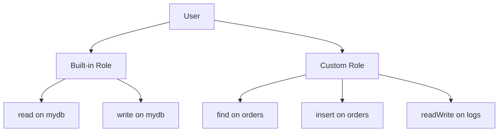

# How to Create Users and Roles in MongoDB

Author: [nawazdhandala](https://www.github.com/nawazdhandala)

Tags: MongoDB, Security, Authentication, Authorization, Administration

Description: Learn how to create, modify, and delete MongoDB users and custom roles, assign privileges, and follow least-privilege principles for database access control.

---

## How MongoDB Users and Roles Work

MongoDB uses a role-based access control model. Users are assigned one or more roles, and roles define the set of privileges (actions on resources) that are allowed. Roles can be built-in (provided by MongoDB) or custom (defined by you).



## Built-in Roles

MongoDB ships with a set of built-in roles. The most commonly used ones are:

Database-level roles (scoped to a specific database):
- `read` - read all non-system collections
- `readWrite` - read and write all non-system collections
- `dbAdmin` - administrative tasks like indexing and stats, but not user management
- `dbOwner` - all `dbAdmin`, `readWrite`, and `userAdmin` privileges combined
- `userAdmin` - create and modify users and roles in the database

Cluster-wide admin roles (stored in `admin` database):
- `readAnyDatabase` - `read` on all databases
- `readWriteAnyDatabase` - `readWrite` on all databases
- `userAdminAnyDatabase` - `userAdmin` on all databases
- `dbAdminAnyDatabase` - `dbAdmin` on all databases
- `clusterAdmin` - manage replica sets and sharded clusters
- `root` - superuser combining all other roles

## Creating a User

Connect to mongosh as an admin user, then switch to the target database and create the user.

Create a read-only user on a specific database:

```javascript
use reporting

db.createUser({
  user: "reportUser",
  pwd: passwordPrompt(),
  roles: [
    { role: "read", db: "reporting" }
  ]
})
```

Create a read-write application user:

```javascript
use myapp

db.createUser({
  user: "appUser",
  pwd: passwordPrompt(),
  roles: [
    { role: "readWrite", db: "myapp" }
  ]
})
```

Create a user with roles on multiple databases:

```javascript
use admin

db.createUser({
  user: "multiDbUser",
  pwd: passwordPrompt(),
  roles: [
    { role: "readWrite", db: "appdb" },
    { role: "read", db: "analytics" }
  ]
})
```

## Viewing Users

List all users on the current database:

```javascript
db.getUsers()
```

Get a specific user with privileges:

```javascript
db.getUser("appUser", { showPrivileges: true, showAuthenticationRestrictions: true })
```

List all users across all databases (run as admin):

```javascript
use admin
db.system.users.find().pretty()
```

## Updating a User

Add a role to an existing user:

```javascript
use myapp

db.grantRolesToUser("appUser", [
  { role: "dbAdmin", db: "myapp" }
])
```

Remove a role from a user:

```javascript
db.revokeRolesFromUser("appUser", [
  { role: "dbAdmin", db: "myapp" }
])
```

Replace all roles on a user:

```javascript
db.updateUser("appUser", {
  roles: [
    { role: "readWrite", db: "myapp" }
  ]
})
```

Change a user's password:

```javascript
db.changeUserPassword("appUser", passwordPrompt())
```

## Dropping a User

```javascript
use myapp
db.dropUser("appUser")
```

## Creating Custom Roles

When built-in roles are too broad or too narrow, create a custom role. Custom roles are stored in the `admin` database but can be granted on specific databases.

Create a custom role that allows only inserting and finding documents in a specific collection:

```javascript
use admin

db.createRole({
  role: "orderWriter",
  privileges: [
    {
      resource: { db: "myapp", collection: "orders" },
      actions: ["find", "insert", "update"]
    }
  ],
  roles: []  // no inherited roles
})
```

A role that inherits from another role and adds extra privileges:

```javascript
use admin

db.createRole({
  role: "analyticsReader",
  privileges: [
    {
      resource: { db: "analytics", collection: "" },  // all collections in analytics
      actions: ["find", "listCollections"]
    }
  ],
  roles: [
    { role: "read", db: "reporting" }  // inherited role
  ]
})
```

Grant the custom role to a user:

```javascript
use myapp

db.grantRolesToUser("appUser", [
  { role: "orderWriter", db: "admin" }
])
```

## Listing and Dropping Custom Roles

List all custom roles:

```javascript
use admin
db.getRoles({ showPrivileges: true, showBuiltinRoles: false })
```

Drop a custom role:

```javascript
use admin
db.dropRole("orderWriter")
```

## Common Privilege Actions

When creating custom roles, these are frequently used actions:

```text
find          - query documents
insert        - insert documents
update        - update documents
remove        - delete documents
createIndex   - create indexes
dropIndex     - drop indexes
createCollection  - create collections
dropCollection    - drop collections
listCollections   - list collections
listIndexes       - list indexes
collStats         - collection statistics
dbStats           - database statistics
```

## Authentication Restrictions

You can restrict a user to connect only from specific IP addresses:

```javascript
use admin

db.createUser({
  user: "restrictedUser",
  pwd: passwordPrompt(),
  roles: [{ role: "readWrite", db: "myapp" }],
  authenticationRestrictions: [
    {
      clientSource: ["10.0.0.0/24"],
      serverAddress: ["10.0.0.5"]
    }
  ]
})
```

## Best Practices

- Follow the principle of least privilege: grant only the actions each user needs.
- Never use the `root` role for application connections.
- Create one user per application service, not one user per developer.
- Use custom roles instead of broad built-in roles when you need collection-level control.
- Store user credentials in a secrets manager and rotate them regularly.
- Periodically audit users with `db.system.users.find()` and remove stale accounts.

## Summary

MongoDB's user and role system provides fine-grained access control through built-in roles like `read`, `readWrite`, and `dbAdmin`, as well as custom roles with specific privileges on specific resources. Create users with `db.createUser()`, assign roles with `grantRolesToUser()`, and define custom roles with `db.createRole()` when the built-in roles do not fit your needs. Always follow least-privilege principles and audit your users regularly.
