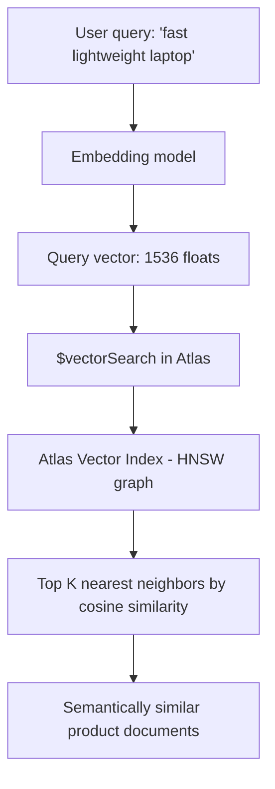

# How to Use $vectorSearch in MongoDB Atlas for AI Applications

Author: OneUptime Team

Tags: MongoDB, Atlas Search, Vector search, AI, Embedding

Description: Learn how to use MongoDB Atlas $vectorSearch to perform semantic similarity search over vector embeddings for AI-powered recommendation and RAG applications.

---

`$vectorSearch` is a MongoDB Atlas aggregation stage that performs approximate nearest-neighbor (ANN) search over dense vector embeddings stored in your documents. It is the foundation for semantic search, recommendation engines, and retrieval-augmented generation (RAG) applications.

## Why Vector Search?

Traditional text search matches on keywords. Vector search matches on *meaning* -- documents are represented as high-dimensional numeric vectors (embeddings) generated by machine learning models, and similar meanings produce vectors that are close together in the embedding space.



## Setting Up a Vector Index

First, create a vector search index on your collection through the Atlas UI, Atlas CLI, or the Atlas API:

```javascript
// Atlas Search Index definition (JSON in Atlas UI)
{
  "fields": [
    {
      "type": "vector",
      "path": "embedding",
      "numDimensions": 1536,        // must match your embedding model
      "similarity": "cosine"        // cosine | euclidean | dotProduct
    },
    {
      "type": "filter",
      "path": "category"            // pre-filter field
    },
    {
      "type": "filter",
      "path": "inStock"
    }
  ]
}
```

## Storing Embeddings

Generate and store embeddings alongside your documents:

```javascript
// Example using OpenAI embeddings
const { OpenAI } = require("openai");
const { MongoClient } = require("mongodb");

const openai = new OpenAI({ apiKey: process.env.OPENAI_API_KEY });
const client = new MongoClient(process.env.MONGODB_URI);

async function embedAndStore(products) {
  const db = client.db("shop");
  const col = db.collection("products");

  for (const product of products) {
    const text = `${product.name} ${product.description} ${product.category}`;
    const response = await openai.embeddings.create({
      model: "text-embedding-3-small",
      input: text
    });

    await col.updateOne(
      { _id: product._id },
      { $set: { embedding: response.data[0].embedding } }
    );
  }
}
```

## Basic $vectorSearch Query

```javascript
// First embed the query text
async function searchProducts(queryText, limit = 10) {
  const response = await openai.embeddings.create({
    model: "text-embedding-3-small",
    input: queryText
  });
  const queryVector = response.data[0].embedding;

  const results = await db.collection("products").aggregate([
    {
      $vectorSearch: {
        index: "products_vector_index",
        path: "embedding",
        queryVector: queryVector,
        numCandidates: 100,   // examine this many candidates
        limit: 10             // return top 10
      }
    },
    {
      $project: {
        name: 1,
        description: 1,
        price: 1,
        score: { $meta: "vectorSearchScore" }
      }
    }
  ]).toArray();

  return results;
}
```

## Pre-Filtering by Metadata

Use `filter` to narrow the vector search before performing ANN search -- this is more efficient than a post-filter:

```javascript
db.products.aggregate([
  {
    $vectorSearch: {
      index: "products_vector_index",
      path: "embedding",
      queryVector: queryVector,
      numCandidates: 200,
      limit: 20,
      filter: {
        $and: [
          { category: { $eq: "Electronics" } },
          { inStock: { $eq: true } },
          { price: { $lte: 1000 } }
        ]
      }
    }
  },
  {
    $project: {
      name: 1,
      price: 1,
      category: 1,
      score: { $meta: "vectorSearchScore" }
    }
  }
]);
```

## Hybrid Search: Combining Vector and Keyword Search

Use `$unionWith` and `$group` to merge vector search results with Atlas full-text search results (reciprocal rank fusion):

```javascript
const vectorResults = db.articles.aggregate([
  {
    $vectorSearch: {
      index: "articles_vector",
      path: "embedding",
      queryVector: queryVector,
      numCandidates: 150,
      limit: 50
    }
  },
  { $addFields: { vsScore: { $meta: "vectorSearchScore" } } },
  { $project: { _id: 1, title: 1, body: 1, vsScore: 1 } }
]);

const keywordResults = db.articles.aggregate([
  {
    $search: {
      index: "articles_text",
      text: { query: queryText, path: ["title", "body"] }
    }
  },
  { $limit: 50 },
  { $addFields: { textScore: { $meta: "searchScore" } } },
  { $project: { _id: 1, title: 1, body: 1, textScore: 1 } }
]);
```

## Retrieval-Augmented Generation (RAG) Pattern

```javascript
const { OpenAI } = require("openai");
const { MongoClient } = require("mongodb");

const openai = new OpenAI({ apiKey: process.env.OPENAI_API_KEY });
const client = new MongoClient(process.env.MONGODB_URI);

async function ragAnswer(userQuestion) {
  const db = client.db("knowledge");
  const col = db.collection("documents");

  // Step 1: embed the question
  const embedResponse = await openai.embeddings.create({
    model: "text-embedding-3-small",
    input: userQuestion
  });
  const queryVector = embedResponse.data[0].embedding;

  // Step 2: retrieve relevant chunks
  const chunks = await col.aggregate([
    {
      $vectorSearch: {
        index: "doc_vectors",
        path: "embedding",
        queryVector: queryVector,
        numCandidates: 100,
        limit: 5
      }
    },
    {
      $project: {
        content: 1,
        source: 1,
        score: { $meta: "vectorSearchScore" }
      }
    }
  ]).toArray();

  const context = chunks.map(c => c.content).join("\n\n");

  // Step 3: answer with context
  const completion = await openai.chat.completions.create({
    model: "gpt-4o-mini",
    messages: [
      {
        role: "system",
        content: "Answer using only the provided context. If unsure, say so."
      },
      {
        role: "user",
        content: `Context:\n${context}\n\nQuestion: ${userQuestion}`
      }
    ]
  });

  return {
    answer: completion.choices[0].message.content,
    sources: chunks.map(c => ({ source: c.source, score: c.score }))
  };
}
```

## Recommendation Engine

```javascript
async function getSimilarProducts(productId) {
  const db = client.db("shop");
  const col = db.collection("products");

  // Get the source product's embedding
  const sourceProduct = await col.findOne(
    { _id: productId },
    { projection: { embedding: 1, category: 1 } }
  );

  if (!sourceProduct?.embedding) return [];

  return col.aggregate([
    {
      $vectorSearch: {
        index: "products_vector_index",
        path: "embedding",
        queryVector: sourceProduct.embedding,
        numCandidates: 50,
        limit: 6,
        filter: {
          category: { $eq: sourceProduct.category }
        }
      }
    },
    {
      $match: {
        _id: { $ne: productId }   // exclude the source product
      }
    },
    { $limit: 5 },
    {
      $project: {
        name: 1, price: 1, imageUrl: 1,
        similarity: { $meta: "vectorSearchScore" }
      }
    }
  ]).toArray();
}
```

## Scoring and Thresholds

Filter out low-quality matches using score thresholds:

```javascript
db.articles.aggregate([
  {
    $vectorSearch: {
      index: "articles_vector",
      path: "embedding",
      queryVector: queryVector,
      numCandidates: 200,
      limit: 50
    }
  },
  {
    $addFields: {
      score: { $meta: "vectorSearchScore" }
    }
  },
  {
    $match: {
      score: { $gte: 0.75 }    // only include high-similarity results
    }
  },
  {
    $project: { title: 1, excerpt: 1, score: 1 }
  }
]);
```

## numCandidates vs. limit

- `numCandidates`: how many vectors the HNSW graph examines during the ANN search. Higher = more accurate but slower.
- `limit`: how many results to return.
- Rule of thumb: set `numCandidates` to at least 10 times `limit` for good recall. With pre-filters, set it higher.

## Supported Similarity Functions

| Similarity | Best for |
|---|---|
| `cosine` | Text embeddings (most common) |
| `euclidean` | Image embeddings, spatial data |
| `dotProduct` | Unit-normalized vectors (faster than cosine if pre-normalized) |

## Summary

`$vectorSearch` enables semantic similarity search directly inside MongoDB Atlas, eliminating the need for a separate vector database. Store embeddings as arrays on your documents, create a vector index specifying the number of dimensions and similarity function, then query with `$vectorSearch` and a query vector generated from the same embedding model. Use `filter` to pre-restrict the search space, `numCandidates` to trade off accuracy and speed, and `$meta: "vectorSearchScore"` to surface relevance scores. The primary use cases are RAG pipelines, product recommendations, semantic search, and duplicate detection.
