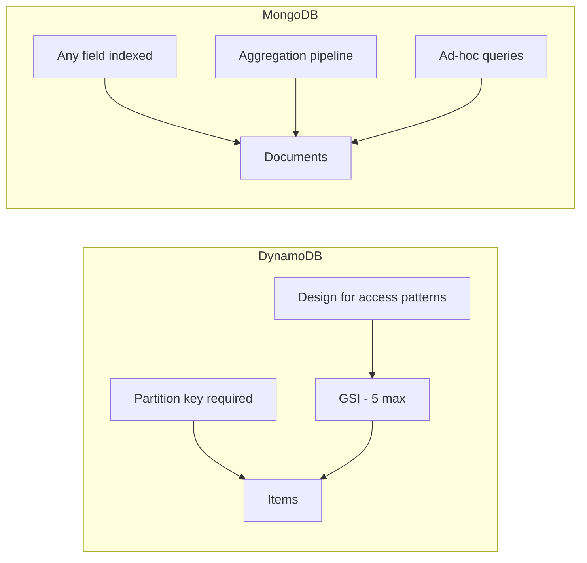

# How to Compare MongoDB vs DynamoDB for Document Storage

Author: [nawazdhandala](https://www.github.com/nawazdhandala)

Tags: MongoDB, DynamoDB, Comparison, AWS, Database

Description: Compare MongoDB and DynamoDB for document storage workloads across data modeling, query capabilities, pricing, and operational trade-offs.

---

## Overview

MongoDB and DynamoDB are both document-capable NoSQL databases, but they take very different approaches. DynamoDB is a fully managed, serverless key-value and document store on AWS with predictable performance. MongoDB is a document database with a rich query model available as Atlas (managed) or self-hosted.



## Data Modeling

**DynamoDB**: Requires a partition key (and optional sort key) defined at table creation. All access patterns must be planned around these keys. Global Secondary Indexes (GSIs) extend access to 5 additional access patterns per table.

**MongoDB**: Documents can be queried on any field. Secondary indexes can be added at any time without table redesign. Collections have no required schema.

Example: storing an order with items.

DynamoDB single-table design:

```json
{
  "PK": "ORDER#12345",
  "SK": "META",
  "customerId": "CUST#abc",
  "status": "pending",
  "total": 99.99
}
```

```json
{
  "PK": "ORDER#12345",
  "SK": "ITEM#prod-001",
  "productName": "Widget",
  "quantity": 2,
  "price": 49.99
}
```

MongoDB document:

```javascript
db.orders.insertOne({
  orderId: "12345",
  customerId: "abc",
  status: "pending",
  total: 99.99,
  items: [
    { productId: "prod-001", productName: "Widget", quantity: 2, price: 49.99 }
  ],
  createdAt: new Date()
})
```

MongoDB's embedded document model keeps related data together, matching intuitive application logic.

## Query Capabilities

| Feature | MongoDB | DynamoDB |
|---|---|---|
| Ad-hoc queries | Any field with any operator | Only key-based or GSI-based |
| Aggregation | Full pipeline ($group, $lookup, $unwind, $facet) | Not available (use DynamoDB Streams + Lambda or Athena) |
| Full-text search | Atlas Search or text indexes | Not available natively |
| Joins | $lookup aggregation | Not available |
| Transactions | Multi-document ACID | TransactWriteItems / TransactGetItems (up to 25 items) |
| Geospatial queries | 2dsphere, $near, $geoWithin | Not available |

MongoDB query example:

```javascript
// Find top 5 customers by revenue with order count
db.orders.aggregate([
  { $match: { status: "completed" } },
  { $group: {
    _id: "$customerId",
    revenue: { $sum: "$total" },
    orderCount: { $sum: 1 }
  }},
  { $sort: { revenue: -1 } },
  { $limit: 5 }
])
```

The equivalent in DynamoDB requires exporting to S3 and running Athena, or building a separate analytics pipeline.

## Performance Characteristics

| Aspect | MongoDB | DynamoDB |
|---|---|---|
| Latency (single-digit ms) | Yes (with indexes) | Yes (guaranteed <10ms at any scale) |
| Throughput scaling | Manual sharding or Atlas auto-scaling | Auto-scaling or on-demand mode |
| Cold start | No | No |
| Capacity planning | Needed for self-hosted; auto on Atlas | Auto-scaling or provisioned WCU/RCU |

DynamoDB provides consistent single-digit millisecond latency at any scale with no index design required for key-based access. MongoDB matches this performance with proper indexing but requires index management.

## Pricing Models

**DynamoDB**:
- On-demand: pay per read/write request unit
- Provisioned: pay for reserved read/write capacity units
- Storage: $0.25/GB/month
- GSI writes consume additional WCUs

**MongoDB Atlas**:
- Dedicated clusters: pay for cluster size (M10, M20, M30...)
- Serverless: pay per operation (similar to DynamoDB on-demand)
- Storage: included with cluster

For sporadic workloads, DynamoDB on-demand or MongoDB Serverless are cost-efficient. For consistent high-volume workloads, DynamoDB provisioned or a dedicated Atlas cluster may be more predictable.

## Schema Flexibility

| Aspect | MongoDB | DynamoDB |
|---|---|---|
| Schema enforcement | Optional JSON Schema validation | None (except required partition key) |
| Adding fields | Any time | Any time |
| Index changes | Create/drop anytime | Add GSIs; GSI on existing data requires backfill |
| Table/collection rename | Requires data copy | Requires data copy |

## AWS Ecosystem Integration

DynamoDB integrates natively with:
- Lambda (DynamoDB Streams as trigger)
- AppSync (direct integration)
- API Gateway
- IAM (fine-grained access by partition key)

MongoDB Atlas integrates with:
- AWS PrivateLink
- AWS Lambda (via Atlas Triggers or direct driver)
- AWS Secrets Manager
- Kafka (Atlas Triggers)

## When to Choose DynamoDB

- Existing AWS-native application with Lambda and API Gateway
- Workloads requiring guaranteed single-digit millisecond latency at any scale
- Well-defined, fixed access patterns that will not change
- Teams wanting serverless with zero operational overhead
- Workloads needing fine-grained IAM authorization per item

## When to Choose MongoDB

- Complex document models requiring flexible queries and aggregation
- Applications where access patterns evolve over time
- Teams needing multi-document ACID transactions
- Applications requiring full-text search or geospatial queries
- Multi-cloud or on-premises deployments not locked to AWS

## Summary

DynamoDB excels for AWS-native applications with predictable, key-based access patterns and a need for guaranteed low latency at scale. MongoDB excels for document-centric workloads requiring rich ad-hoc queries, aggregation pipelines, and full-text search. The key deciding factor is access pattern predictability: if you can define all your access patterns upfront, DynamoDB is operationally simpler; if your query needs evolve or are complex, MongoDB provides significantly more flexibility.
