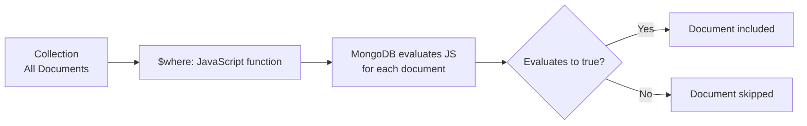
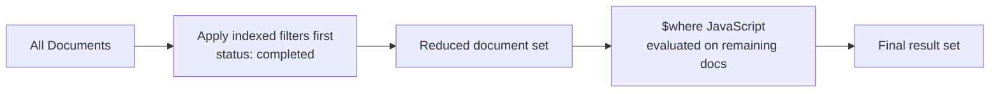

# How to Use $where for JavaScript-Based Queries in MongoDB

Author: [nawazdhandala](https://www.github.com/nawazdhandala)

Tags: MongoDB, $where, JavaScript, Query, Operator

Description: Learn how to use the $where operator in MongoDB to run JavaScript expressions as query filters, understand its limitations, and when to prefer $expr instead.

---

## Overview

The `$where` operator allows you to pass a JavaScript function or string expression to a MongoDB query. MongoDB evaluates the JavaScript against each document in the collection and returns documents for which the expression evaluates to `true`.



## Syntax

```javascript
// Using a JavaScript string
db.collection.find({ $where: "this.field1 > this.field2" })

// Using a JavaScript function
db.collection.find({
  $where: function() {
    return this.field1 > this.field2
  }
})
```

Inside the JavaScript context, `this` refers to the current document being evaluated.

## Basic Examples

### Compare Two Fields

```javascript
// Find orders where the actual cost exceeds the budget
db.orders.find({
  $where: "this.actualCost > this.budget"
})
```

### Using a JavaScript Function

```javascript
db.orders.find({
  $where: function() {
    return this.actualCost > this.budget
  }
})
```

Both forms are equivalent.

### String Length Check

```javascript
// Find users whose username is longer than their email (unusual, but demonstrates the capability)
db.users.find({
  $where: "this.username.length > this.email.length"
})
```

### Date Comparison

```javascript
// Find tasks completed after their deadline
db.tasks.find({
  $where: function() {
    return this.completedAt > this.deadline
  }
})
```

## Combining $where with Other Query Operators

`$where` can be combined with regular query operators. The regular operators are applied first (and can use indexes), and `$where` is applied afterward as a post-filter:

```javascript
// First filter by status (uses index), then apply JavaScript
db.orders.find({
  status: "completed",
  $where: "this.actualCost > this.budget"
})
```

Always place indexed filter conditions alongside `$where` to reduce the number of documents that JavaScript must evaluate.



## Important Limitations

### No Index Support

`$where` cannot use indexes. MongoDB must evaluate the JavaScript expression against every document that passes the pre-filter (or against every document in the collection if there is no pre-filter). This makes it very slow on large collections.

### Security Risk: JavaScript Injection

Never pass user-provided input directly into a `$where` expression. Doing so exposes your application to JavaScript injection attacks, similar to SQL injection.

```javascript
// DANGEROUS: never do this
const userInput = req.query.filter
db.users.find({ $where: userInput })  // injection risk
```

### Requires JavaScript Engine

`$where` requires the JavaScript engine to be enabled in MongoDB. Some deployments disable it for security reasons using `--noscripting`.

### Deprecated Pattern

MongoDB documentation discourages `$where` and recommends `$expr` for all inter-field comparisons. `$where` was more useful in older MongoDB versions before `$expr` was introduced in MongoDB 3.6.

## $where vs $expr: Which to Use?

| Feature | $where | $expr |
|---|---|---|
| Introduced | Early versions | MongoDB 3.6 |
| Uses aggregation operators | No | Yes |
| Index support | No | Partial (MongoDB 5.0+) |
| JavaScript engine required | Yes | No |
| Security risk | Yes (injection) | No |
| Recommended | No | Yes |

### Prefer $expr for Inter-Field Comparisons

```javascript
// Avoid this
db.orders.find({
  $where: "this.actualCost > this.budget"
})

// Prefer this
db.orders.find({
  $expr: { $gt: ["$actualCost", "$budget"] }
})
```

`$expr` is faster, more secure, and does not require the JavaScript engine.

## When $where May Still Be Useful

`$where` is occasionally useful for:

- Ad hoc exploration in the mongosh shell where performance is not a concern
- Complex string manipulations not yet supported by aggregation string operators
- Quick one-off queries on small collections during development

For production queries, always prefer `$expr` or aggregation pipeline operators.

## Example: Complex $where vs Aggregation Alternative

```javascript
// $where approach (avoid in production)
db.products.find({
  $where: function() {
    return (this.price * this.quantity) > this.revenueTarget
  }
})

// Preferred: $expr with aggregation operators
db.products.find({
  $expr: {
    $gt: [
      { $multiply: ["$price", "$quantity"] },
      "$revenueTarget"
    ]
  }
})
```

## Summary

The `$where` operator allows JavaScript functions to filter MongoDB documents, but it has significant downsides: no index support, security risks from JavaScript injection, requirement for the JavaScript engine, and poor performance on large collections. Always use `$expr` with aggregation expressions for inter-field comparisons in production code. Reserve `$where` only for exploratory queries on small datasets in a development environment where security and performance are not concerns.
